# OptiFleet — Business Flow (Alur Proses Bisnis End-to-End)

**Branch/commit:** `Improvement` @ `05dd372e5bfeba9b920d3bf2d8676b2e4a908f8d`

Dokumen ini memetakan alur proses bisnis utama dari awal sampai akhir, berdasarkan implementasi aktual (service layer, transition rules, dan permission yang benar-benar diperiksa backend). Diagram Mermaid bersifat pendamping penjelasan tertulis, bukan pengganti.

---

## 1. Autentikasi & Konteks Tenant

**Tujuan:** memverifikasi identitas user dan menetapkan konteks akses (platform atau tenant tertentu) untuk seluruh permintaan berikutnya.
**Aktor:** semua user.
**Prasyarat:** akun user aktif (`status='active'`); untuk user tenant, keanggotaan tenant (`TenantUser`) juga harus aktif dan tenant berstatus `ACTIVE`.

**Langkah:**
1. User mengisi email & password di halaman Login (`/login`).
2. Backend memvalidasi kredensial; jika salah → pesan "The provided credentials are incorrect."; jika akun nonaktif → "This account has been deactivated."
3. Jika user platform → diterbitkan token bernama `platform-session` dengan ability `platform`.
4. Jika user tenant → sistem mencari **keanggotaan tenant aktif pertama** milik user tersebut (jika user memiliki beberapa tenant, tidak ada pemilihan tenant saat login — otomatis tenant aktif pertama) dan menerbitkan token `tenant-session` dengan ability `tenant:{uuid}`.
5. Token disimpan di `localStorage` browser; setiap permintaan API berikutnya membawa token ini.
6. **Konteks tenant ditentukan murni dari ability token**, tidak pernah dari header/permintaan klien lain.

**Pindah Tenant (Switch Tenant):** user dengan lebih dari satu keanggotaan tenant dapat memilih tenant lain dari dropdown di header Tenant Portal → memicu `POST /auth/switch-tenant` → **menerbitkan token baru** (token lama tetap valid untuk tenant sebelumnya, tidak otomatis dicabut).

**Logout:** hanya mencabut token yang sedang dipakai pada permintaan tersebut (bukan seluruh sesi/perangkat).

**Hasil:** user memperoleh sesi dengan `permissions[]` (daftar permission efektif) dan `memberships[]` (daftar tenant + role per tenant), dipakai frontend untuk menampilkan/menyembunyikan menu.

**Penting:** penyembunyian menu di frontend adalah bantuan tampilan saja — validasi sebenarnya selalu dilakukan ulang oleh backend pada setiap permintaan.

---

## 2. Siklus Hidup Komersial (Platform) — Bundle → Kontrak → Subscription → Billing → Invoice → Payment

**Tujuan:** menjadi dasar komersial mengapa sebuah tenant dapat mengakses modul-modul OptiFleet, dan bagaimana tagihan dihasilkan & dilunasi.
**Aktor:** Platform Superadmin (mengelola), Admin Tenant (membayar).
**Prasyarat:** Bundle sudah dipublikasikan dan/atau Pricing aktif tersedia untuk modul/bundle yang akan dijual.

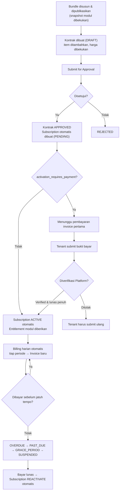

**Detail per tahap:**
- **Kontrak** (`DRAFT→PENDING_APPROVAL→APPROVED→ACTIVE`, sisi `REJECTED`/`TERMINATED`): item kontrak membekukan harga pada saat ditambahkan (tidak berubah walau daftar harga standar berubah di kemudian hari). Persetujuan kontrak (`contract.approve`) **langsung memicu** pembuatan Subscription + Billing pertama + Invoice pertama dalam satu transaksi.
- **Amandemen kontrak:** menambah/menghapus item pada kontrak aktif; menghapus modul yang menjadi dependency modul lain akan **ditolak** ("reverse-dependency check") kecuali modul yang bergantung juga dihapus bersamaan. Jika periode tagihan sedang berjalan, selisih hari dihitung proporsional (proration) dan menghasilkan invoice penyesuaian terpisah.
- **Perpanjangan (Renew):** membuat kontrak **baru** (bukan memperpanjang kontrak lama secara in-place), dengan tanggal mulai menyambung tanggal akhir kontrak lama; kontrak lama tidak diubah sama sekali.
- **Billing → Invoice:** dijalankan otomatis setiap hari pukul 01:00 UTC (`billing:generate`), lalu invoice dibuat otomatis dari billing tersebut. Nomor invoice dijamin unik & berurutan meski banyak proses berjalan bersamaan (row-lock database).
- **Payment:** tenant mengunggah bukti bayar (JPG/PNG/WEBP/PDF, maks 5MB); Platform Superadmin **memverifikasi** atau **menolak**. Hanya jika invoice **lunas penuh** (bukan sebagian), subscription yang berstatus PENDING/SUSPENDED/PAST_DUE/GRACE_PERIOD otomatis kembali ke ACTIVE dan entitlement modul diberikan/dipulihkan.
- **Dunning (penagihan otomatis):** invoice lewat jatuh tempo → `OVERDUE`, subscription → `PAST_DUE` → jika melewati periode tenggang (grace period, dihitung dari `grace_period_days` pada kontrak) → `SUSPENDED`. Saat `SUSPENDED`, **seluruh fitur operasional terkunci (403 SUBSCRIPTION_SUSPENDED)** kecuali menu Account (Subscription/Contract/Company/Invoices/Payments), Audit Log, dan Configuration — agar tenant tetap bisa membayar untuk memulihkan aksesnya.

**Peringatan:** aksi Terminate kontrak bersifat sulit dibatalkan — akan membatalkan Subscription terkait sekaligus.

---

## 3. Registrasi & Pengelolaan Kendaraan

**Tujuan:** mendaftarkan kendaraan ke sistem dan menjaga data induk kendaraan tetap akurat sepanjang siklus operasionalnya.
**Aktor:** Fleet Manager/Admin.
**Prasyarat:** Branch, Vehicle Category sudah tersedia.

**Langkah:**
1. Sidebar → Vehicle → List → tombol **"+ New Vehicle"**.
2. Isi field wajib: Branch, Vehicle Category, dan field lain (Registration Number, VIN, dsb. — lihat kamus data). Simpan → status awal `ACTIVE`, `operational_status = AVAILABLE`.
3. Kendaraan dapat dipindahkan cabang melalui dua mekanisme berbeda:
   - **Reassignment langsung** (tab Assignment, permission `vehicle.assign`) — perubahan segera, tanpa persetujuan, tercatat sebagai riwayat.
   - **Transfer resmi** (tab Transfer / `/app/vehicle-transfers`, permission `vehicle.transfer`) — melalui alur `DRAFT→REQUESTED→APPROVED→IN_TRANSIT→RECEIVED→COMPLETED` (atau `REJECTED`/`CANCELLED`). **Cabang/bengkel kendaraan baru berubah hanya pada saat status `COMPLETED`**, tidak pada tahap-tahap sebelumnya.
4. Dokumen legal (STNK dsb.) diunggah di tab Documents — hanya format JPG/PNG/WEBP/PDF, maks 10MB, disimpan privat (tidak ada URL publik).
5. Status operasional (`ACTIVE/IN_MAINTENANCE/BREAKDOWN/OUT_OF_SERVICE/INACTIVE/DISPOSED`) dapat diubah manual oleh user berpermission `vehicle.status.update`, namun juga **diubah otomatis oleh sistem** ketika terjadi Breakdown (→`BREAKDOWN`) atau Vehicle Release (→`ACTIVE`).

**Hasil:** kendaraan tersedia untuk dijadwalkan perawatan, diinspeksi, dan menjadi objek Work Order.

**Catatan:** hanya satu Transfer yang boleh berjalan (belum `COMPLETED`/`REJECTED`/`CANCELLED`) per kendaraan pada satu waktu — sistem menolak pembuatan transfer kedua selagi satu masih berjalan.

---

## 4. Scheduled Maintenance (Perawatan Terjadwal)

**Tujuan:** memastikan kendaraan diservis secara preventif sesuai interval (jarak tempuh/jam mesin/kalender), bukan menunggu rusak.
**Aktor:** Admin (menyusun paket), Fleet Manager (memantau jatuh tempo).
**Prasyarat:** Maintenance Package + Interval berstatus ACTIVE.

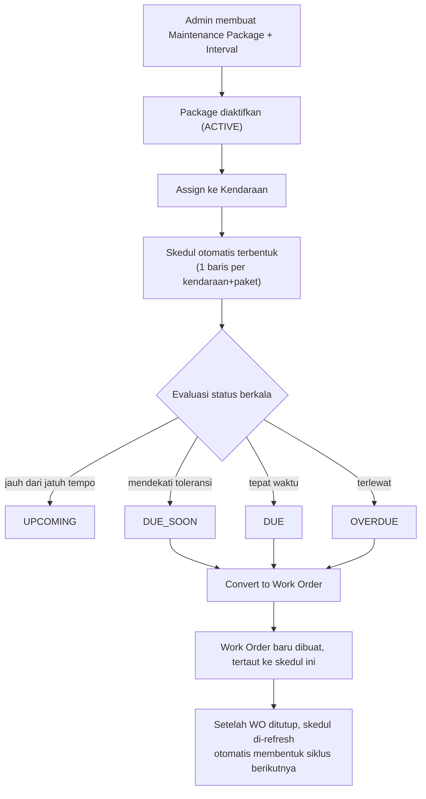

**Detail:**
- Interval mendukung 6 jenis trigger: `ODOMETER`, `ENGINE_HOUR`, `CALENDAR_DAY`, `MONTH`, `COMBINATION`, `CONDITION_BASED`. Untuk kombinasi, status keseluruhan mengambil dimensi **yang paling mendesak** (mana yang lebih dulu tercapai).
- **"Assign to Vehicle" langsung membentuk skedul** — ini satu aksi atomik, bukan dua langkah terpisah.
- Tombol **"Convert to WO"** hanya muncul ketika status skedul `DUE_SOON`/`DUE`/`OVERDUE` — tidak muncul saat `UPCOMING`.
- Setelah Work Order hasil konversi ini ditutup (`markCompleted`), skedul otomatis dihitung ulang untuk siklus berikutnya berdasarkan odometer/tanggal terakhir selesai.
- **Catatan teknis:** nilai status `SCHEDULED` ada di daftar enum tetapi **tidak pernah benar-benar digunakan** oleh sistem saat ini — jangan mengharapkan skedul pernah menampilkan status ini.

**Hasil:** setiap kombinasi kendaraan+paket punya satu baris skedul hidup yang terus diperbarui, menjadi sumber peringatan dini perawatan preventif.

---

## 5. Inspeksi Kendaraan

**Tujuan:** memeriksa kondisi kendaraan terhadap checklist standar dan, jika ditemukan masalah, menindaklanjuti menjadi permintaan perawatan.
**Aktor:** Inspector/Mechanic (melaksanakan), Workshop Manager (menindaklanjuti).

**Langkah:** `CREATED → ASSIGNED → STARTED → (submit) → PASSED/WARNING/FAILED`.
1. Buat inspeksi baru: pilih Vehicle + Template aktif.
2. Assign ke pelaksana, lalu **Start**.
3. Isi setiap item checklist (checkbox/pass-fail/angka/teks) dan catat temuan (finding) dengan tingkat keparahan (INFO–CRITICAL) bila ada.
4. **Submit** → status akhir ditentukan otomatis:
   - Ada item gagal, atau temuan tertinggi CRITICAL/HIGH → **FAILED**.
   - Temuan tertinggi MEDIUM/LOW → **WARNING**.
   - Selain itu → **PASSED**.
5. Jika hasil FAILED/WARNING, tombol **"Create Maintenance Request"** muncul — **ini aksi manual**, sistem tidak otomatis membuat Maintenance Request hanya karena inspeksi gagal.

**Prasyarat/Batasan diketahui:** tipe item **SELECT** dan **PHOTO** pada checklist saat ini ditampilkan sebagai kotak teks biasa di formulir pengisian — belum ada dropdown pilihan atau unggah foto sungguhan meskipun backend sudah menyiapkan strukturnya.

**Hasil:** rekaman inspeksi tersimpan permanen di riwayat kendaraan; odometer kendaraan ikut terbarui jika nilai yang dicatat lebih tinggi dari sebelumnya.

---

## 6. Maintenance Request (Permintaan Perawatan)

**Tujuan:** titik kumpul permintaan servis dari berbagai sumber sebelum disetujui menjadi Work Order.
**Aktor:** siapa pun yang berhak `maintenance_request.create` (mengajukan), Workshop Manager (meninjau & menyetujui).

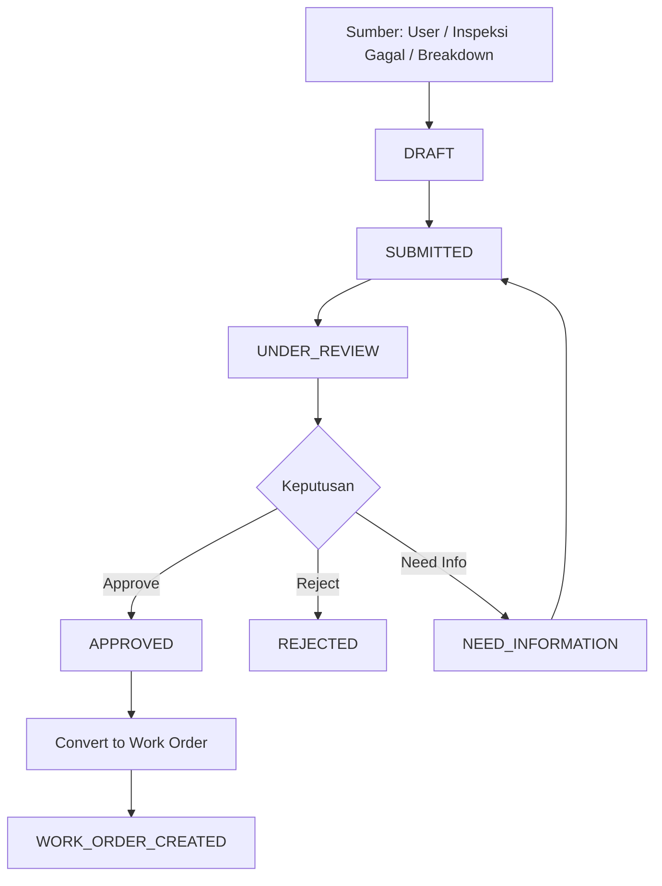

**Catatan implementasi:**
- Field `source_type` mendukung 7 nilai (`USER, INSPECTION, SCHEDULE, BREAKDOWN, TELEMATICS, MECHANIC, INTELLIGENCE`), tetapi hanya **USER, INSPECTION, BREAKDOWN, dan INTELLIGENCE** yang benar-benar memiliki jalur pembuatan otomatis di kode saat ini — SCHEDULE/TELEMATICS/MECHANIC ada di database namun belum punya pemicu pembuatan record.
- Satu Maintenance Request hanya bisa menghasilkan **satu** Work Order (`work_order_id` dikunci setelah konversi pertama).
- Tombol aksi di layar detail tidak mencakup semua transisi backend yang valid — misalnya tidak ada tombol Cancel eksplisit dari status `UNDER_REVIEW`.

**Hasil:** Maintenance Request berstatus `APPROVED` menjadi prasyarat sah satu-satunya untuk memulai Work Order dari jalur ini (jalur lain: langsung dari Skedul Perawatan, atau dari Breakdown).

---

## 7. Breakdown (Kerusakan Mendadak)

**Tujuan:** menangani kerusakan tak terduga di lapangan secara terstruktur, termasuk menghentikan operasional kendaraan sejak dilaporkan.

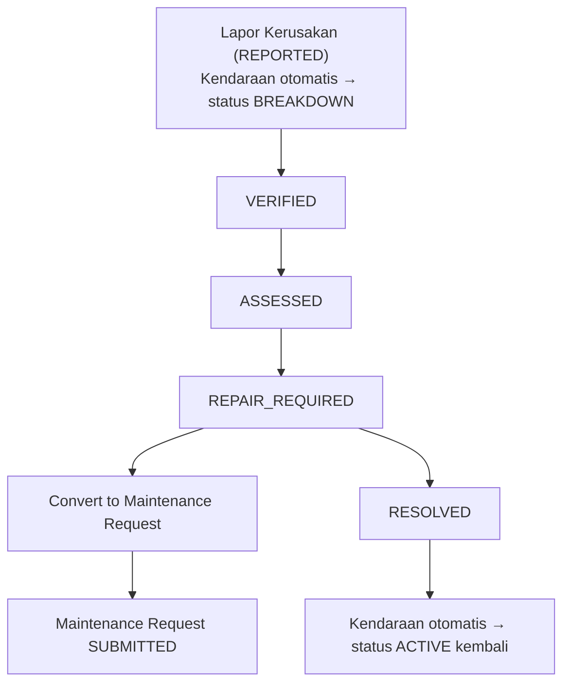

**Detail penting:**
- **Sejak dilaporkan**, kendaraan langsung diberi status `BREAKDOWN`/`ON_HOLD` — bukan menunggu verifikasi.
- Prioritas Maintenance Request hasil konversi otomatis bernilai `URGENT` jika keparahan `IMMOBILIZED`, atau `HIGH` untuk keparahan lain — **namun formulir di aplikasi saat ini selalu mengirim `HIGH` secara tetap**, sehingga nilai `URGENT` otomatis dari backend tidak pernah benar-benar terpakai melalui antarmuka standar.
- **Perhatian — keterhubungan status belum menutup penuh:** mengonversi Breakdown menjadi Maintenance Request **tidak** mengubah status Breakdown itu sendiri (tetap `REPAIR_REQUIRED`) dan **tidak** otomatis mengisi `work_order_id` pada Breakdown ketika Work Order akhirnya dibuat dari Maintenance Request tersebut — akibatnya, secara antarmuka standar sebuah Breakdown yang sudah lanjut ke Work Order tetap terlihat "REPAIR_REQUIRED", bukan berubah ke "WORK_ORDER_CREATED" secara otomatis. Ini dicatat sebagai temuan (lihat `OPTIFLEET_USER_GUIDE_FINDINGS.md` F-05).
- Resolusi (`RESOLVED`) hanya dapat dilakukan selagi status `REPAIR_REQUIRED`, dan otomatis mengembalikan kendaraan ke `ACTIVE`/`AVAILABLE`.

---

## 8. Work Order — Alur Inti Perawatan (End-to-End)

**Tujuan:** menjalankan seluruh eksekusi perawatan kendaraan dari penugasan hingga penutupan, dengan integritas transaksi penuh.
**Aktor:** Workshop Manager (kelola alur), Mechanic (eksekusi), Lead Mechanic/QC (kontrol kualitas).
**Prasyarat:** WO dibuat dari Maintenance Request (APPROVED), Maintenance Schedule (DUE/DUE_SOON/OVERDUE), atau langsung.

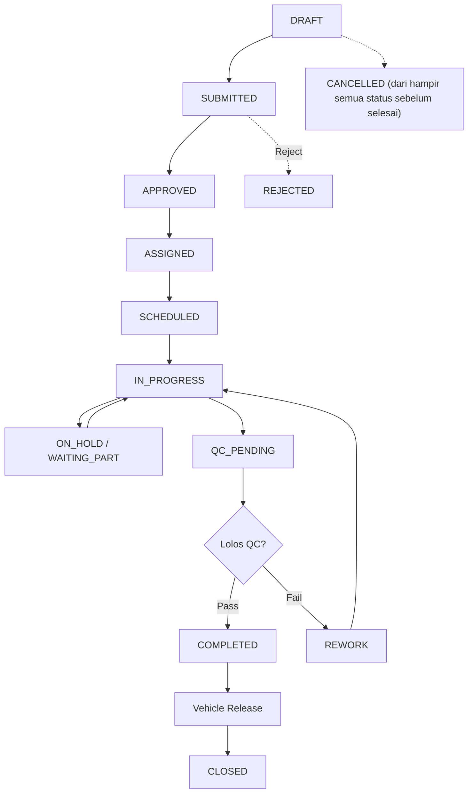

**Rincian tahapan & pelaku:**

| Tahap | Pemicu | Pelaku (permission) | Catatan |
|---|---|---|---|
| DRAFT→SUBMITTED | Tombol Submit | `work_order.submit` | Estimasi biaya (labor/parts) diisi selagi status masih di kelompok awal |
| SUBMITTED→APPROVED/REJECTED | Tombol Approve/Reject | `work_order.approve` | |
| APPROVED→ASSIGNED | Tombol Assign | `work_order.assign` | Menugaskan mekanik (cross-check: mekanik harus dari bengkel yang sama dengan WO) |
| ASSIGNED→SCHEDULED | Tombol Schedule | `work_order.schedule` | Memilih Workspace/Bay & target waktu — **tidak otomatis membuat reservasi bay**, lihat Catatan Bengkel |
| SCHEDULED→IN_PROGRESS | Tombol Start | `work_order.start` | Mencatat `started_at`; mekanik mencatat Complaint/Finding/Diagnosis/Corrective Action; Jam kerja dicatat via Labor Timer (Start/Pause/Resume/Finish) |
| IN_PROGRESS→ON_HOLD/WAITING_PART | Hold / Wait for Part | `work_order.pause` | Dapat kembali ke IN_PROGRESS |
| IN_PROGRESS→QC_PENDING | Submit to QC | `work_order.complete` | Memerlukan seluruh temuan (finding) sudah diselesaikan |
| QC_PENDING→COMPLETED/REWORK | QC Pass/Fail | `qc.approve`/`qc.reject` | REWORK mengembalikan WO ke IN_PROGRESS |
| COMPLETED→CLOSED | Vehicle Release | `vehicle_release.perform` | Rilis kendaraan **sekaligus** menutup WO ke CLOSED |

**Guard Penutupan (Closure Guard) — memblokir transisi ke COMPLETED/CLOSED jika:**
1. Ada Planned Part yang belum berstatus `CONSUMED/RETURNED/CANCELLED`.
2. Ada ban yang dilepas pada WO ini masih berstatus `UNDER_INSPECTION/RETREAD/REPAIR/QUARANTINED`.
3. Ada Finding yang masih `OPEN`.
4. Ada temuan QC yang belum diselesaikan.

**Pekerjaan Tambahan (Additional Work):** diajukan (`REQUESTED`) saat pekerjaan berjalan bila ditemukan kebutuhan di luar rencana awal; disetujui/ditolak oleh Workshop Manager — **disetujui otomatis membuat Maintenance Job baru**.

**Pengadaan Part untuk WO (Planned Parts):** membuat rencana kebutuhan part **tidak memindahkan stok apa pun**. Pergerakan stok sesungguhnya (Reserve→Issue→Consume/Return) adalah aksi terpisah yang berada di bawah modul **Inventory** (permission `inventory.reserve/issue/return`), meski dilakukan pada baris rencana part yang sama — lihat Bagian 10.

**Layanan Eksternal (Maintenance Memo):** bila sebagian pekerjaan dikirim ke Partner/bengkel eksternal, dibuat "Memo" yang berstatus `REQUESTED→COMPLETED`, lalu dapat dilanjutkan ke pencatatan Workshop Invoice (Bagian 9).

**Hasil akhir:** WO `CLOSED`, kendaraan kembali `ACTIVE`, riwayat kendaraan bertambah satu entri, dan (jika ada part yang dikonsumsi) ledger stok berkurang secara permanen.

---

## 9. Workshop Invoice & Settlement (R1)

**Tujuan:** mencatat invoice yang **diterbitkan oleh Partner/bengkel eksternal** (OptiFleet tidak pernah menerbitkan invoice atas nama dirinya sendiri untuk fitur ini) dan melacak pelunasannya.

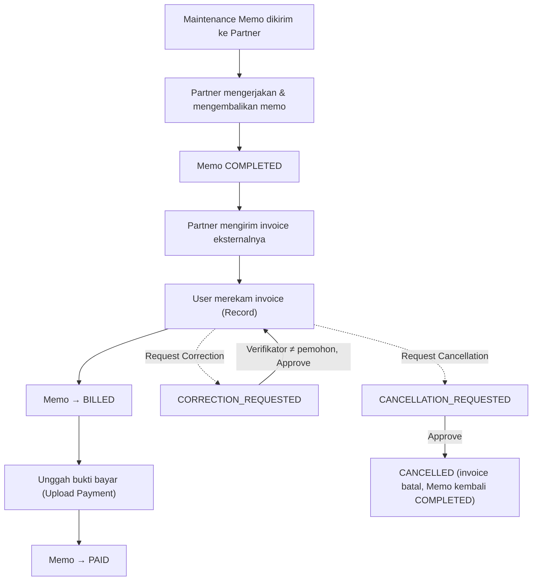

**Aturan bisnis kunci:**
- Nomor invoice **bukan** dinomori oleh OptiFleet — nomor yang diinput adalah nomor invoice asli dari Partner (`external_invoice_number`), dicek duplikasi per tenant+partner (mengabaikan huruf besar/kecil dan spasi berlebih).
- Pembayaran **hanya satu kali per invoice**, dan nominal yang dibayar **harus tepat sama** dengan total invoice — tidak didukung pembayaran sebagian (parsial).
- **Maker-checker berlaku pada koreksi & pembatalan:** pemohon koreksi/pembatalan tidak dapat menjadi verifikatornya sendiri, meski secara teknis memegang kedua permission tersebut.
- Pembatalan invoice yang sudah `PAID` tetap diperbolehkan (Memo kembali ke `COMPLETED`) — namun **baris pembayaran yang sudah ada tidak dihapus/dibalik**, hanya ditinggalkan sebagai riwayat.
- **Rekonsiliasi** (selisih antara biaya yang diperkirakan pada Memo vs nilai invoice riil) dihitung langsung setiap kali dibuka, tidak pernah disimpan sebagai nilai tetap, dan **tidak pernah memblokir** proses apa pun — murni informasi pendukung keputusan.

---

## 10. Alur Inventaris — Stock Request, Issue, Return, Disposisi Part Bekas, Penjualan

**Tujuan:** menjaga ketertelusuran penuh setiap pergerakan stok spare part.

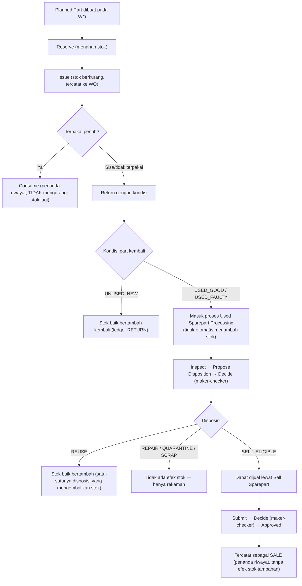

**Aturan bisnis kunci:**
- **Ledger (`stock_movements`) bersifat append-only** — saldo stok selalu dapat dihitung ulang dari seluruh riwayat mutasinya; tidak ada baris ledger yang pernah diubah/dihapus.
- Kondisi `USED_FAULTY` **tidak pernah** bisa berakhir pada disposisi REUSE atau SELL_ELIGIBLE — dicegah dua kali (saat propose dan saat sale dibuat) sebagai pertahanan berlapis.
- **Sell Sparepart hanya punya dua jenis penjualan**: `OPERATIONAL_REUSE` dan `SCRAP_MATERIAL`. **Jangan disamakan** dengan penjualan Ban yang punya tiga jenis (lihat Bagian 12) — dua fitur yang mirip namun terpisah.
- Stock Transfer antar-gudang mengikuti alur `DRAFT→...→DISPATCHED→IN_TRANSIT→RECEIVED→COMPLETED`; jumlah diterima+rusak+hilang tidak boleh melebihi jumlah yang dikirim, dan kekurangan tanpa alasan (`discrepancy_reason`) akan ditolak sistem.

---

## 11. Procurement — Purchase Request → RFQ → Quotation → PO → Goods Receipt

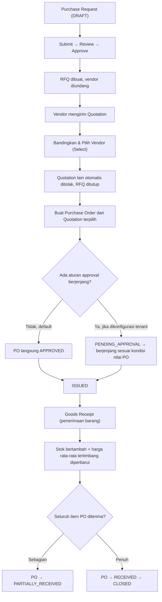

**Catatan:** kelebihan penerimaan di atas sisa jumlah PO **selalu ditolak**, tanpa toleransi. Persetujuan PO berjenjang adalah **framework yang tersedia namun tidak aktif secara default** — setiap tenant memakai persetujuan satu-tingkat kecuali secara sengaja mempublikasikan konfigurasi Workflow bertingkat sendiri.

---

## 12. Tire Lifecycle (Pemasangan, Rotasi, Retread/Repair, Scoring, Penjualan)

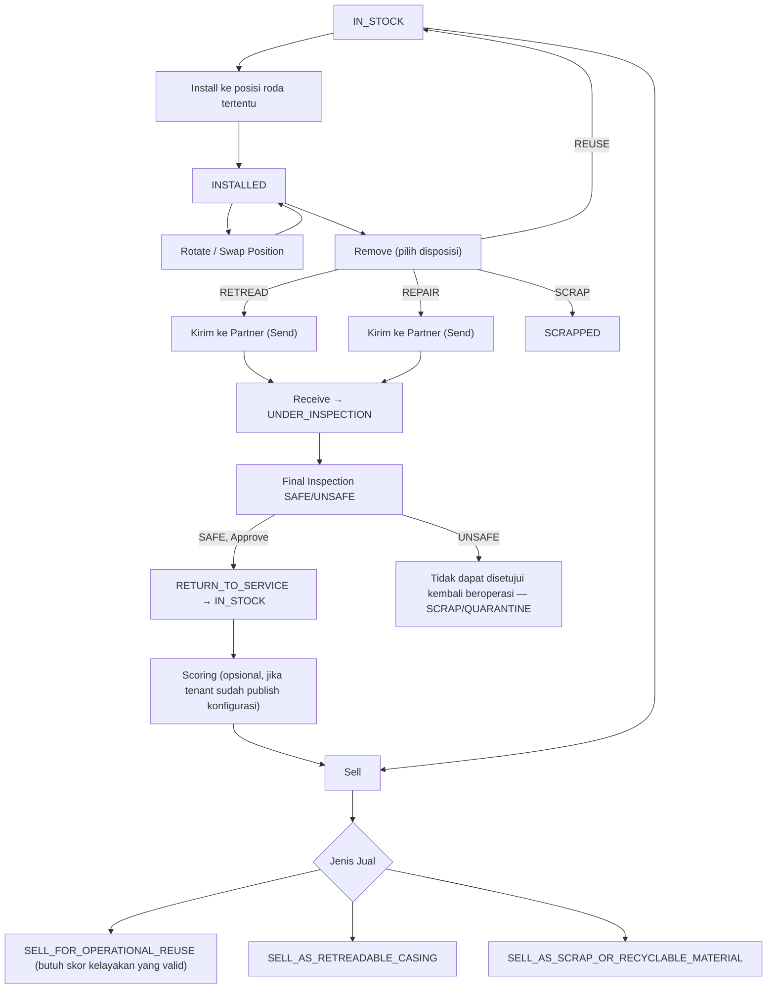

**Aturan bisnis kunci (integritas keselamatan):**
- Satu nomor seri ban = satu aset fisik; satu posisi roda hanya boleh diisi satu ban aktif pada satu waktu — **ditegakkan di level database**, bukan hanya validasi aplikasi.
- **Gerbang gagal-kritis (critical-fail) selalu mengalahkan segalanya** — hasil inspeksi final `UNSAFE`, atau skor yang ditandai `critical_safety_fail`, **tidak pernah** bisa disetujui untuk RETURN_TO_SERVICE atau dijual sebagai SELL_FOR_OPERATIONAL_REUSE, apa pun keputusan approver.
- **Maker-checker:** penerima kiriman ban tidak dapat menjadi penyetuju akhirnya sendiri; penghitung skor tidak dapat menjadi penetap-akhir (finalize) skor yang sama.
- **Tire Scoring baru berlaku jika tenant sudah mempublikasikan konfigurasinya sendiri** (band, bobot, batas legal/casing/lifecycle) — sebelum itu, sistem **menolak** menghitung skor sama sekali (bukan memakai nilai default apa pun).
- Kelayakan Retread/Repair (aturan legal/casing/lifecycle) bersifat **opt-in**: jika tenant belum mempublikasikan aturan ini, seluruh ban dianggap layak tanpa pemeriksaan tambahan (perilaku sebelum fitur ini ada, tidak berubah).
- **Rim adalah katalog referensi berdiri sendiri** — tidak tertaut ke data Tire atau Vehicle mana pun; jangan mengharapkan pemilihan Rim memengaruhi proses pemasangan ban.

---

## 13. Warranty Claim

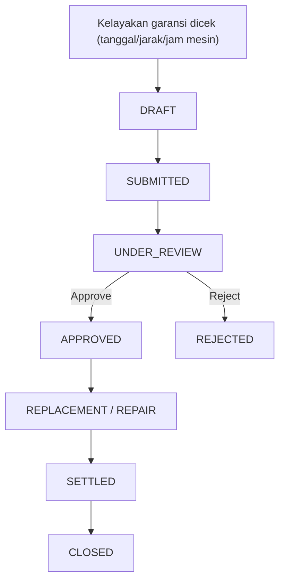

**Aturan kelayakan (untuk cakupan kombinasi tanggal+jarak+jam mesin):** garansi dianggap **berakhir begitu SATU dimensi saja terlampaui**, meski dimensi lain masih dalam batas — contoh: garansi 12 bulan/20.000 km, kendaraan baru berjalan 8 bulan tetapi sudah 22.000 km → **berakhir**, karena jarak tempuh sudah melampaui batas.

---

## 14. Notifikasi & Eskalasi (Ringkas)

Setiap event bisnis (Work Order dibuat, stok menipis, PO disetujui, dst.) dapat memicu notifikasi berdasarkan **Notification Rule** yang dikonfigurasi. Notifikasi dikirim ke kanal In-App dan/atau Email. Jika tidak ditangani dalam waktu tertentu, aturan eskalasi (opsional) akan mengulang notifikasi ke penerima lain.

**Catatan penting:** meskipun mekanisme pengiriman & penyimpanan pesan In-App berfungsi penuh di backend, **saat ini tidak ada kotak masuk/lonceng notifikasi di antarmuka pengguna** untuk membaca pesan tersebut — pengguna hanya dapat mengonfigurasi aturan notifikasi (Configuration → Notification), bukan membaca hasil kirimannya, melalui aplikasi.

---

## 15. Audit Trail (Ringkas)

Setiap pembuatan, pengubahan, dan penghapusan/penonaktifan pada model-model penting (Role, Branch, Workshop, Vehicle Category, User, dsb.) otomatis tercatat di Audit Log dengan nilai sebelum/sesudah, aktor, waktu, alamat IP, dan user agent. Password **tidak pernah** ikut tercatat. Tenant hanya dapat melihat audit log miliknya sendiri; Platform Superadmin dapat melihat lintas tenant.

---

## Ringkasan Dependensi Antarproses

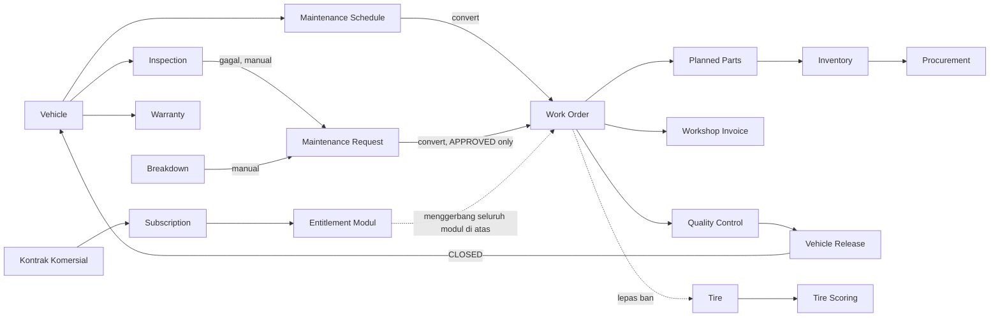
