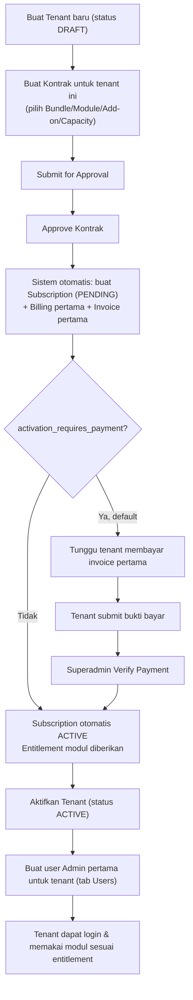
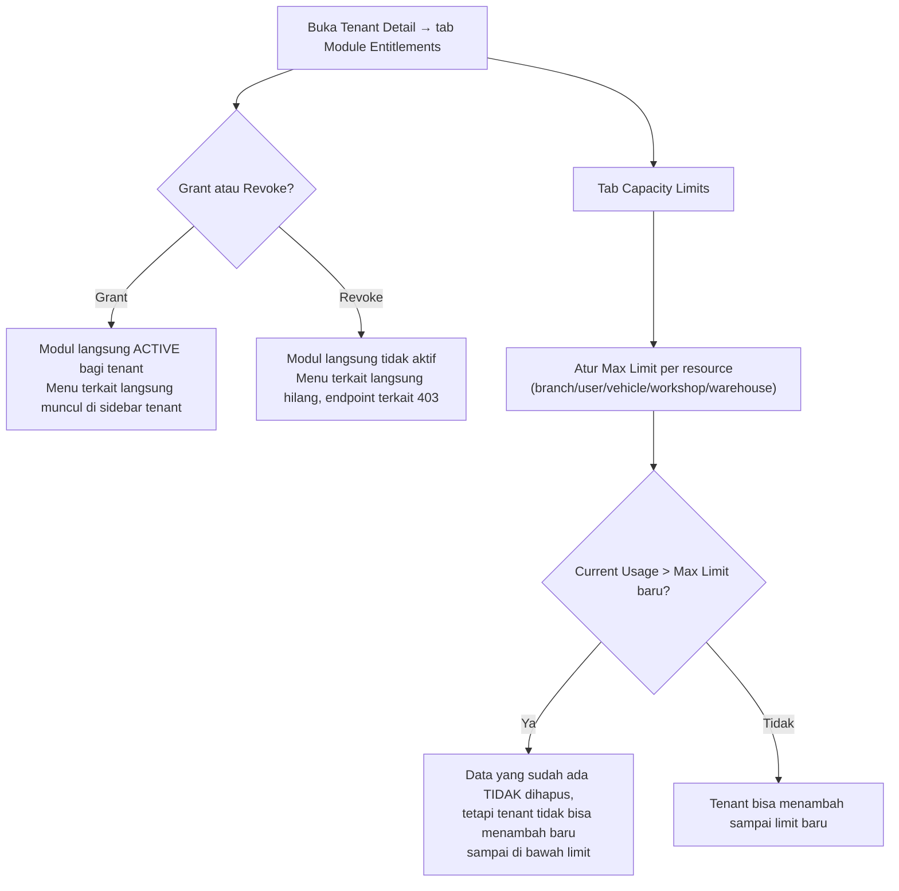
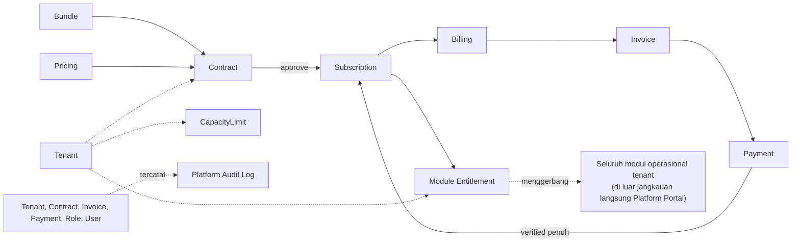

# OptiFleet — Platform Portal Business Flow

**Branch/commit:** `Improvement` @ `05dd372e5bfeba9b920d3bf2d8676b2e4a908f8d`

---

## 1. Onboarding Tenant Baru — End-to-End

**Tujuan:** menghidupkan akses satu perusahaan pelanggan baru ke OptiFleet.
**Aktor:** Platform Superadmin.
**Prasyarat:** Bundle yang akan dijual sudah `PUBLISHED`; Pricing untuk modul/bundle tersebut sudah `ACTIVE`.

**Detail & Peringatan:**
- **Tenant tidak otomatis `ACTIVE` saat dibuat** — formulir "+ New Tenant" hanya mengirim Code & Name, status awal selalu `DRAFT`. Superadmin harus mengklik **Activate** secara terpisah kapan pun dianggap tepat (biasanya setelah kontrak & pembayaran pertama beres, meski secara teknis tidak ada validasi yang memaksa urutan ini).
- **Persetujuan Kontrak (`Approve`) memicu efek langsung dan otomatis** — Subscription, Billing pertama, dan Invoice pertama dibuat dalam satu transaksi database seketika tombol ditekan. Ini bukan proses terjadwal.
- **Prasyarat entitlement modul:** modul hanya benar-benar aktif bagi tenant setelah Subscription mencapai `ACTIVE` (baik otomatis karena `activation_requires_payment=false`, maupun setelah pembayaran pertama diverifikasi penuh).
- User Admin pertama tenant **harus dibuat manual** oleh Superadmin lewat tab Users pada Tenant Detail — tidak ada mekanisme otomatis yang membuatkan akun ini.

**Hasil:** tenant baru siap dipakai; Superadmin dapat memverifikasi keberhasilan dengan memastikan status Tenant `ACTIVE`, status Subscription `ACTIVE` (Bagian Contract Management), dan user Admin pertama dapat login.

---

## 2. Siklus Komersial Penuh — Kontrak → Subscription → Billing → Invoice → Payment

Alur detail sudah didokumentasikan lengkap pada `OPTIFLEET_BUSINESS_FLOW.md` §2 (Tenant Guide) — bagian tersebut ditulis dari sudut pandang yang sama (Platform Superadmin sebagai pengelola), sehingga **berlaku identik** di sini tanpa penyesuaian. Ringkasan ulang untuk kemandirian dokumen:

- **Kontrak**: `DRAFT → PENDING_APPROVAL → APPROVED → ACTIVE`, sisi `REJECTED`/`TERMINATED`/`EXPIRING`/`EXPIRED`. Item kontrak membekukan harga saat ditambahkan.
- **Amandemen**: menambah/menghapus item pada kontrak `ACTIVE`/`APPROVED`; penghapusan modul yang menjadi dependency modul lain **ditolak** kecuali modul yang bergantung turut dihapus. Proration otomatis dihitung bila mengubah komposisi di tengah periode tagihan berjalan.
- **Perpanjangan (Renew)**: membuat kontrak **baru**, tidak pernah mengubah kontrak lama.
- **Billing → Invoice**: otomatis setiap hari 01:00 UTC; nomor invoice dijamin unik meski dibuat bersamaan.
- **Payment**: tenant unggah bukti bayar → Superadmin **Verify** (memicu reaktivasi Subscription bila lunas penuh) atau **Reject** (tenant harus mengajukan ulang — catatan: fitur "resubmit" backend ada tetapi tidak dipakai UI tenant, lihat Tenant Guide Findings F-13, tetap berlaku di sini karena ini perilaku tenant, bukan platform).
- **Dunning otomatis**: invoice lewat jatuh tempo → `OVERDUE` → Subscription `PAST_DUE` → `GRACE_PERIOD` (durasi dari `grace_period_days` kontrak) → `SUSPENDED`. Seluruhnya berjalan otomatis via scheduled command harian, **tidak memerlukan aksi manual Superadmin** — peran Superadmin hanya memverifikasi pembayaran begitu tenant melunasi untuk memicu reaktivasi.

**Dampak lintas tenant:** setiap transisi Subscription ke `SUSPENDED` langsung mengunci **seluruh** fitur operasional tenant tersebut (Vehicle, Work Order, Inventory, dst.) kecuali menu Account/Audit Log/Configuration — Superadmin perlu menyadari bahwa menekan **Suspend** manual, atau membiarkan dunning berjalan, berdampak langsung dan seketika ke pekerjaan harian tenant.

---

## 3. Mengelola Module Entitlement & Capacity Limit

**Tujuan:** mengendalikan modul apa dan berapa banyak resource yang boleh dipakai satu tenant, independen dari siklus kontrak formal (mis. untuk penyesuaian cepat, demo, atau uji coba).

**Penting:** Grant/Revoke Entitlement adalah aksi **langsung dan seketika** (tidak melalui approval atau jadwal) — begitu tombol ditekan, dampaknya langsung terlihat oleh seluruh user tenant tersebut pada permintaan berikutnya. **Peringatan:** mencabut modul yang sedang dipakai aktif oleh tenant (mis. saat mereka punya Work Order berjalan) tidak memicu peringatan konfirmasi khusus di UI — data yang sudah ada tetap tersimpan di database, hanya **akses melihat/mengubahnya lewat aplikasi yang terputus** sampai modul diberikan kembali.

---

## 4. Mengelola Akses Platform — User, Role, Permission

Mengikuti pola generik RBAC yang sama seperti dijelaskan di Tenant Guide (`OPTIFLEET_ROLE_PERMISSION_MATRIX.md` §1) — **berlaku identik**, hanya beroperasi pada permission `scope=platform` dan tanpa konsep Data Scope. Lihat Bagian M dan N pada `OPTIFLEET_PLATFORM_PORTAL_USER_GUIDE.md` untuk langkah rinci.

**Dampak berubah permission role:** karena tidak ada bypass, mengubah kumpulan permission suatu role platform **langsung** mengubah apa yang bisa dilakukan **setiap** user yang memegang role tersebut pada permintaan berikutnya (cache permission disegarkan otomatis).

---

## 5. Audit Trail Lintas Tenant

Setiap aksi administratif Superadmin (buat/ubah/aktifkan/nonaktifkan Tenant, ubah Role/Permission, dst.) tercatat otomatis ke `AuditLog` dengan `tenant_id` sesuai konteks tenant yang terdampak (atau `null` untuk aksi murni level-platform seperti mengubah Role platform). Platform Audit Log menampilkan log ini **lintas seluruh tenant sekaligus**, menjadikannya satu-satunya tempat di aplikasi untuk melihat aktivitas administratif gabungan.

---

## 6. Analisis Risiko Action Superadmin

| Action | Scope Dampak | Data yang Terpengaruh | Dapat Dibatalkan? | Risiko | Kontrol yang Tersedia |
|---|---|---|---|---|---|
| Nonaktifkan Tenant (Deactivate) | Satu tenant, seluruh usernya | Kemampuan login seluruh user tenant tersebut | Ya — Activate kembali kapan saja | Tenant tiba-tiba tidak bisa login tanpa peringatan dini otomatis dari sistem | Tidak ada konfirmasi modal tambahan di UI; hanya permission `tenant.deactivate` |
| Cabut Module Entitlement | Satu tenant, seluruh user yang memakai modul tsb | Akses menu & endpoint modul tersebut bagi tenant | Ya — Grant kembali kapan saja; **data yang sudah dibuat tenant sebelumnya tidak hilang**, hanya tidak dapat diakses selama modul tidak aktif | Mencabut modul yang sedang dipakai aktif tenant dapat menghentikan pekerjaan mereka mendadak (mis. mencabut WORK_ORDER saat ada WO berjalan) | Tidak ada peringatan "modul sedang dipakai aktif" — murni tanggung jawab operator |
| Turunkan Capacity Limit di bawah Current Usage | Satu tenant | Kemampuan tenant menambah resource baru (bukan data lama) | Ya — naikkan kembali limitnya | Tenant tidak bisa lagi menambah cabang/user/kendaraan baru sampai limit dinaikkan; data eksisting tidak terhapus | `current_count` ditampilkan berdampingan dengan `max_count` sebelum disimpan |
| Suspend Subscription (manual) | Satu tenant, seluruh fitur operasional | Seluruh akses `/app/*` operasional tenant (kecuali Account/Audit/Configuration) | Ya — Reactivate kapan saja | Penghentian operasional total dan seketika bagi tenant | Wajib mengisi alasan (reason) saat Suspend |
| Terminate Contract | Satu tenant | Contract + Subscription terkait (Subscription otomatis ikut dibatalkan/`CANCELLED`) | **Tidak** — tidak ada jalur "un-terminate"; harus buat kontrak baru dari awal | Kehilangan akses permanen bagi tenant kecuali dibuatkan kontrak baru | Permission terpisah `contract.terminate`, tidak ada konfirmasi ganda di UI selain klik tombol |
| Void Invoice | Satu tenant | Status invoice tersebut | Sebagian — tidak bisa void invoice yang sudah `PAID` (ditolak backend), dan tidak ada jalur reversal pembayaran sama sekali dalam sistem | Invoice yang sudah lunas dengan kesalahan data tidak dapat dikoreksi lewat aplikasi | Guard backend menolak void atas invoice PAID |
| Verifikasi Pembayaran (Verify) | Satu tenant, berpotensi mereaktivasi Subscription | Status Payment, status Invoice, status Subscription (bila lunas penuh) | **Tidak ada tombol "batalkan verifikasi"** — bersifat final | Verifikasi keliru (jumlah/bukti tidak sesuai) akan mereaktivasi tenant yang seharusnya belum berhak | Verifikasi memerlukan pemeriksaan manual bukti bayar oleh operator; tidak ada validasi otomatis kecocokan nominal terhadap outstanding |
| Mengubah kumpulan Permission suatu Role Platform | Global — seluruh pemegang role tersebut | Hak akses **seluruh** user platform yang memegang role itu | Ya — kembalikan permission semula | Mencabut permission penting dari role yang dipegang banyak Superadmin dapat mengunci diri sendiri dan rekan kerja dari fitur kritis | Tidak ada pengaman "jangan hapus permission terakhir dirimu sendiri" — tanggung jawab penuh operator |
| Publish versi Bundle baru | Global — seluruh tenant dengan kontrak baru ke depan | Komposisi modul yang dijual untuk kontrak-kontrak berikutnya | Ya secara teknis (publish versi baru lagi), tetapi versi lama yang sudah dipakai kontrak aktif tidak berubah (dibekukan) | Kesalahan komposisi modul pada bundle yang baru dipublikasikan memengaruhi seluruh kontrak baru sampai diperbaiki | Validasi dependency modul otomatis sebelum publish berhasil |
| Aktivasi model Intelligence (GLOBAL scope) | Cross-tenant — seluruh tenant yang belum punya model sendiri | Hasil prediksi risiko kegagalan kendaraan yang ditampilkan ke tenant tersebut | Ya — retire model, model sebelumnya (jika masih EVALUATED) berpotensi diaktifkan ulang | Model dengan akurasi buruk yang diaktifkan memengaruhi kualitas rekomendasi seluruh tenant tanpa model sendiri | Aktivasi hanya diizinkan bila model memenuhi kriteria akurasi minimum yang sudah ditetapkan (acceptance criteria) |

**Catatan/Peringatan/Prasyarat/Hasil/Dampak lintas tenant** — penanda ini dipakai konsisten pada setiap prosedur terkait di `OPTIFLEET_PLATFORM_PORTAL_USER_GUIDE.md`, bukan hanya di tabel ringkas ini.

---

## Diagram Ringkasan Dependensi (Sudut Pandang Platform)

