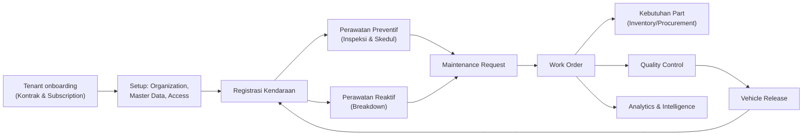

# USER GUIDE OPTIFLEET

## A. Informasi Dokumen

| Item | Keterangan |
|---|---|
| Nama Dokumen | User Guide OptiFleet — Vehicle Maintenance & Fleet Management SaaS Platform |
| Nama Aplikasi | OptiFleet |
| Branch/Commit yang Diperiksa | `Improvement` @ `05dd372e5bfeba9b920d3bf2d8676b2e4a908f8d` |
| Versi Dokumen | 1.0 |
| Tanggal Pembuatan | 15 September 2026 |
| Status Dokumen | Final — berdasarkan pemeriksaan langsung source code, siap distribusi |
| Penulis | Tim analisis teknis (disusun dengan bantuan Claude, Anthropic) |
| Target Pembaca | Pengguna operasional (Fleet Manager, Workshop Manager, Mechanic, Warehouse, Procurement), Administrator tenant, Superadmin platform, tim QA, Product, Technical Support |
| Ruang Lingkup | Seluruh modul yang benar-benar ditemukan terimplementasi pada branch `Improvement`: Identity & Access, Organization & Master Data, Commercial SaaS Lifecycle, Vehicle, Inspection, Maintenance (Policy/Schedule/Request), Breakdown, Work Order, Service Invoice, Workshop Operations, Quality Control, Vehicle Release, Inventory, Procurement, Partner, Tire Management, Component Asset, Warranty, Configuration, Audit, Analytics, Maintenance Intelligence |
| Sumber Analisis | Pemeriksaan langsung backend (`backend/app/Domain/*`, routes, migrations, seeders), frontend (`frontend/src/*`), dokumentasi proyek (`README.md`, `docs/implementation/IMPROVEMENT_CONTEXT.md`, `docs/status/PHASE6_STATUS.md`, `docs/status/PHASE7_STATUS.md`, `docs/deployment/RELEASE_READINESS_R4.md`, `docs/implementation/VMS_RECONCILIATION_TRACEABILITY.md`) |

---

## B. Revision History

| Versi | Tanggal | Perubahan | Penulis/Reviewer |
|---|---|---|---|
| 1.0 | 15 September 2026 | Penyusunan awal — cakupan penuh seluruh modul yang ditemukan pada branch `Improvement` | Tim analisis teknis |

---

## C. Daftar Isi

- A. Informasi Dokumen
- B. Revision History
- C. Daftar Isi
- D. Pendahuluan
- E. Persyaratan Penggunaan
- F. Konsep Dasar Sistem
- G. Navigasi dan Antarmuka
- H. Panduan Berdasarkan Role
- I. Panduan Setiap Modul
  1. Access Management & Identity
  2. Organization & Master Data
  3. Vehicle
  4. Inspection
  5. Maintenance Policy & Schedule
  6. Maintenance Request
  7. Breakdown
  8. Work Order
  9. Service Invoice & Settlement
  10. Workshop Operations (Worker, Workspace, Reservasi)
  11. Quality Control & Vehicle Release
  12. Inventory
  13. Procurement
  14. Partner
  15. Tire Management
  16. Component Asset
  17. Warranty
  18. Configuration
  19. Audit Log
  20. Analytics
  21. Maintenance Intelligence
  22. Portal Platform — Komersial SaaS (Bundle, Pricing, Contract, Subscription, Billing, Invoice, Payment)
- 4. Panduan Proses End-to-End
- 5. Referensi Kamus Data (lihat dokumen terpisah)
- 6. Glossary
- Lampiran — Traceability & Findings (lihat dokumen terpisah)

---

## D. Pendahuluan

### Latar Belakang

OptiFleet adalah platform **manajemen armada & perawatan kendaraan (Vehicle Maintenance System)** yang dibangun sebagai **SaaS multi-tenant** — satu instalasi aplikasi melayani banyak perusahaan pelanggan (tenant) secara terisolasi penuh. Selain fungsi inti perawatan kendaraan, OptiFleet juga mencakup siklus komersial lengkap (kontrak, penagihan, pembayaran), rantai pasok (inventaris & pengadaan), siklus hidup ban & komponen bernomor seri, serta lapisan analitik dan kecerdasan prediktif (Maintenance Intelligence).

### Tujuan Sistem

Membantu perusahaan yang mengoperasikan armada kendaraan (truk, bus, alat berat, kendaraan operasional lain) untuk:
- Mendaftarkan & memantau kondisi kendaraan secara terstruktur.
- Menjalankan perawatan preventif berbasis jarak tempuh/jam mesin/tanggal, bukan reaktif semata.
- Menindaklanjuti kerusakan mendadak (breakdown) secara terlacak.
- Mengelola seluruh siklus perintah kerja (Work Order) bengkel — dari keluhan hingga kendaraan kembali beroperasi.
- Mengendalikan stok spare part & proses pengadaan secara tertelusur penuh (ledger).
- Mengelola aset ban & komponen bernomor seri dengan standar keselamatan berlapis.
- Memberi visibilitas manajemen melalui dashboard analitik dan rekomendasi berbasis data.

### Ruang Lingkup Sistem

Dokumen ini mencakup **Tenant Portal** (digunakan oleh perusahaan pelanggan/tenant untuk operasional harian) dan **Platform Portal** (digunakan oleh operator OptiFleet sendiri untuk mengelola tenant, kontrak komersial, dan penagihan).

### Manfaat bagi Pengguna

- **Fleet Manager:** visibilitas penuh status & riwayat kendaraan, kontrol jatuh tempo perawatan.
- **Workshop Manager/Mechanic:** alur kerja Work Order terstruktur dengan jejak audit penuh, penjadwalan tenaga kerja & bay servis.
- **Warehouse/Procurement:** ledger stok yang tidak pernah "hilang jejak", rantai pengadaan yang tertaut ke kebutuhan riil.
- **Admin/Manajemen:** kontrol akses granular per pengguna, audit trail menyeluruh, dashboard analitik & prediksi risiko armada.
- **Platform Superadmin:** kendali penuh siklus komersial tenant dari kontrak hingga pelunasan.

### Batasan Dokumentasi

- Dokumen ini disusun berdasarkan **kondisi implementasi aktual** pada commit yang disebut di atas — bukan berdasarkan rencana produk, dokumen lama, atau asumsi nama fitur.
- Fitur yang ditemukan **belum aktif secara default** (misalnya Tire Scoring sebelum tenant mempublikasikan konfigurasinya) dijelaskan sebagai prasyarat, bukan disembunyikan atau diklaim sudah berjalan.
- Beberapa fitur backend belum memiliki antarmuka pengguna (ditandai eksplisit "Backend Only") — bagian tersebut dijelaskan sebagai keterbatasan, bukan langkah penggunaan yang bisa diikuti dari aplikasi.
- Dokumen ini **tidak menyertakan screenshot** — seluruh instruksi disampaikan melalui jalur menu, nama field, nama tombol, dan langkah bernomor tertulis.

### Gambaran Proses Bisnis (Ringkas)

---

## E. Persyaratan Penggunaan

- **Browser:** aplikasi berbasis web SPA (React) — disarankan browser modern terbaru (Chrome/Edge/Firefox). Tidak ditemukan pembatasan versi browser spesifik pada kode.
- **Ukuran layar:** antarmuka mendukung tampilan desktop (sidebar tetap) dan mobile (sidebar dapat disembunyikan/ditampilkan via tombol "☰ Menu" — perilaku *responsive* terkonfirmasi pada `TenantLayout.tsx`).
- **Koneksi:** memerlukan koneksi internet aktif ke server API backend; tidak ada mode offline.
- **URL Aplikasi:** ditentukan oleh konfigurasi deployment masing-masing instansi (lihat `README.md` untuk contoh environment pengembangan: frontend `http://localhost:5173`, API `http://localhost:8000/api/v1`). URL produksi ditentukan oleh operator platform.
- **Kebutuhan Akun:** setiap pengguna memerlukan akun (email + password) yang dibuat oleh Admin tenant (untuk user tenant) atau Superadmin platform (untuk user platform). Tidak ada pendaftaran akun mandiri (self sign-up) yang ditemukan.
- **Mekanisme Login:** email + password pada satu formulir (`/login`), tanpa pemilihan tenant di awal — sistem otomatis memilih keanggotaan tenant aktif pertama milik akun tersebut. Lihat Bagian F & Business Flow §1 untuk detail token dan pindah tenant.
- **Session:** sesi berbasis token (Laravel Sanctum), tersimpan di penyimpanan lokal browser. Tidak ditemukan mekanisme *expiry* otomatis berbasis waktu pada kode yang diperiksa (token berlaku sampai dicabut lewat logout, atau lewat mekanisme rotasi token saat pindah tenant).
- **Logout:** tombol "Logout" pada header portal — mencabut token yang sedang aktif pada perangkat tersebut saja (bukan seluruh sesi di semua perangkat).
- **Reset Password:** **tidak ditemukan** fitur "Forgot Password"/self-service reset password pada halaman Login maupun endpoint API — perubahan password saat ini harus dilakukan lewat proses administratif oleh Admin (tidak diverifikasi lebih jauh pada cakupan riset ini; ditandai **Unverified** apakah ada endpoint ubah password tersembunyi di luar cakupan yang diperiksa).
- **Keamanan Akun:** password di-hash, tidak pernah tampil di log audit; unggahan berkas (bukti bayar, dokumen kendaraan) disimpan di disk privat dan diunduh hanya lewat endpoint terautentikasi.
- **Kebutuhan Permission:** setiap halaman/aksi memerlukan permission tertentu (lihat `OPTIFLEET_ROLE_PERMISSION_MATRIX.md`) — pengguna tanpa permission memadai akan melihat pesan "You do not have permission (...)" atau menu yang tidak muncul sama sekali di sidebar.

**Peringatan:** jangan pernah membagikan token sesi atau kredensial login kepada pihak lain. Dokumen ini tidak akan pernah menampilkan password atau token asli.

---

## F. Konsep Dasar Sistem

Bagian ini menjelaskan istilah dan konsep inti yang perlu dipahami sebelum mengikuti prosedur penggunaan pada Bagian I.

- **Tenant** — satu perusahaan pelanggan yang menggunakan OptiFleet. Seluruh data tenant terisolasi penuh dari tenant lain (baik lewat filter query otomatis, pemeriksaan kepemilikan eksplisit di setiap controller, maupun foreign key gabungan di database).
- **Module Entitlement** — hak akses tenant terhadap sekelompok fitur (contoh: modul `TIRE`, `INVENTORY`, `ANALYTICS`). Modul yang tidak "dibeli"/diberikan oleh Platform Superadmin akan membuat seluruh menu & endpoint terkait modul tersebut tidak dapat diakses (403), terlepas dari permission RBAC yang dimiliki user.
- **RBAC Dinamis (Role & Permission)** — hak melakukan aksi ditentukan oleh **permission** granular (`resource.action`) yang dikumpulkan ke dalam **role** dengan nama bebas. Lihat `OPTIFLEET_ROLE_PERMISSION_MATRIX.md` Bagian 1 untuk penjelasan penuh.
- **Data Scope** — batas *cakupan data* (bukan cakupan aksi) yang bisa dijangkau seorang user: seluruh tenant, cabang tertentu, bengkel tertentu, atau gudang tertentu. Independen dari permission.
- **Vehicle** — unit kendaraan terdaftar, memiliki status sistem (ACTIVE/IN_MAINTENANCE/BREAKDOWN/OUT_OF_SERVICE/INACTIVE/DISPOSED) dan status operasional (AVAILABLE/IN_USE/ON_HOLD).
- **Scheduled Maintenance (Perawatan Terjadwal)** — mekanisme paket perawatan preventif dengan interval berbasis odometer/jam mesin/kalender, menghasilkan satu baris "skedul" per kombinasi kendaraan+paket yang statusnya berubah otomatis mendekati jatuh tempo.
- **Complaint / Finding / Diagnosis** — rangkaian pencatatan pada Work Order: keluhan awal (complaint), temuan pemeriksaan (finding, berjenjang keparahan), dan diagnosis akar masalah.
- **Estimation** — estimasi biaya tenaga kerja & part pada Work Order sebelum dieksekusi (bukan estimasi formal yang memerlukan persetujuan terpisah dari status WO itu sendiri).
- **Maintenance Task (Maintenance Job)** — satuan pekerjaan konkret dalam satu Work Order, dapat ditugaskan ke satu atau lebih mekanik.
- **Mechanic Assignment** — penugasan pekerja bengkel ke Work Order/Job tertentu, dengan pembatasan lintas-bengkel (mekanik harus dari bengkel yang sama dengan WO).
- **Stock Request/Planned Part** — rencana kebutuhan part pada Work Order; **belum** memindahkan stok sampai benar-benar di-*issue*.
- **Spare Part Issuance/Return** — pergerakan stok nyata (Reserve→Issue→Consume/Return) terhadap rencana part di atas.
- **Maintenance Result** — ringkasan hasil pekerjaan (result summary) yang dicatat saat Work Order diselesaikan (Complete).
- **Inventory Transaction (Stock Movement)** — baris ledger append-only yang mencatat setiap mutasi stok; saldo stok selalu dapat direkonstruksi dari ledger ini.
- **Tire Lifecycle** — rangkaian status ban bernomor seri: IN_STOCK → INSTALLED → (rotasi/pelepasan) → RETREAD/REPAIR/SCRAP/SOLD, dengan gerbang keselamatan (critical-fail) yang tidak dapat dilewati siapa pun.
- **Warehouse** — lokasi fisik penyimpanan stok, dapat bertingkat: Central/Branch/Workshop/Tire/Consumable/Scrap/Quarantine.
- **Partner** — mitra eksternal (vendor, bengkel eksternal, supplier ban) yang berinteraksi dengan proses Procurement, Tire Retread/Repair, dan Service Invoice.
- **Approval (Persetujuan)** — pola umum "maker-checker": pengajuan oleh satu pihak, keputusan oleh pihak lain — pada banyak modul (Maintenance Request, Purchase Order, Used Part Disposition, Tire Retread/Repair, Service Invoice Correction/Cancellation), sistem **secara aktif menolak** bila pemohon dan penyetuju adalah orang yang sama.
- **Status Proses** — setiap entitas transaksional (Work Order, Maintenance Request, Breakdown, dst.) memiliki mesin status sendiri dengan transisi yang divalidasi di backend; lihat Kamus Status pada `OPTIFLEET_DATA_DICTIONARY.md` §5.3.

---

## G. Navigasi dan Antarmuka

### Struktur Umum

Aplikasi terbagi menjadi dua portal terpisah dengan tampilan (layout) berbeda:

1. **Platform Portal** (`/platform/*`) — untuk Superadmin OptiFleet. Sidebar berupa daftar menu datar (tidak berkelompok), seluruhnya digerbang permission saja (tidak ada konsep modul di level platform).
2. **Tenant Portal** (`/app/*`) — untuk pengguna perusahaan pelanggan. Sidebar berkelompok per area fungsional (Vehicle, Inspection, Maintenance, Workshop Operations, Inventory, Procurement, Partner, Tire Management, Component Management, Warranty, Analytics, Maintenance Intelligence, Organization, Master Data, Access, Configuration), setiap item digerbang **permission DAN modul** secara bersamaan.

### Header/Navbar

- Kanan atas: nama pengguna aktif dan tombol **Logout**.
- Pada Tenant Portal, bila user memiliki lebih dari satu keanggotaan tenant, tersedia dropdown pemilihan tenant aktif (memicu penerbitan token baru).
- Tombol **"☰ Menu"** muncul pada tampilan lebar sempit (mobile) untuk membuka/menutup sidebar.
- **Banner peringatan subscription** tampil persisten di bawah header Tenant Portal bila status subscription tenant `SUSPENDED` (banner merah, akses operasional terkunci) atau `GRACE_PERIOD`/`PAST_DUE` (banner kuning, peringatan dini).

### Sidebar

- Setiap item menu hanya muncul jika **permission** pengguna terpenuhi **dan** (untuk Tenant Portal) **modul** terkait sedang aktif untuk tenant tersebut.
- Kelompok menu tidak akan tampil sama sekali (termasuk judul kelompoknya) apabila seluruh item di dalamnya tidak lolos pemeriksaan di atas.

### Dashboard

- **Platform Dashboard** (`/platform/dashboard`) dan **Tenant Dashboard** (`/app/dashboard`) adalah titik masuk setelah login, menampilkan ringkasan sesuai portalnya. Tenant Dashboard juga menjadi sumber daftar "modul aktif" yang dipakai sidebar untuk menyaring menu.

### Daftar, Filter, Pencarian, Pengurutan, Pagination

- Hampir seluruh halaman daftar (List Page) menampilkan: kotak pencarian teks bebas, filter status berbentuk *chip*/dropdown (nilai-nilainya mengikuti enum status entitas tersebut), dan tabel data dengan pagination di sisi backend (bukan seluruh data dimuat sekaligus).
- Filter status pada sebagian halaman (Audit Log) berbentuk **kotak teks bebas**, bukan dropdown — pengguna harus mengetik nilai yang tepat (contoh: `created`, `Branch`) karena tidak ada daftar bantu di UI.

### Tab pada Halaman Detail

Halaman detail entitas kompleks (Vehicle, Work Order, Tire, Contract, Service Invoice) menggunakan **tab** untuk memisahkan area informasi — misalnya Work Order Detail memiliki tab Overview, Complaint, Diagnosis, Jobs, Mechanic, Planned Parts, Workspace, QC, Road Test, External Services, Documents, History, Audit.

### Tombol Aksi

- Tombol aksi (Submit/Approve/Reject/Start/Complete/dsb.) hanya muncul bila **status entitas saat ini mengizinkan aksi tersebut** dan **pengguna memiliki permission-nya**. Jika salah satu syarat tidak terpenuhi, tombol tidak ditampilkan sama sekali (bukan ditampilkan tapi nonaktif/disabled).
- Aksi yang memerlukan alasan/catatan (Reject, Request Correction, dsb.) akan membuka modal kecil berisi kotak teks wajib diisi sebelum tombol konfirmasi dapat ditekan.

### Formulir & Validasi

- Validasi dasar (field wajib, format email, rentang angka) diperiksa di sisi frontend sebagai bantuan cepat, **namun validasi yang benar-benar mengikat selalu di backend** — pesan galat dari backend akan ditampilkan bila validasi frontend terlewat atau tidak mencakup suatu aturan.
- Field yang tidak dapat diubah setelah dibuat (misalnya kode/Code pada Master Data) ditampilkan sebagai input yang dinonaktifkan (disabled) saat mode edit, bukan disembunyikan.

### Unggah Berkas (Upload)

Ditemukan pada: Dokumen Kendaraan, Bukti Pembayaran (Payment Proof), Bukti Penyelesaian Layanan Eksternal, lampiran Service Invoice. Seluruh unggahan dibatasi jenis berkas (umumnya JPG/PNG/WEBP/PDF) dan ukuran maksimum (5–10MB tergantung modul), disimpan privat, dan diunduh lewat tombol khusus (bukan tautan langsung).

### Notifikasi & Pesan kepada Pengguna

- Pesan sukses/galat umumnya ditampilkan sebagai teks inline berwarna (hijau/merah) di atas atau di dalam formulir terkait — bukan sebagai *toast* pop-up yang menghilang otomatis (bervariasi per halaman; tidak ada komponen toast global yang konsisten ditemukan).
- **Catatan penting:** notifikasi **in-app** dari sistem (`NotificationInAppMessage`, dipicu Notification Rule) **tidak memiliki tampilan kotak masuk** — lihat `OPTIFLEET_USER_GUIDE_FINDINGS.md` F-04.

### Perilaku Responsive

Sidebar Tenant Portal berubah menjadi panel yang dapat disembunyikan (overlay) pada lebar layar sempit, dibuka/ditutup lewat tombol "☰ Menu"; mengetuk tautan menu otomatis menutup panel tersebut.

---

## H. Panduan Berdasarkan Role

Bagian ini menjelaskan gambaran kerja tiap peran **contoh** (bukan daftar tertutup — lihat `OPTIFLEET_ROLE_PERMISSION_MATRIX.md` untuk penjelasan RBAC dinamis).

### Platform Superadmin

- **Tujuan peran:** mengoperasikan OptiFleet sebagai bisnis SaaS — menjual & mengelola akses tenant.
- **Tanggung jawab:** aktivasi/nonaktivasi tenant, penyusunan Bundle & Pricing, persetujuan Kontrak, verifikasi pembayaran, pengelolaan Access Management level platform, pengawasan audit log lintas tenant.
- **Modul yang diakses:** seluruh menu di Platform Portal (Bagian I.22).
- **Batasan akses:** tidak dapat masuk ke data operasional tenant (Vehicle/Work Order/dst.) — portal Platform sama sekali tidak memiliki menu untuk data operasional tenant; hanya melihat ringkasan komersial & administratif.
- **Hubungan kerja:** menjadi pihak yang "menghidupkan" akses modul bagi Admin Tenant lewat Entitlement; menerima & memverifikasi pembayaran yang diajukan Admin Tenant.

### Admin (Tenant)

- **Tujuan peran:** administrator penuh operasional satu tenant.
- **Tanggung jawab:** setup awal (Organization, Master Data, Access Management), pengelolaan user & role tenant, konfigurasi (Numbering/Template/Workflow/Notification/Tire Scoring), profil perusahaan, pemantauan subscription & pembayaran.
- **Modul yang diakses:** hampir seluruh menu Tenant Portal, tergantung modul yang di-entitle dan permission yang diberikan kepadanya sendiri.
- **Batasan akses:** tetap tunduk pada Module Entitlement — bila platform belum memberikan modul tertentu (misalnya `ANALYTICS`), menu terkait tidak akan muncul meski Admin memiliki seluruh permission relevan.
- **Hubungan kerja:** menjadi kontak utama ke Platform Superadmin untuk urusan entitlement & pembayaran; menugaskan role ke Fleet Manager/Workshop Manager/Warehouse/dst.

### Fleet Manager

- **Tujuan peran:** mengelola armada kendaraan & memantau kepatuhan perawatan preventif.
- **Tanggung jawab harian:** registrasi/kelola kendaraan, memantau skedul jatuh tempo perawatan, meninjau & menyetujui Maintenance Request, menindaklanjuti Breakdown, meninjau riwayat kendaraan.
- **Modul yang diakses:** Vehicle, Maintenance (Package/Schedule/Request), Breakdown, History; umumnya hanya *View* pada Work Order & Inventory (lihat Role & Permission Matrix §3.4).
- **Batasan akses:** biasanya dibatasi Data Scope ke cabang tertentu — hanya melihat kendaraan & data cabang yang ditugaskan.
- **Hubungan kerja:** meneruskan Maintenance Request yang disetujui ke Workshop Manager untuk dieksekusi sebagai Work Order.

### Workshop Manager

- **Tujuan peran:** mengelola operasional bengkel dari penerimaan Work Order hingga penyelesaian.
- **Tanggung jawab harian:** menyetujui & menugaskan Work Order, mengatur Worker & Workspace, memantau pekerjaan berjalan, menyetujui Additional Work, menjadi checker pada siklus Tire Retread/Repair dan Service Invoice, menyetujui/menolak hasil QC, merilis kendaraan.
- **Modul yang diakses:** Work Order, Workshop Operations, Quality Control, Vehicle Release, Tire Management (approval), Service Invoice (verifikasi).
- **Batasan akses:** dibatasi Data Scope ke bengkel tertentu (WORKSHOP scope) pada seed demo.
- **Hubungan kerja:** menerima pekerjaan dari Fleet Manager (via Maintenance Request) atau langsung dari Breakdown; berkoordinasi dengan Warehouse untuk kebutuhan part.

### Mechanic (dan Worker lain: Lead Mechanic, Inspector, QC)

- **Tujuan peran:** mengeksekusi pekerjaan perawatan/inspeksi secara langsung.
- **Tanggung jawab harian:** mencatat complaint/finding/diagnosis, menjalankan Labor Timer, memasang/melepas ban & komponen, melaksanakan inspeksi.
- **Catatan penting:** "Mechanic"/"Lead Mechanic"/"QC" di sini adalah **worker_type** (atribut data pekerja), bukan role RBAC — akun login pekerja tersebut baru dapat melakukan aksi jika ditautkan ke User yang memegang role dengan permission yang relevan (`work_order.start`, `qc.perform`, dst.).
- **Batasan akses:** aksi QC ditolak struktural bila worker yang sama masih tercatat sebagai mekanik aktif pada WO yang sama (self-QC block).

### Warehouse

- **Tujuan peran:** mengendalikan stok fisik & administrasi gudang.
- **Tanggung jawab harian:** memproses Reserve/Issue/Return part untuk Work Order, Stock Transfer, Stock Opname, inspeksi & disposisi part bekas, penjualan part bekas, penerimaan barang (Goods Receipt), pencatatan Service Invoice (sebagai maker).
- **Modul yang diakses:** Inventory, sebagian Procurement (Goods Receipt), Service Invoice (record/upload), Tire Retread/Repair (send/receive sebagai maker).
- **Hubungan kerja:** menerima permintaan part dari Mechanic/Workshop Manager; mengirim barang ke bengkel; berkoordinasi dengan Procurement untuk kebutuhan pembelian.

### Procurement

- **Tujuan peran:** mengelola siklus pengadaan barang dari permintaan hingga penerimaan.
- **Tanggung jawab harian:** memproses Purchase Request, mengelola RFQ & Quotation vendor, menerbitkan Purchase Order, memelihara data Partner/Vendor.
- **Modul yang diakses:** Procurement penuh, Partner, View pada Inventory.

### Manajemen (Analytics/Intelligence Viewer)

- **Tujuan peran:** memantau kinerja armada & mengambil keputusan berbasis data.
- **Tanggung jawab harian:** meninjau dashboard Analytics (14 domain) & Maintenance Intelligence, meninjau & menindaklanjuti Recommendation.
- **Modul yang diakses:** Analytics, Maintenance Intelligence — biasanya *view-only* di modul operasional lain.

---

## I. Panduan Setiap Modul

### I.1 Access Management & Identity

#### 1. Kegunaan Modul
Mengelola siapa yang dapat masuk ke sistem (User), apa yang boleh mereka lakukan (Role & Permission), dan data mana yang dapat mereka jangkau (Data Scope). Modul ini adalah fondasi seluruh kontrol akses OptiFleet.

#### 2. Pengguna yang Memiliki Akses
Admin Tenant (`user.*`, `role.*` scope tenant) untuk portal Tenant; Platform Superadmin (`user.*`, `role.*` scope platform) untuk portal Platform. Modul ini sendiri digerbang oleh entitlement modul `ACCESS_MANAGEMENT` di sisi tenant — tenant yang belum diberi modul ini oleh platform tidak dapat mengelola user/role-nya sendiri sama sekali.

#### 3. Fitur yang Tersedia

| Fitur | Kegunaan | Role | Input Utama | Output |
|---|---|---|---|---|
| Kelola User | Membuat/mengubah akun & status aktif | Admin | Nama, Email, Password | Akun user baru |
| Kelola Role | Membuat role & memilih kumpulan permission | Admin | Nama Role, Deskripsi, daftar Permission | Role baru dengan permission tersinkron |
| Assign Role ke User | Menugaskan role ke user dalam konteks tenant | Admin | User, Role | `RoleAssignment` |
| Kelola Data Scope | Membatasi cakupan data user | Admin | User, scope_type, resource (branch/workshop/warehouse) | `DataScopeAssignment` |

#### 4. Data dan Informasi yang Digunakan
Data master: daftar Permission (di-seed, 275 baris, tidak dapat diubah pengguna). Data transaksi: Role, RoleAssignment, DataScopeAssignment. Data referensi: Branch/Workshop/Warehouse (untuk pilihan Data Scope).

#### 5. Prasyarat
Tenant harus sudah memiliki entitlement modul `ACCESS_MANAGEMENT`. Branch/Workshop/Warehouse sebaiknya sudah dibuat sebelum menugaskan Data Scope selain TENANT.

#### 6. Cara Mengakses
`Sidebar → Access → Users` (`/app/access/users`) atau `Sidebar → Access → Roles` (`/app/access/roles`). Di Platform Portal: `Sidebar → Platform Users`/`Platform Roles`.

#### 7. Prosedur Penggunaan

**Membuat User baru (Tenant):**
1. Buka `Access → Users`.
2. Klik **"+ New User"** (atau tombol serupa pada halaman) — field wajib: Nama, Email, Password.
3. Simpan. **Hasil:** akun baru dibuat berstatus aktif, belum memiliki role/permission apa pun.
4. Klik baris user → **"Manage Access"**.
5. Pilih Role dari dropdown → simpan. **Hasil:** `RoleAssignment` terbentuk; user langsung memperoleh seluruh permission role tersebut pada tenant ini (cache permission langsung diperbarui).
6. Pada bagian Data Scope di modal yang sama: pilih `scope_type` (TENANT/BRANCH/WORKSHOP/WAREHOUSE), lalu jika bukan TENANT, pilih resource spesifiknya (nama cabang/bengkel/gudang). Klik "Add". **Peringatan:** jangan memilih `OWN` — opsi ini terdaftar di dropdown namun belum berfungsi (lihat Findings F-01) dan akan membuat user tersebut **tidak memiliki akses data sama sekali**.

**Membuat Role baru:**
1. Buka `Access → Roles` → **"+ New Role"**.
2. Isi Nama & Deskripsi.
3. Centang permission yang diinginkan dari daftar berkelompok (gunakan "Select All"/"Clear All" untuk mempercepat per kelompok).
4. Simpan. **Hasil:** Role baru langsung tersedia untuk ditugaskan ke user mana pun di tenant ini.
5. Untuk mengubah kumpulan permission role yang sudah ada, klik **"Edit permissions"** (tidak tersedia untuk role bertanda `SYSTEM`).

**Catatan/Peringatan:**
- **Nama role tidak dapat diubah lewat UI** setelah dibuat (Findings F-28) — pastikan penamaan sudah benar sejak awal, atau buat role baru bila perlu penamaan ulang.
- **Tidak ada fitur hapus Role/User** — hanya nonaktifkan (User) atau lepas seluruh permission (Role).

#### 8. Penjelasan Field

| Field | Deskripsi | Tipe Data | Wajib | Sumber Data | Validasi | Contoh |
|---|---|---|---|---|---|---|
| Nama Role | Label bebas untuk role | string | Ya | Input Admin | max 100 karakter, unik per tenant | "Kepala Bengkel" |
| Permission | Daftar hak aksi granular | multi-select | Ya (minimal 0, boleh kosong tapi tidak berguna) | Daftar seed sistem | ID permission harus benar-benar ada | `work_order.approve` |
| scope_type | Jenis lingkup data | enum | Ya | Pilihan pengguna | `TENANT/BRANCH/WORKSHOP/WAREHOUSE/OWN` | `BRANCH` |
| scope_resource_id | Referensi cabang/bengkel/gudang spesifik | uuid | Wajib jika scope_type bukan TENANT/OWN | Pilihan dari daftar Organization | Harus ada & milik tenant yang sama | — |

#### 9. Status dan Transisi Status
Modul ini tidak memiliki mesin status formal — User hanya memiliki status `active`/`inactive` (toggle langsung, tanpa alur persetujuan).

#### 10. Aturan Bisnis
- Permission adalah satu-satunya sumber kebenaran otorisasi di backend — penyembunyian menu di frontend murni bantuan tampilan.
- `worker_type` pada data Worker/Mekanik **bukan** sumber permission.
- Cache permission per user disegarkan otomatis setiap kali role/permission-nya diubah.

#### 11. Hubungan dengan Modul Lain
Menggerbang **seluruh** modul lain melalui middleware `permission:` pada setiap endpoint; Data Scope diterapkan tambahan pada Organization, Vehicle, dan modul operasional lain yang memiliki relasi ke branch/workshop/warehouse.

#### 12. Hasil atau Output
User baru dapat login dan mengakses menu sesuai permission & modul aktif tenant; setiap perubahan tercatat di Audit Log.

#### 13. Troubleshooting

| Masalah | Kemungkinan Penyebab | Cara Mengatasi |
|---|---|---|
| User baru tidak bisa login | Password salah saat dibuat, atau status user nonaktif | Periksa status user; buat ulang/reset kredensial lewat proses administratif |
| Menu Access Management tidak muncul sama sekali | Modul `ACCESS_MANAGEMENT` belum di-entitle platform ke tenant ini | Hubungi Platform Superadmin untuk mengaktifkan modul |
| User memilih scope `OWN` tetapi tidak bisa melihat data apa pun | Bug/gap dikonfirmasi (Findings F-01) — `OWN` belum diimplementasikan | Ganti ke `BRANCH`/`WORKSHOP`/`WAREHOUSE`/`TENANT` sesuai kebutuhan riil |
| Tombol "Edit Role" tidak bisa mengubah nama | Fitur ubah nama role tidak tersedia di UI (Findings F-28) | Buat role baru dengan nama yang benar, pindahkan assignment |

#### 14. Catatan dan Batasan
Tidak ada fitur hapus permanen User maupun Role. Rename Role hanya lewat database langsung (di luar aplikasi). Jangan gunakan Data Scope `OWN`.

---

### I.2 Organization & Master Data

#### 1. Kegunaan Modul
Mendefinisikan struktur fisik perusahaan (Branch/Workshop/Warehouse) dan data referensi yang dipakai berulang di seluruh sistem (Kategori Kendaraan, Merek/Model, Component Group, Kategori Produk, Satuan/UoM).

#### 2. Pengguna yang Memiliki Akses
Admin (`branch.*`, `workshop.*`, `warehouse.*`, `vehicle_category.*`, `vehicle_brand.*`, `component_group.*`, `product.view`).

#### 3. Fitur yang Tersedia

| Fitur | Kegunaan | Role | Input Utama | Output |
|---|---|---|---|---|
| Branch | Daftar cabang perusahaan | Admin | Kode, Nama, Kota, Provinsi, Alamat | Data cabang |
| Workshop | Daftar bengkel per cabang | Admin | Kode, Nama, Branch, Tipe, Kapasitas | Data bengkel |
| Warehouse | Daftar gudang | Admin | Kode, Nama, Branch/Workshop, Tipe | Data gudang |
| Vehicle Category | Kategori kendaraan + mapping Component Group | Admin | Kode, Nama, Deskripsi | Data kategori |
| Component Group | Klasifikasi komponen berjenjang | Admin | Kode, Nama, Parent, Sequence | Data kelompok komponen |
| Vehicle Brand/Model | Master merek & model kendaraan | Admin | Kode, Nama, Brand Of/Brand | Data merek/model |
| Product Category / UoM | Master kategori produk & satuan | Admin/Warehouse | Kode, Nama | Data referensi produk |

#### 4. Data dan Informasi yang Digunakan
Data master platform ("system", `tenant_id=null`, tidak dapat diubah tenant) dikombinasikan dengan data buatan tenant sendiri (`is_system=false`). Kategori Kendaraan bertaut many-to-many ke Component Group.

#### 5. Prasyarat
Tidak ada — modul ini biasanya diisi paling awal saat onboarding tenant (bersama data platform "system" yang sudah tersedia sejak awal).

#### 6. Cara Mengakses
`Sidebar → Organization → Branches/Workshops/Warehouses`; `Sidebar → Master Data → Vehicle Categories/Component Groups/Product Categories/Units of Measure/Vehicle Brands/Vehicle Models`.

#### 7. Prosedur Penggunaan

**Membuat Cabang (Branch):**
1. `Organization → Branches` → **"+ New Branch"**.
2. Isi Code (tidak dapat diubah setelah dibuat), Name, City, Province, Address.
3. Simpan → status awal `DRAFT`.
4. Klik **"Activate"** pada baris cabang untuk mengubah ke `ACTIVE` agar dapat dipakai modul lain (Workshop/Vehicle memerlukan Branch aktif untuk berfungsi optimal, meski secara teknis field ini opsional pada beberapa entitas).

**Catatan field yang hilang dari formulir (lihat Findings F-08):** Latitude/Longitude, Phone, Email, PIC, dan Jam Operasional **didukung backend** tetapi **tidak muncul di formulir Branch saat ini** — bila data ini penting bagi organisasi Anda, isi lewat permintaan ke tim teknis (API langsung) sampai formulir diperbarui.

**Membuat Kategori Kendaraan & Mapping Component Group:**
1. `Master Data → Vehicle Categories` → **"+ New"** → isi Code, Name, Description.
2. Klik ikon/tautan **"Component Groups"** pada baris kategori → centang Component Group yang relevan → Simpan. **Hasil:** mapping tersimpan, dipakai antara lain saat menyusun Maintenance Package.

**Menonaktifkan data master:**
- Branch/Workshop/Warehouse: tombol **Deactivate** hanya mengubah status ke `INACTIVE` (data tetap ada, dapat diaktifkan kembali).
- Vehicle Category/Component Group: tombol **Deactivate** memanggil aksi hapus yang **juga men-soft-delete baris data** (Findings F-09) — data akan hilang dari daftar utama, bukan sekadar berstatus nonaktif. Data "system" (`is_system=true`) tidak dapat dinonaktifkan/diubah oleh tenant sama sekali.

#### 8. Penjelasan Field

| Field | Deskripsi | Tipe Data | Wajib | Sumber Data | Validasi | Contoh |
|---|---|---|---|---|---|---|
| Code | Kode unik entitas | string | Ya | Input user | Unik per tenant, maks 50 karakter, tidak dapat diubah setelah dibuat (UI) | `JKT-01` |
| Name | Nama tampilan | string | Ya | Input user | maks 255 karakter | "Cabang Jakarta" |
| Workshop Type | Jenis bengkel | enum | Tidak | Pilihan | `INTERNAL/SATELLITE/MOBILE` | `INTERNAL` |
| Warehouse Type | Jenis gudang | enum | Tidak | Pilihan | 7 nilai (lihat Kamus Enum) | `BRANCH` |
| is_system | Penanda data platform | boolean | Sistem | Otomatis | Tidak dapat diubah tenant | `true` |

#### 9. Status dan Transisi Status

| Status | Arti | Dipicu Oleh | Status Berikutnya |
|---|---|---|---|
| DRAFT | Baru dibuat, belum dipakai penuh | Create | ACTIVE/INACTIVE |
| ACTIVE | Siap dipakai modul lain | Tombol Activate | INACTIVE |
| INACTIVE | Dinonaktifkan sementara | Tombol Deactivate | ACTIVE |
| CLOSED | Status akhir permanen (jarang dipakai) | **Tidak ada aksi UI yang mencapainya** (Findings F-24) | — |

#### 10. Aturan Bisnis
Kode unik per tenant; data platform ("system") tidak dapat diedit/dihapus tenant; Component Group mendukung hierarki (parent-child); kuota jumlah Branch/Workshop/Warehouse dibatasi oleh Capacity Limit yang diberikan platform (lihat Bagian I.22).

#### 11. Hubungan dengan Modul Lain
Branch/Workshop/Warehouse menjadi dasar Data Scope, lokasi Vehicle, lokasi stok (Warehouse Stock), dan lokasi eksekusi Work Order. Vehicle Category menjadi dasar Maintenance Package & Wheel Configuration.

#### 12. Hasil atau Output
Data referensi tersedia sebagai pilihan dropdown di seluruh modul terkait.

#### 13. Troubleshooting

| Masalah | Kemungkinan Penyebab | Cara Mengatasi |
|---|---|---|
| Tidak bisa membuat Branch baru | Kuota Capacity Limit tenant sudah tercapai | Hubungi Platform Superadmin untuk menaikkan kuota |
| Data "system" tidak bisa diedit | Memang oleh desain — data platform bersifat baku | Buat data serupa milik tenant sendiri (`is_system=false`) sebagai alternatif |
| Kategori Kendaraan hilang dari daftar setelah "Deactivate" | Aksi ini melakukan soft-delete, bukan sekadar nonaktif | Hubungi tim teknis untuk memulihkan bila tidak disengaja |

#### 14. Catatan dan Batasan
Field lokasi (lat/long) dan kontak (phone/email/PIC/jam operasional) pada Branch/Workshop/Warehouse belum dapat diisi lewat formulir UI standar.

---

### I.3 Vehicle

#### 1. Kegunaan Modul
Registrasi & pengelolaan data induk kendaraan — spesifikasi, penempatan (cabang/bengkel), status operasional, dokumen legal, dan riwayat lintas modul.

#### 2. Pengguna yang Memiliki Akses
Fleet Manager/Admin (`vehicle.view/create/update/assign/transfer/status.update`, `maintenance_history.view`).

#### 3. Fitur yang Tersedia

| Fitur | Kegunaan | Role | Input Utama | Output |
|---|---|---|---|---|
| Daftar & Detail Kendaraan | CRUD data induk kendaraan | Fleet Manager | Branch, Category, Registration, VIN, dst. | Data kendaraan |
| Ubah Status | Mengubah status sistem kendaraan | Fleet Manager | Status baru | Status terbaru |
| Reassignment | Pindah cabang/bengkel langsung tanpa approval | Fleet Manager | Branch/Workshop tujuan | Riwayat assignment baru |
| Transfer | Pindah cabang resmi dengan approval | Fleet Manager | Branch/Workshop tujuan, alasan | Dokumen Transfer bernomor |
| Dokumen Kendaraan | Kelola dokumen legal (STNK, dsb.) | Fleet Manager | Jenis dokumen, berkas | Dokumen tersimpan |
| Riwayat Kendaraan | Linimasa gabungan seluruh aktivitas kendaraan | Fleet Manager | — | Linimasa read-only |

#### 4. Data dan Informasi yang Digunakan
Data master: Vehicle Category, Vehicle Brand/Model, Branch/Workshop. Data transaksi: VehicleAssignment, VehicleTransfer, VehicleDocument. Data turunan: Riwayat (History) yang mengagregasi data dari Inspection, Maintenance Request, Breakdown, Work Order, QC, Vehicle Release.

#### 5. Prasyarat
Branch dan Vehicle Category harus sudah tersedia. Modul `VEHICLE` harus di-entitle ke tenant.

#### 6. Cara Mengakses
`Sidebar → Vehicle → List` (`/app/vehicles`); Detail: `/app/vehicles/:id`; Transfer: `Sidebar → Vehicle → Transfer` (`/app/vehicle-transfers`); History: `Sidebar → History → Maintenance History` (`/app/vehicle-history`).

#### 7. Prosedur Penggunaan

**Mendaftarkan Kendaraan Baru:**
1. Buka `Vehicle → List` → klik **"+ New Vehicle"**.
2. Isi field wajib: **Branch**, **Vehicle Category**. Isi field lain sesuai kebutuhan: Brand/Model (teks bebas atau pilih dari master data), Registration Number, VIN, Chassis Number, Tipe Bahan Bakar, Transmisi, Odometer awal.
3. Klik **Save**. **Hasil:** kendaraan baru tersimpan dengan status `ACTIVE`/`AVAILABLE`. **Pesan galat yang mungkin muncul:** "Registration number sudah digunakan" bila nomor polisi sudah terdaftar di tenant yang sama.

**Mengubah Status Kendaraan:**
1. Buka detail kendaraan → tab **Overview** → tombol **"Change Status"** (memerlukan permission `vehicle.status.update`).
2. Pilih status baru dari 6 pilihan (ACTIVE/IN_MAINTENANCE/BREAKDOWN/OUT_OF_SERVICE/INACTIVE/DISPOSED).
3. Simpan. **Hasil:** status berubah seketika, tercatat di Audit Log. **Peringatan:** perubahan manual ini tidak divalidasi terhadap proses lain yang sedang berjalan (misalnya WO aktif) — gunakan dengan hati-hati agar tidak bertentangan dengan status yang sedang diatur otomatis oleh Breakdown/Vehicle Release.

**Transfer Kendaraan Antarcabang (resmi, dengan approval):**
1. Buka detail kendaraan → tab **Transfer** → **"Request Transfer"** (hanya muncul bila tidak ada transfer lain yang masih berjalan untuk kendaraan ini).
2. Isi Branch/Workshop tujuan dan alasan.
3. **Submit** → status `REQUESTED`.
4. Pengguna berwenang (`vehicle.transfer`) klik **Approve** → `APPROVED` → **Dispatch** → `IN_TRANSIT` → **Receive** → `RECEIVED` → **Complete** → `COMPLETED`.
5. **Hasil setelah Complete:** cabang/bengkel kendaraan berubah otomatis, riwayat assignment lama ditutup, riwayat baru dibuka. **Sebelum tahap ini, cabang kendaraan TIDAK berubah** meski status transfer sudah lanjut beberapa tahap.
6. Setiap tahap juga dapat **Reject** (dari REQUESTED) atau **Cancel** (dari tahap-tahap sebelum COMPLETED).

**Mengunggah Dokumen Kendaraan:**
1. Tab **Documents** → pilih jenis dokumen (REGISTRATION/INSPECTION_CERTIFICATE/INSURANCE/PERMIT/WARRANTY/OTHER) → pilih berkas (JPG/PNG/WEBP/PDF, maks 10MB) → Upload.
2. **Hasil:** dokumen tersimpan privat; tombol Download tersedia untuk mengunduhnya kembali.

#### 8. Penjelasan Field
Lihat `OPTIFLEET_DATA_DICTIONARY.md` §5.2 "Vehicle" untuk daftar field lengkap (Registration Number, VIN, Chassis Number, Current Odometer, Status, dsb.).

#### 9. Status dan Transisi Status

| Status | Arti | Dipicu Oleh | Status Berikutnya |
|---|---|---|---|
| ACTIVE | Kendaraan siap operasi | Default/manual/Vehicle Release | IN_MAINTENANCE, BREAKDOWN, OUT_OF_SERVICE, INACTIVE, DISPOSED |
| IN_MAINTENANCE | Sedang dalam perawatan | Manual | ACTIVE |
| BREAKDOWN | Rusak mendadak | Otomatis saat Breakdown dilaporkan | ACTIVE (otomatis saat Breakdown Resolved) |
| OUT_OF_SERVICE | Ditarik dari operasi | Manual | ACTIVE |
| INACTIVE | Tidak dipakai untuk sementara | Manual | ACTIVE |
| DISPOSED | Kendaraan sudah dilepas/dijual (akhir) | Manual | — |

**Status Transfer:** `DRAFT → REQUESTED → APPROVED → IN_TRANSIT → RECEIVED → COMPLETED`, sisi `REJECTED`/`CANCELLED`.

#### 10. Aturan Bisnis
- Registration Number, VIN, Chassis Number unik per tenant (nilai kosong/NULL tidak dianggap duplikat satu sama lain).
- Hanya satu Transfer aktif per kendaraan pada satu waktu.
- Cabang/bengkel kendaraan hanya berubah pada Transfer status `COMPLETED`.
- Dokumen disimpan privat, tidak pernah dapat diakses lewat URL publik.

#### 11. Hubungan dengan Modul Lain
Vehicle menjadi objek dari Inspection, Maintenance Schedule, Maintenance Request, Breakdown, Work Order, Tire Installation, Warranty. Riwayat (History) membaca lintas seluruh modul tersebut secara read-only.

#### 12. Hasil atau Output
Data kendaraan tersedia sebagai pilihan di seluruh modul operasional; riwayat lengkap dapat dilihat kapan saja tanpa perlu mencari manual ke masing-masing modul sumber.

#### 13. Troubleshooting

| Masalah | Kemungkinan Penyebab | Cara Mengatasi |
|---|---|---|
| Tidak bisa membuat Transfer baru | Sudah ada Transfer lain yang belum selesai untuk kendaraan ini | Selesaikan/batalkan transfer yang berjalan terlebih dahulu |
| Odometer terlihat tidak berubah setelah inspeksi | Nilai yang dicatat inspeksi lebih rendah dari odometer saat ini | Odometer kendaraan hanya naik, tidak pernah otomatis diturunkan sistem |
| Kendaraan tetap berstatus BREAKDOWN meski sudah diperbaiki | Breakdown terkait belum di-"Resolve" | Selesaikan proses Breakdown (Bagian I.7) untuk mengembalikan status otomatis |

#### 14. Catatan dan Batasan
Latitude/Longitude tidak ada pada entitas Vehicle (ada pada Branch, namun juga belum di formulir UI). Perubahan status manual tidak diperiksa terhadap proses WO yang sedang berjalan.

---

### I.4 Inspection

#### 1. Kegunaan Modul
Menjalankan pemeriksaan kondisi kendaraan berbasis checklist standar (template) dan menindaklanjuti temuan menjadi permintaan perawatan.

#### 2. Pengguna yang Memiliki Akses
Admin (membuat Template, `inspection.create`); Mechanic/Inspector (melaksanakan, `inspection.perform/submit`); siapa pun dengan `inspection.view` untuk melihat.

#### 3. Fitur yang Tersedia

| Fitur | Kegunaan | Role | Input Utama | Output |
|---|---|---|---|---|
| Inspection Template | Desain checklist per tipe/kategori kendaraan | Admin | Nama, Tipe, Kategori, daftar item | Template siap pakai |
| Pelaksanaan Inspeksi | Assign → Start → Submit inspeksi | Mechanic | Vehicle, Template, hasil per item, temuan | Hasil PASSED/WARNING/FAILED |
| Create Maintenance Request | Menindaklanjuti hasil gagal/peringatan | Workshop Manager | — | Maintenance Request baru |

#### 4. Data dan Informasi yang Digunakan
Data master: Inspection Template & item-itemnya. Data transaksi: Inspection, InspectionResult, InspectionFinding. Data turunan: status akhir (PASSED/WARNING/FAILED) dihitung otomatis, bukan diinput manual.

#### 5. Prasyarat
Inspection Template harus berstatus `ACTIVE` sebelum dapat dipakai. Modul `INSPECTION` harus di-entitle.

#### 6. Cara Mengakses
`Sidebar → Inspection → Inspections` (`/app/inspections`); `Sidebar → Inspection → Templates` (`/app/inspection-templates`).

#### 7. Prosedur Penggunaan

**Menyusun Template (oleh Admin):**
1. `Inspection → Templates` → **"+ New Template"** → isi Nama, Tipe (PRE_TRIP/POST_TRIP/PERIODIC/WORKSHOP/MAINTENANCE), Kategori Kendaraan (opsional — kosongkan bila berlaku untuk semua kategori).
2. Tambah item checklist satu per satu: teks item, tipe input (CHECKBOX/PASS_FAIL/TEXT/NUMBER/SELECT/PHOTO), wajib/opsional, urutan.
3. Klik **"Activate"** agar template dapat dipilih saat membuat inspeksi baru.

**Melaksanakan Inspeksi:**
1. `Inspection → Inspections` → **"+ New Inspection"** → pilih Vehicle & Template aktif → Simpan → status `CREATED`.
2. Klik **"Assign"** (opsional, menugaskan pelaksana) → status `ASSIGNED`.
3. Klik **"Start"** → status `STARTED`. Odometer saat inspeksi dapat diisi di sini.
4. Isi hasil tiap item checklist. **Catatan:** untuk tipe SELECT dan PHOTO, kotak yang muncul saat ini adalah **kotak teks biasa** (belum dropdown pilihan/unggah foto sungguhan — Findings F-17) — isi sesuai instruksi internal tim Anda sampai fitur ini disempurnakan.
5. Tambahkan **Finding** (temuan) bila ada — pilih tingkat keparahan (INFO/LOW/MEDIUM/HIGH/CRITICAL) dan deskripsi.
6. Klik **Submit**. **Hasil:** status akhir dihitung otomatis:
   - Ada item gagal ATAU temuan tertinggi CRITICAL/HIGH → **FAILED**.
   - Temuan tertinggi MEDIUM/LOW (tanpa item gagal) → **WARNING**.
   - Selain itu → **PASSED**.
7. Bila hasil FAILED/WARNING, tombol **"Create Maintenance Request"** muncul (memerlukan `maintenance_request.create`) — klik untuk membuat permintaan perawatan terkait (deskripsi keluhan otomatis terisi dari temuan paling parah, dapat diedit). **Ini adalah langkah manual** — sistem tidak membuat Maintenance Request secara otomatis hanya karena hasil inspeksi FAILED.

#### 8. Penjelasan Field
Lihat `OPTIFLEET_DATA_DICTIONARY.md` §5.2 "Inspection".

#### 9. Status dan Transisi Status

| Status | Arti | Dipicu Oleh | Status Berikutnya |
|---|---|---|---|
| CREATED | Baru dibuat | Simpan inspeksi baru | ASSIGNED, STARTED |
| ASSIGNED | Sudah ditugaskan ke pelaksana | Tombol Assign | STARTED |
| STARTED | Sedang dikerjakan | Tombol Start | SUBMITTED → (dihitung otomatis) |
| PASSED/WARNING/FAILED | Hasil akhir | Tombol Submit (dihitung otomatis dari hasil & temuan) | — (akhir) |

#### 10. Aturan Bisnis
Odometer kendaraan otomatis dinaikkan bila nilai yang dicatat saat inspeksi lebih tinggi dari odometer saat ini (tidak pernah diturunkan). Status akhir selalu dihitung sistem, tidak dapat dipilih manual oleh pelaksana.

#### 11. Hubungan dengan Modul Lain
Hasil FAILED/WARNING dapat ditindaklanjuti manual menjadi Maintenance Request. Rekaman inspeksi masuk ke Riwayat Kendaraan (History).

#### 12. Hasil atau Output
Rekaman inspeksi permanen tersimpan; odometer kendaraan mungkin ikut terbarui; (opsional) Maintenance Request baru.

#### 13. Troubleshooting

| Masalah | Kemungkinan Penyebab | Cara Mengatasi |
|---|---|---|
| Template tidak muncul saat membuat inspeksi baru | Template belum berstatus ACTIVE | Aktifkan template terlebih dahulu |
| Tombol Submit tidak muncul | Status inspeksi belum STARTED | Klik Start terlebih dahulu |
| Field SELECT/PHOTO terasa aneh (hanya kotak teks) | Keterbatasan UI saat ini (Findings F-17) | Ikuti konvensi input teks internal tim sampai diperbaiki |

#### 14. Catatan dan Batasan
Tipe input SELECT dan PHOTO belum sepenuhnya didukung tampilannya. Status skedul perawatan tidak otomatis disegarkan hanya karena submit inspeksi (Findings F-19) — bila perlu, buka halaman Maintenance Schedule dan klik Recalculate secara manual.

---

### I.5 Maintenance Policy & Schedule

#### 1. Kegunaan Modul
Mendefinisikan paket perawatan preventif (jenis servis + interval pemicu) dan memantau status jatuh tempo per kendaraan secara otomatis.

#### 2. Pengguna yang Memiliki Akses
Admin (`maintenance_policy.view/manage`); Fleet Manager/Workshop Manager (`maintenance_schedule.view/manage/convert_work_order`).

#### 3. Fitur yang Tersedia

| Fitur | Kegunaan | Role | Input Utama | Output |
|---|---|---|---|---|
| Maintenance Package | Definisi paket servis | Admin | Kode, Nama, Tipe, Jam kerja standar | Paket perawatan |
| Interval | Pemicu jatuh tempo per paket | Admin | Tipe trigger, nilai (km/jam/hari/bulan), toleransi | Interval terpasang pada paket |
| Assign to Vehicle | Mengaitkan paket ke kendaraan | Admin | Vehicle, Package | Skedul otomatis terbentuk |
| Maintenance Schedule | Pantau status jatuh tempo | Fleet Manager | — | Status UPCOMING/DUE_SOON/DUE/OVERDUE |
| Convert to Work Order | Membuat WO dari skedul jatuh tempo | Workshop Manager | — | Work Order baru |

#### 4. Data dan Informasi yang Digunakan
Data master: Maintenance Package, Interval, Package Item (dapat tertaut ke Inspection Template). Data transaksi: VehicleMaintenanceProfile, MaintenanceSchedule.

#### 5. Prasyarat
Vehicle Category (untuk relevansi paket) dan Vehicle itu sendiri harus sudah ada.

#### 6. Cara Mengakses
`Sidebar → Maintenance → Maintenance Packages` (`/app/maintenance-policies`); `Sidebar → Maintenance → Planning & Schedule` (`/app/maintenance-schedules`).

#### 7. Prosedur Penggunaan

**Menyusun Paket & Interval:**
1. `Maintenance Packages` → **"+ New Package"** → isi Code, Name, Tipe (PREVENTIVE/CORRECTIVE/BREAKDOWN/INSPECTION/CAMPAIGN), Jam Kerja Standar.
2. Buka detail paket → tab **Intervals** → **"+ Add Interval"** → pilih Trigger Type (salah satu/gabungan dari ODOMETER/ENGINE_HOUR/CALENDAR_DAY/MONTH/COMBINATION/CONDITION_BASED) → isi nilai & toleransi.
3. Tab **Items** → **"+ Add Item"** → isi nama pekerjaan (service item), Component Group terkait, referensi part yang disarankan, jam kerja standar.
4. Klik **"Activate"** pada detail paket agar dapat ditugaskan ke kendaraan.

**Menugaskan Paket ke Kendaraan:**
1. Pada paket yang ACTIVE, klik **"Assign to Vehicle"** → pilih kendaraan.
2. **Peringatan/Penting:** aksi ini **langsung membentuk skedul perawatan** untuk kendaraan tersebut dalam satu langkah — bukan dua langkah terpisah.

**Memantau & Menindaklanjuti Skedul:**
1. Buka `Planning & Schedule` → gunakan filter status (UPCOMING/DUE_SOON/DUE/OVERDUE/COMPLETED).
2. Klik **"Recalculate"** pada baris tertentu bila ingin memaksa evaluasi ulang status (misalnya setelah odometer diperbarui manual).
3. Untuk baris berstatus **DUE_SOON/DUE/OVERDUE**, tombol **"Convert to WO"** akan muncul — klik untuk langsung membuat Work Order baru yang tertaut ke skedul ini. **Tombol ini tidak muncul untuk status UPCOMING.**
4. Setelah Work Order hasil konversi ini benar-benar diselesaikan (lihat Bagian I.8), skedul otomatis dihitung ulang membentuk siklus berikutnya.

#### 8. Penjelasan Field
Lihat `OPTIFLEET_DATA_DICTIONARY.md` §5.2 & §5.4 untuk detail trigger type dan field interval.

#### 9. Status dan Transisi Status

| Status | Arti | Dipicu Oleh |
|---|---|---|
| UPCOMING | Masih jauh dari jatuh tempo | Evaluasi otomatis |
| DUE_SOON | Mendekati jatuh tempo (dalam toleransi) | Evaluasi otomatis |
| DUE | Tepat waktu jatuh tempo | Evaluasi otomatis |
| OVERDUE | Sudah melewati jatuh tempo | Evaluasi otomatis |
| COMPLETED | Siklus ini selesai, siklus baru sudah dibentuk | Penyelesaian Work Order terkait |
| ~~SCHEDULED~~ | *(nilai ada di database, tidak pernah benar-benar dipakai sistem — Findings F-27)* | — |

#### 10. Aturan Bisnis
Satu baris skedul per kombinasi kendaraan+paket (dijaga unik). Untuk interval kombinasi beberapa dimensi (jarak/jam/tanggal), status keseluruhan mengikuti dimensi **paling mendesak**. Toleransi menentukan kapan status berubah dari UPCOMING ke DUE_SOON.

#### 11. Hubungan dengan Modul Lain
Skedul dapat langsung dikonversi menjadi Work Order. Package Item dapat tertaut ke Inspection Template (namun belum ada pembuatan inspeksi otomatis dari tautan ini — sifatnya baru referensi data).

#### 12. Hasil atau Output
Peringatan dini jatuh tempo servis; Work Order baru bila dikonversi; siklus skedul berikutnya otomatis terbentuk setelah WO selesai.

#### 13. Troubleshooting

| Masalah | Kemungkinan Penyebab | Cara Mengatasi |
|---|---|---|
| Tombol "Convert to WO" tidak muncul | Status skedul masih UPCOMING | Tunggu hingga status berubah, atau periksa apakah interval sudah benar |
| Status skedul tidak berubah meski odometer sudah diperbarui | Evaluasi ulang belum dipicu otomatis | Klik "Recalculate" secara manual |
| Tidak bisa Assign to Vehicle | Paket belum berstatus ACTIVE | Aktifkan paket terlebih dahulu |

#### 14. Catatan dan Batasan
Status `SCHEDULED` tidak akan pernah terlihat pada penggunaan normal. Evaluasi ulang skedul tidak otomatis terpicu oleh submit inspeksi — gunakan tombol Recalculate bila diperlukan segera.

---

### I.6 Maintenance Request

#### 1. Kegunaan Modul
Titik kumpul permintaan servis dari berbagai sumber (pengguna, hasil inspeksi gagal, breakdown) sebelum disetujui menjadi Work Order — memastikan setiap pekerjaan bengkel punya jejak persetujuan.

#### 2. Pengguna yang Memiliki Akses
Siapa pun dengan `maintenance_request.create` (mengajukan); Workshop Manager (`maintenance_request.review/approve/reject`).

#### 3. Fitur yang Tersedia

| Fitur | Kegunaan | Role | Input Utama | Output |
|---|---|---|---|---|
| Ajukan Permintaan | Membuat permintaan servis baru | Semua yang berwenang | Vehicle, Priority, Complaint | MR berstatus DRAFT |
| Submit/Review/Approve/Reject | Alur persetujuan | Workshop Manager | Catatan (untuk Reject/Need Info) | Status terbaru |
| Convert to Work Order | Menindaklanjuti permintaan yang disetujui | Workshop Manager | — | Work Order baru |

#### 4. Data dan Informasi yang Digunakan
Data transaksi: MaintenanceRequest. Data turunan: `source_type` (asal permintaan — USER/INSPECTION/BREAKDOWN adalah sumber yang benar-benar aktif digunakan saat ini).

#### 5. Prasyarat
Vehicle harus sudah terdaftar.

#### 6. Cara Mengakses
`Sidebar → Maintenance → Maintenance Request` (`/app/maintenance-requests`).

#### 7. Prosedur Penggunaan

1. **Mengajukan:** `Maintenance Request` → **"+ New Request"** → pilih Vehicle, Priority (LOW/MEDIUM/HIGH/URGENT), isi Complaint (keluhan, wajib) → Save → status `DRAFT`.
2. **Submit:** buka detail → tombol **Submit** → status `SUBMITTED`.
3. **Review:** Workshop Manager membuka detail → tombol **"Move to Review"** → status `UNDER_REVIEW`.
4. **Keputusan:**
   - **Approve** → status `APPROVED`.
   - **Reject** (wajib isi catatan) → status `REJECTED` (akhir).
   - **Request Info** (wajib isi catatan) → status `NEED_INFORMATION` — pemohon dapat melengkapi info lalu status kembali ke `SUBMITTED` (tombol "Resubmit").
5. **Convert to Work Order:** hanya muncul saat status `APPROVED` → klik **"Create Work Order"** → sistem membentuk Work Order baru tertaut ke permintaan ini → status berubah menjadi `WORK_ORDER_CREATED`.

**Catatan:** satu Maintenance Request hanya dapat menghasilkan **satu** Work Order. Tidak semua transisi yang diizinkan backend memiliki tombol di tampilan detail (misalnya membatalkan langsung dari status UNDER_REVIEW) — bila perlu, gunakan jalur Reject sebagai gantinya.

#### 8. Penjelasan Field
Lihat `OPTIFLEET_DATA_DICTIONARY.md` §5.4 untuk daftar `source_type`.

#### 9. Status dan Transisi Status
Lihat `OPTIFLEET_DATA_DICTIONARY.md` §5.3 "Status Permintaan Perawatan" dan diagram pada `OPTIFLEET_BUSINESS_FLOW.md` §6.

#### 10. Aturan Bisnis
Hanya status `APPROVED` yang dapat dikonversi ke Work Order; satu MR = maksimal satu WO. `source_type` `SCHEDULE/TELEMATICS/MECHANIC` ada di skema tetapi belum ada jalur pembuatan otomatis (jangan didokumentasikan sebagai cara kerja hari ini).

#### 11. Hubungan dengan Modul Lain
Dapat berasal dari Inspection (manual, setelah FAILED/WARNING) atau Breakdown (manual, setelah REPAIR_REQUIRED). Menjadi prasyarat sah pembuatan Work Order pada jalur ini.

#### 12. Hasil atau Output
Work Order baru (jika dikonversi); jejak persetujuan lengkap tersimpan di riwayat.

#### 13. Troubleshooting

| Masalah | Kemungkinan Penyebab | Cara Mengatasi |
|---|---|---|
| Tombol "Create Work Order" tidak muncul | Status belum APPROVED, atau MR ini sudah pernah dikonversi sebelumnya | Pastikan status APPROVED dan `work_order_id` masih kosong |
| Tidak bisa Reject tanpa alasan | Field catatan wajib diisi untuk Reject/Request Info | Isi catatan sebelum submit |

#### 14. Catatan dan Batasan
Tidak ada tombol Cancel eksplisit dari semua status pada tampilan detail — pertimbangkan Reject sebagai jalan keluar administratif bila permintaan tidak lagi relevan.

---

### I.7 Breakdown

#### 1. Kegunaan Modul
Menangani kerusakan mendadak di lapangan secara terstruktur, termasuk menghentikan status operasional kendaraan segera setelah dilaporkan.

#### 2. Pengguna yang Memiliki Akses
Siapa pun dengan `breakdown.report` (melapor); Fleet Manager (`breakdown.review/resolve`).

#### 3. Fitur yang Tersedia

| Fitur | Kegunaan | Role | Input Utama | Output |
|---|---|---|---|---|
| Lapor Kerusakan | Mencatat insiden breakdown | Driver/Fleet Manager | Vehicle, Severity, Lokasi, Deskripsi | Breakdown baru, kendaraan otomatis BREAKDOWN |
| Verify/Assess/Require Repair | Tahapan tindak lanjut | Fleet Manager | Catatan opsional | Status terbaru |
| Convert to Maintenance Request | Menindaklanjuti jadi permintaan servis | Fleet Manager | Deskripsi keluhan | Maintenance Request baru |
| Resolve | Menutup insiden | Fleet Manager | — | Kendaraan kembali ACTIVE |

#### 4. Data dan Informasi yang Digunakan
Data transaksi: Breakdown. Field `evidence` tersedia di skema namun **tidak ada input unggah bukti/foto** di formulir saat ini (Findings F-25).

#### 5. Prasyarat
Vehicle harus sudah terdaftar.

#### 6. Cara Mengakses
`Sidebar → Maintenance → Breakdown` (`/app/breakdowns`).

#### 7. Prosedur Penggunaan

1. **Lapor:** `Breakdown` → **"+ Report Breakdown"** → pilih Vehicle, Severity (MINOR/MAJOR/IMMOBILIZED), Lokasi (opsional), Deskripsi → Save. **Hasil seketika:** status `REPORTED`, dan **kendaraan otomatis berubah ke status `BREAKDOWN`/`ON_HOLD`** — tanpa menunggu verifikasi lebih lanjut.
2. **Verify** → status `VERIFIED`.
3. **Mark Assessed** → status `ASSESSED`.
4. **Require Repair** → status `REPAIR_REQUIRED`.
5. **Create Maintenance Request** (muncul saat status `REPAIR_REQUIRED` dan belum tertaut MR) → deskripsi keluhan default terisi dari deskripsi breakdown, dapat diedit → Save. **Catatan penting:** formulir ini pada aplikasi saat ini **selalu mengirim Priority = HIGH secara tetap** — logika otomatis backend yang seharusnya memakai `URGENT` untuk keparahan IMMOBILIZED tidak tercermin di sini (Findings F-18); atur priority secara manual bila kerusakan benar-benar sangat mendesak.
6. **Mark Resolved** (muncul selama status `REPAIR_REQUIRED`) → status `RESOLVED`, dan kendaraan otomatis kembali ke `ACTIVE`/`AVAILABLE`.

**Peringatan penting (Findings F-02):** mengonversi Breakdown ke Maintenance Request **tidak** mengubah status Breakdown maupun mengisi `work_order_id`-nya secara otomatis ketika WO akhirnya dibuat dari MR tersebut — Breakdown akan tetap terlihat `REPAIR_REQUIRED` pada daftar meski proses sebenarnya sudah berlanjut jauh ke Work Order. Gunakan tautan "View Maintenance Request"/"View Work Order" pada detail Breakdown untuk memverifikasi progres sebenarnya, jangan hanya mengandalkan status Breakdown itu sendiri.

#### 8. Penjelasan Field
Lihat `OPTIFLEET_DATA_DICTIONARY.md` §5.4 "Keparahan Breakdown".

#### 9. Status dan Transisi Status
Lihat `OPTIFLEET_DATA_DICTIONARY.md` §5.3 "Status Breakdown".

#### 10. Aturan Bisnis
Kendaraan otomatis `BREAKDOWN` sejak dilaporkan, otomatis `ACTIVE` saat Resolved. Konversi ke Maintenance Request hanya dapat dilakukan dari status `REPAIR_REQUIRED`.

#### 11. Hubungan dengan Modul Lain
Breakdown → Maintenance Request (manual) → Work Order. Lihat catatan keterhubungan yang belum menutup penuh di atas.

#### 12. Hasil atau Output
Riwayat insiden tersimpan permanen; status kendaraan berubah otomatis pada dua titik (lapor & resolve).

#### 13. Troubleshooting

| Masalah | Kemungkinan Penyebab | Cara Mengatasi |
|---|---|---|
| Kendaraan tidak bisa dipakai setelah dilaporkan breakdown | Ini perilaku yang disengaja — status otomatis BREAKDOWN/ON_HOLD | Selesaikan proses hingga Resolve untuk mengembalikan ketersediaan |
| Breakdown tidak kunjung "selesai" di daftar meski WO sudah CLOSED | Keterhubungan status belum menutup otomatis (Findings F-02) | Periksa status Work Order/Maintenance Request terkait secara langsung, bukan status Breakdown |
| Priority Maintenance Request hasil konversi tidak sesuai ekspektasi (selalu HIGH) | Perilaku form saat ini (Findings F-18) | Ubah priority secara manual sebelum menyimpan bila diperlukan URGENT |

#### 14. Catatan dan Batasan
Tidak ada unggahan bukti foto pada pelaporan breakdown. Status Breakdown tidak selalu mencerminkan progres nyata setelah dikonversi ke Maintenance Request/Work Order — selalu verifikasi lewat tautan terkait.

---

### I.8 Work Order

#### 1. Kegunaan Modul
Transaksi inti eksekusi perawatan kendaraan — dari persetujuan, penugasan, eksekusi (keluhan/temuan/diagnosis/pekerjaan), kebutuhan part, hingga siap untuk Quality Control dan Vehicle Release.

#### 2. Pengguna yang Memiliki Akses
Workshop Manager (`work_order.submit/approve/assign/schedule/complete/close`, dst.); Mechanic (`work_order.start/pause`, `diagnosis.manage`, `maintenance_job.manage`).

#### 3. Fitur yang Tersedia

| Fitur | Kegunaan | Role | Input Utama | Output |
|---|---|---|---|---|
| Siklus Status WO | Mengendalikan tahapan WO dari DRAFT ke CLOSED | Workshop Manager/Mechanic | — | Status terbaru |
| Complaint & Finding | Mencatat keluhan awal & temuan pemeriksaan | Mechanic | Deskripsi, severity | Rekaman temuan |
| Diagnosis & Corrective Action | Mencatat akar masalah & tindakan | Mechanic | Root cause, tindakan | Rekaman diagnosis |
| Maintenance Job & Labor Timer | Penjadwalan pekerjaan & pencatatan jam kerja | Mechanic | Service item, jam kerja | Job & log jam kerja |
| Mechanic Assignment | Menugaskan mekanik ke WO/Job | Workshop Manager | Worker, Role (Primary/Assistant) | Penugasan tercatat |
| Planned Parts | Merencanakan kebutuhan part | Mechanic | Produk, kuantitas | Rencana part (belum memindahkan stok) |
| Additional Work | Mengajukan pekerjaan tambahan di luar rencana | Mechanic/Workshop Manager | Deskripsi | Persetujuan pekerjaan tambahan |
| External Service (Maintenance Memo) | Mengirim sebagian pekerjaan ke Partner eksternal | Workshop Manager | Partner, deskripsi, biaya | Memo layanan eksternal |
| Cost Estimate | Estimasi biaya labor & part | Workshop Manager | Nominal estimasi | Estimasi tersimpan |

#### 4. Data dan Informasi yang Digunakan
Data transaksi inti: WorkOrder dan seluruh sub-entitasnya. Data turunan dari modul lain: Maintenance Request/Maintenance Schedule/Breakdown (sumber pembuatan WO), Worker/Workspace (Workshop Operations), Product/WarehouseStock (kebutuhan part), Partner (layanan eksternal).

#### 5. Prasyarat
WO dibuat dari salah satu tiga jalur: (a) Maintenance Request berstatus APPROVED, (b) Maintenance Schedule berstatus DUE_SOON/DUE/OVERDUE, atau (c) dibuat langsung (bila permission `work_order.create` dimiliki).

#### 6. Cara Mengakses
`Sidebar → Maintenance → Work Order` (`/app/work-orders`); Detail: `/app/work-orders/:id` dengan 13 tab (Overview, Complaint, Diagnosis, Jobs, Mechanic, Planned Parts, Workspace, QC, Road Test, External Services, Documents, History, Audit).

#### 7. Prosedur Penggunaan

**Menjalankan siklus utama WO (langkah demi langkah, tombol yang tersedia mengikuti status saat ini):**

1. **DRAFT → Submit** (`work_order.submit`): pastikan data dasar sudah benar, klik **Submit**.
2. **SUBMITTED → Approve/Reject** (`work_order.approve`): Workshop Manager meninjau, klik **Approve** (lanjut) atau **Reject** (berhenti, isi alasan bila diperlukan).
3. **APPROVED → Assign** (`work_order.assign`): tentukan bengkel eksekusi; pada tab **Mechanic**, tugaskan satu atau lebih mekanik (Role: PRIMARY/ASSISTANT) — sistem menolak mekanik dari bengkel yang berbeda dari WO ini.
4. **ASSIGNED → Schedule** (`work_order.schedule`): buka modal Schedule, pilih Workspace (bay) yang berstatus tersedia di bengkel ini & tentukan target waktu mulai/selesai. **Catatan:** aksi ini **tidak secara otomatis membuat baris reservasi bay** (lihat Findings F-03) — bila organisasi Anda memerlukan pencegahan tabrakan jadwal bay yang ketat, buat reservasi terpisah lewat `Workshop Operations → Assignment` (Bagian I.10).
5. **SCHEDULED → Start** (`work_order.start`): mencatat waktu mulai aktual. Selama tahap ini (dan ON_HOLD/WAITING_PART/REWORK):
   - Tab **Complaint**: tambahkan **Finding** (severity + deskripsi) untuk setiap temuan pemeriksaan.
   - Tab **Diagnosis**: tambahkan **Diagnosis** (root cause, opsional tertaut ke satu finding) dan **Corrective Action** (tindakan, opsional tertaut ke satu diagnosis).
   - Tab **Jobs**: tambahkan **Maintenance Job** (service item, jam kerja estimasi); ubah status job (PENDING→ASSIGNED→IN_PROGRESS→COMPLETED, atau CANCELLED).
   - Tab **Mechanic**: jalankan **Labor Timer** per job — **Start** (mulai, otomatis mengubah job ke IN_PROGRESS bila masih ASSIGNED) → **Pause**/**Resume** sesuai kebutuhan → **Finish** (mencatat total jam kerja aktual).
   - Tab **Planned Parts**: tambahkan rencana kebutuhan part (deskripsi, produk katalog opsional, kuantitas). **Catatan penting:** menambah rencana part **tidak memindahkan stok apa pun** — pergerakan stok nyata (Reserve/Issue/Consume/Return) adalah aksi terpisah pada baris yang sama (lihat Bagian I.12 untuk detail, memerlukan permission modul Inventory).
   - Bila ditemukan kebutuhan di luar rencana awal: tab **Diagnosis/Jobs** → **"Request Additional Work"** → Workshop Manager **Approve**/**Reject**; bila disetujui, sistem otomatis membuat Maintenance Job baru.
   - Bila sebagian pekerjaan perlu dikirim ke pihak eksternal: tab **External Services** → **"Request External Service"** (pilih Partner, deskripsi, referensi, biaya) → setelah partner selesai, klik **Complete**. Lihat Bagian I.9 untuk pencatatan invoicenya.
6. **Hold/Wait for Part** (`work_order.pause`): bila pekerjaan tertunda, klik **Hold** atau **Wait for Part** → status `ON_HOLD`/`WAITING_PART` → klik **Resume** untuk kembali ke `IN_PROGRESS`.
7. **Submit to QC** (`work_order.complete`): setelah pekerjaan selesai dan **seluruh Finding sudah diselesaikan** (tombol Resolve pada tab Complaint), klik ini → status `QC_PENDING`. Lihat Bagian I.11 untuk proses QC.
8. **QC Pass → Complete**: setelah QC **Pass** lalu **Complete**, status WO menjadi `COMPLETED`. **Guard penutupan** akan menolak transisi ini bila masih ada Planned Part yang belum `CONSUMED/RETURNED/CANCELLED`, ban yang dilepas masih dalam proses (`UNDER_INSPECTION/RETREAD/REPAIR/QUARANTINED`), atau Finding/temuan QC yang masih terbuka — pesan galat akan menyebutkan penyebabnya.
9. **QC Fail → Rework**: WO kembali ke `IN_PROGRESS` untuk perbaikan ulang.
10. **Vehicle Release → Closed**: pada tab **Road Test**, setelah WO `COMPLETED`, klik **"Release Vehicle"** (lihat Bagian I.11) — ini **sekaligus** menutup WO ke status `CLOSED`.

**Field wajib per aksi utama:** Submit (tidak ada field tambahan wajib selain data WO itu sendiri); Reject/Additional Work Decision (catatan disarankan); Schedule (Workspace + target waktu); Complete (result summary — opsional).

#### 8. Penjelasan Field
Lihat `OPTIFLEET_DATA_DICTIONARY.md` §5.2 "Work Order".

#### 9. Status dan Transisi Status
Lihat tabel lengkap & diagram pada `OPTIFLEET_BUSINESS_FLOW.md` §8 dan `OPTIFLEET_DATA_DICTIONARY.md` §5.3 "Status Work Order".

#### 10. Aturan Bisnis
- Setiap transisi status mengunci baris WO (row-lock) sehingga dua permintaan bersamaan tidak dapat saling menimpa.
- Nomor WO dijamin unik meski dibuat bersamaan oleh banyak pengguna (format `WO/OPTIFLEET/{tahun}/{6 digit}`).
- Guard penutupan (lihat langkah 8) berlaku mutlak — tidak dapat dilewati siapa pun tanpa menyelesaikan prasyaratnya.
- Mekanik hanya dapat ditugaskan dari bengkel yang sama dengan WO.
- **Catatan teknis penting:** permission & rute `work_order.close`/`POST .../close` secara teknis independen dari Vehicle Release — pada beberapa kondisi, user berwenang dapat menutup WO tanpa melalui Rilis Kendaraan resmi (Findings F-07). Sebagai praktik terbaik, **selalu gunakan jalur Vehicle Release** (Bagian I.11) untuk menutup WO, bukan aksi Close terpisah, agar status kendaraan ikut diperbarui dengan benar.

#### 11. Hubungan dengan Modul Lain
Sumber: Maintenance Request, Maintenance Schedule, Breakdown (opsional langsung). Tujuan: Inventory (Planned Parts), Tire (pelepasan ban terkait WO), Service Invoice (Maintenance Memo), Quality Control, Vehicle Release, History, Analytics.

#### 12. Hasil atau Output
WO `CLOSED`; kendaraan kembali `ACTIVE` (via Vehicle Release); riwayat kendaraan bertambah; stok berkurang sesuai part yang dikonsumsi; dokumen WO dapat dicetak (`Print` — tersedia di seluruh status, permission `work_order.view`).

#### 13. Troubleshooting

| Masalah | Kemungkinan Penyebab | Cara Mengatasi |
|---|---|---|
| Tidak bisa Complete/Close WO | Guard penutupan menahan — ada part/ban/finding yang belum selesai | Selesaikan seluruh Planned Part (Consume/Return), ban terkait, dan Finding yang masih terbuka |
| Mekanik tidak muncul di pilihan penugasan | Mekanik bukan dari bengkel yang sama dengan WO | Pilih mekanik dari bengkel yang sesuai, atau pindahkan penugasan bengkel mekanik terlebih dahulu |
| Tombol Fail/Pass QC tidak sesuai permission yang dimiliki | Ketidaksesuaian gerbang permission pada tampilan (Findings F-06) | Hubungi Admin untuk memastikan kombinasi permission `qc.approve`/`qc.reject` sesuai kebutuhan peran |
| Reservasi bay tidak tercipta setelah Schedule | Keterbatasan diketahui (Findings F-03) | Buat reservasi manual lewat `Workshop Operations → Assignment` |

#### 14. Catatan dan Batasan
Dokumen level-WO (lampiran umum) secara eksplisit belum didukung pada fase ini (tab Documents pada WO hanya menampilkan keterangan, bukan fitur unggah aktif). Penutupan WO tanpa Vehicle Release resmi secara teknis mungkin — ikuti SOP internal untuk selalu memakai jalur Release.

---

### I.9 Service Invoice & Settlement

> **Istilah:** *Service Invoice* (sebelumnya disebut "Workshop Invoice") = invoice jasa pihak ketiga (mis. towing) yang dicatat pada Work Order **eksekusi internal**. Ini **berbeda** dari *External Workshop Invoice*, yaitu invoice bengkel eksternal untuk Work Order yang **seluruhnya dikerjakan External Workshop** (menu External Work Order Invoices / tab Documents). Nama teknis (`WorkshopInvoice`, `workshop_invoice.*`, `/app/workshop-invoices`) tidak berubah.

#### 1. Kegunaan Modul
Mencatat invoice yang **diterbitkan oleh Partner/bengkel eksternal** atas layanan yang dikerjakan di luar tenant, serta melacak proses pelunasannya — OptiFleet tidak pernah menerbitkan invoice atas nama dirinya sendiri untuk fitur ini.

#### 2. Pengguna yang Memiliki Akses
Warehouse/Finance (`workshop_invoice.record/upload_payment/request_correction/request_cancellation` — pemohon/maker); Workshop Manager (`workshop_invoice.verify_correction/verify_cancellation` — penyetuju/checker).

#### 3. Fitur yang Tersedia

| Fitur | Kegunaan | Role | Input Utama | Output |
|---|---|---|---|---|
| Record Invoice | Mencatat invoice eksternal yang diterima | Warehouse | No. invoice eksternal, tanggal, nominal | WorkshopInvoice RECORDED |
| Upload Payment | Mencatat pelunasan | Warehouse | Tanggal bayar, nominal, bukti | Memo → PAID |
| Request/Verify Correction | Koreksi data invoice | Warehouse (ajukan) / Workshop Manager (verifikasi) | Field yang dikoreksi, alasan | Invoice terkoreksi |
| Request/Verify Cancellation | Pembatalan invoice | Warehouse (ajukan) / Workshop Manager (verifikasi) | Alasan | Invoice CANCELLED |
| Reconciliation | Bandingkan estimasi vs invoice riil | Semua yang punya `view_settlement_history` | — | Selisih/variance (informasi, tidak memblokir) |

#### 4. Data dan Informasi yang Digunakan
Prasyarat: Maintenance Memo (External Service pada WO) yang sudah `COMPLETED`. Data transaksi: WorkshopInvoice, WorkshopInvoiceCorrection, WorkshopInvoiceCancellation, WorkshopInvoicePayment.

#### 5. Prasyarat
Ada Maintenance Memo berstatus `COMPLETED` pada Work Order terkait (dibuat dari tab External Services — Bagian I.8).

#### 6. Cara Mengakses
Dari detail Work Order (eksekusi internal) → tab **External Services** → tombol **"Record Service Invoice"** / **"View Service Invoice"** (`/app/workshop-invoices/:id`). Menu terpisah lama "Workshop Invoices" sudah tidak ada (`/app/workshop-invoices` diarahkan ke daftar Work Order); data dan histori invoice serta pembayaran tetap tersimpan. Work Order dengan eksekusi External Workshop tidak memiliki tab External Services — dokumennya (WAL, External Workshop Invoice, bukti bayar) ada di tab **Documents**. Work Order dengan eksekusi External Workshop tidak memiliki tab External Services — dokumennya (WAL, invoice bengkel, bukti bayar) ada di tab **Documents**.

#### 7. Prosedur Penggunaan

1. Pada tab External Services WO yang Memo-nya sudah `COMPLETED`, klik **"Record Service Invoice"**.
2. Isi: **No. Invoice Eksternal** (wajib, sesuai dokumen fisik dari Partner), Referensi Partner, Tanggal Invoice (wajib), Tanggal Jatuh Tempo, Mata Uang (default IDR), **Total** (wajib), Subtotal, Pajak, Diskon, tautan lampiran memo yang dikembalikan, tautan lampiran invoice, catatan.
3. Simpan → status `RECORDED`, Memo otomatis berubah ke `BILLED`.
4. **Upload Payment:** buka detail invoice → **"Upload Payment Evidence"** (muncul saat status RECORDED & Memo BILLED & belum ada pembayaran) → isi tanggal bayar, **nominal (harus tepat sama dengan Total invoice — tidak mendukung pembayaran sebagian)**, metode, referensi, bukti (wajib) → Simpan → Memo berubah ke `PAID`.
5. **Koreksi:** bila ada kesalahan input (nominal/tanggal), klik **"Request Correction"** → isi nilai baru & alasan → status invoice `CORRECTION_REQUESTED`. Pengguna lain (bukan pemohon yang sama) klik **Approve**/**Reject** pada permintaan tersebut — sistem **menolak** bila penyetuju adalah orang yang sama dengan pemohon.
6. **Pembatalan:** klik **"Request Cancellation"** → isi alasan → status `CANCELLATION_REQUESTED` → diverifikasi pihak lain → **Approve** → status `CANCELLED` (Memo kembali ke `COMPLETED`; bukti pembayaran yang sudah ada, bila ada, **tidak dihapus**, hanya ditinggalkan sebagai riwayat).
7. **Reconciliation:** buka tab/kartu Reconciliation pada detail invoice untuk melihat selisih antara biaya perkiraan pada Memo dan nilai invoice riil — murni informasi pendukung keputusan, dapat diberi catatan (`view_settlement_history`).

#### 8. Penjelasan Field
Lihat `OPTIFLEET_BUSINESS_FLOW.md` §9 dan `OPTIFLEET_DATA_DICTIONARY.md` §5.2.

#### 9. Status dan Transisi Status
Lihat `OPTIFLEET_DATA_DICTIONARY.md` §5.3 "Status Service Invoice" dan "Status Maintenance Memo".

#### 10. Aturan Bisnis
- Nomor invoice yang diinput adalah nomor asli dari Partner, dicek duplikasi per tenant+partner (mengabaikan kapitalisasi/spasi berlebih), kecuali invoice yang sudah CANCELLED.
- Pembayaran hanya sekali, nominal harus tepat sama dengan total.
- Maker-checker berlaku ketat pada koreksi & pembatalan — pemohon tidak dapat memverifikasi permintaannya sendiri, meski secara teknis memiliki kedua permission.
- Pembatalan invoice yang sudah PAID tetap diperbolehkan; baris pembayaran lama tidak pernah dihapus.

#### 11. Hubungan dengan Modul Lain
Bertaut ke Work Order (via Maintenance Memo) dan Partner. Setiap perubahan status memicu catatan pada `IntegrationOutboxEvent` (disiapkan untuk integrasi akuntansi masa depan — belum ada konsumen yang memprosesnya saat ini).

#### 12. Hasil atau Output
Riwayat invoice & pembayaran tersimpan lengkap; dokumen dapat dicetak (tombol Print).

#### 13. Troubleshooting

| Masalah | Kemungkinan Penyebab | Cara Mengatasi |
|---|---|---|
| Tidak bisa Record Invoice | Maintenance Memo belum berstatus COMPLETED, atau sudah ada invoice tertaut | Selesaikan Memo terlebih dahulu; satu Memo hanya bisa punya satu invoice |
| Upload Payment ditolak | Nominal tidak tepat sama dengan Total invoice | Sesuaikan nominal persis, atau ajukan Request Correction bila Total-nya sendiri yang salah |
| Tidak bisa memverifikasi koreksi/pembatalan sendiri | Aturan maker-checker | Minta pengguna lain yang berwenang untuk memverifikasi |

#### 14. Catatan dan Batasan
Tidak mendukung pembayaran sebagian. Tidak ada nomor dokumen internal OptiFleet untuk invoice ini — selalu memakai nomor asli dari Partner.

---

### I.10 Workshop Operations (Worker, Workspace, Reservasi)

#### 1. Kegunaan Modul
Mengelola tenaga kerja bengkel (mekanik) dan fasilitas fisik (bay servis), termasuk penjadwalan pemakaiannya.

#### 2. Pengguna yang Memiliki Akses
Workshop Manager (`worker.view/manage/assign`, `workspace.view/manage/reserve/block`).

#### 3. Fitur yang Tersedia

| Fitur | Kegunaan | Role | Input Utama | Output |
|---|---|---|---|---|
| Worker (Mekanik) | Data pekerja bengkel & skill | Workshop Manager | Nama, tipe pekerja, skill, tarif | Data pekerja |
| Link/Unlink User | Menautkan akun login ke data pekerja | Workshop Manager | User tenant | Akses sistem bagi pekerja |
| Workspace (Bay) | Data & status bay servis | Workshop Manager | Kode, nama, tipe, kapasitas | Data bay |
| Assignment (Reservation) | Pemesanan slot waktu bay | Workshop Manager | Bay, rentang waktu | Reservasi (bila dibuat lewat API) |
| Scheduler | Tampilan kalender pemakaian bay | Workshop Manager | Rentang tanggal, bengkel | Grid visual jadwal |
| Workload | Beban kerja aktif per mekanik | Workshop Manager | — | Tabel jumlah job aktif |

#### 4. Data dan Informasi yang Digunakan
Data master: Worker, WorkerSkill, Workspace. Data transaksi: WorkspaceReservation, WorkOrderMechanicAssignment, WorkOrderLaborLog.

#### 5. Prasyarat
Branch/Workshop harus sudah tersedia.

#### 6. Cara Mengakses
`Sidebar → Workshop Operations → Mechanic` (`/app/workers`), `→ Workspace` (`/app/workspaces`), `→ Scheduler` (`/app/workshop-scheduler`), `→ Assignment` (`/app/workspace-reservations`), `→ Workload` (`/app/workers/workload`).

#### 7. Prosedur Penggunaan

**Mendaftarkan Mekanik:**
1. `Mechanic` → **"+ New Worker"** → isi Employee Code, Nama, Branch, Workshop (opsional), Tipe Pekerja (LEAD_MECHANIC/MECHANIC/TECHNICIAN/INSPECTOR/QC), kontak, tarif.
2. Buka detail → tab Skills → tambahkan Component Group + tingkat keahlian (1-5).
3. **Menautkan akun login:** tab Login Account → pilih User tenant yang sesuai → **Link**. **Hasil:** pekerja ini sekarang dapat login dan melakukan aksi sesuai permission role yang dipegang User tersebut (bukan otomatis dari tipe pekerjanya).

**Mendaftarkan Bay Servis (Workspace):**
1. `Workspace` → **"+ New Workspace"** → isi Workshop, Code, Name, Tipe (10 pilihan, mis. GENERAL_SERVICE_BAY/QC_BAY), kapasitas.
2. Gunakan tombol **Block/Unblock** untuk menandai bay sedang tidak dapat dipakai (misalnya perbaikan bay itu sendiri).

**Membuat Reservasi Bay (Assignment):**
- **Penting (lihat Findings F-03):** halaman `Assignment` saat ini **hanya menyediakan aksi Activate/Complete/Cancel** atas reservasi yang sudah ada — **tidak ada formulir untuk membuat reservasi baru** di antarmuka standar, dan aksi "Schedule" pada Work Order juga tidak otomatis membuatnya. Bila organisasi Anda benar-benar memerlukan pencegahan tabrakan jadwal bay secara ketat, sampaikan kebutuhan ini ke tim teknis untuk memakai jalur API langsung sementara UI belum dilengkapi.

**Melihat Jadwal & Beban Kerja:**
- `Scheduler`: pilih bengkel & rentang tanggal → tampil grid bay × hari berisi reservasi yang ada (tampilan baca saja).
- `Workload`: tabel jumlah pekerjaan aktif per mekanik — bantu Workshop Manager menyeimbangkan penugasan.

#### 8. Penjelasan Field
Lihat `OPTIFLEET_DATA_DICTIONARY.md` §5.4 untuk daftar tipe Worker dan tipe Workspace.

#### 9. Status dan Transisi Status

| Entitas | Status | Arti |
|---|---|---|
| Workspace | AVAILABLE/RESERVED/OCCUPIED/BLOCKED/UNDER_MAINTENANCE/INACTIVE | Ketersediaan bay |
| WorkspaceReservation | RESERVED→ACTIVE→COMPLETED, sisi CANCELLED | Tahap pemakaian slot waktu |
| WorkOrderLaborLog | RUNNING/PAUSED/FINISHED | Tahap pencatatan jam kerja |

#### 10. Aturan Bisnis
- Reservasi bay dicegah tumpang tindih pada level database (mengunci baris Workspace sebelum memeriksa jadwal) — **namun mekanisme ini hanya benar-benar teraktivasi bila reservasi memang dibuat**, lihat catatan di atas.
- `worker_type` murni atribut deskriptif, bukan sumber izin.
- Mekanik hanya dapat ditugaskan pada WO dari bengkel yang sama.
- Labor Timer menolak urutan tidak logis (Pause saat belum Running, Resume saat belum Paused, Start kedua kali selagi log pertama masih terbuka).

#### 11. Hubungan dengan Modul Lain
Worker & Workspace dipakai langsung oleh Work Order (Mechanic Assignment, Schedule, Labor Timer).

#### 12. Hasil atau Output
Data pekerja & bay siap dipakai penugasan Work Order; visibilitas beban kerja tim.

#### 13. Troubleshooting

| Masalah | Kemungkinan Penyebab | Cara Mengatasi |
|---|---|---|
| Tidak menemukan cara membuat reservasi bay baru dari UI | Keterbatasan diketahui (Findings F-03) | Hubungi tim teknis untuk pembuatan lewat API, atau kelola jadwal secara manual di luar sistem sementara ini |
| Mekanik baru tidak bisa login | Belum ditautkan (Link) ke akun User | Tautkan lewat tab Login Account, pastikan User tersebut sudah memiliki role dengan permission memadai |

#### 14. Catatan dan Batasan
Pembuatan reservasi bay baru belum tersedia lewat antarmuka standar.

---

### I.11 Quality Control & Vehicle Release

#### 1. Kegunaan Modul
Memastikan pekerjaan Work Order memenuhi standar mutu sebelum kendaraan dikembalikan ke operasi, dengan pemisahan tegas antara pelaksana pekerjaan dan pemeriksa mutu.

#### 2. Pengguna yang Memiliki Akses
Lead Mechanic/QC (`qc.perform`); Workshop Manager (`qc.approve/reject`, `vehicle_release.perform`).

#### 3. Fitur yang Tersedia

| Fitur | Kegunaan | Role | Input Utama | Output |
|---|---|---|---|---|
| Start QC | Memulai pemeriksaan mutu | QC/Lead Mechanic | — | QC Inspection STARTED |
| QC Finding | Mencatat temuan mutu | QC | Severity, deskripsi | Temuan tercatat |
| Pass/Fail | Keputusan hasil QC | Workshop Manager | — | WO lanjut/REWORK |
| Road Test | Uji jalan (opsional) | QC | Hasil, odometer awal/akhir | Rekaman uji jalan |
| Vehicle Release | Merilis kendaraan & menutup WO | Workshop Manager | Odometer rilis, kondisi | Vehicle Release + WO CLOSED |

#### 4. Data dan Informasi yang Digunakan
Data transaksi: QcInspection, QcFinding, RoadTest, VehicleRelease. Tidak ada tabel "checklist" QC terpisah — QcFinding-lah yang berfungsi sebagai daftar temuan pemeriksaan.

#### 5. Prasyarat
Work Order harus berstatus `QC_PENDING` (untuk QC) atau `COMPLETED` (untuk Vehicle Release).

#### 6. Cara Mengakses
Kedua fitur ini **bukan halaman terpisah** — diakses lewat tab **QC** dan **Road Test** pada halaman detail Work Order (`/app/work-orders/:id`).

#### 7. Prosedur Penggunaan

1. Setelah WO berstatus `QC_PENDING`, buka tab **QC** → klik **"Start QC Inspection"**. **Penting:** sistem akan **menolak** bila pelaksana QC yang dipilih adalah mekanik yang masih tercatat aktif pada WO ini (self-QC block) — pilih personel QC yang berbeda dari yang mengerjakan WO.
2. Tambahkan **Finding** bila ditemukan masalah mutu (severity + deskripsi).
3. Klik **"Resolve"** pada setiap finding yang sudah ditindaklanjuti.
4. Keputusan akhir: klik **"Pass"** (memerlukan `qc.approve`) → WO lanjut ke `COMPLETED`; atau **"Fail (Rework)"** (memerlukan `qc.reject`) → WO kembali ke `IN_PROGRESS` untuk perbaikan ulang.
5. (Opsional) tab **Road Test**: catat hasil uji jalan (PASS/FAIL/NOT_REQUIRED) beserta odometer awal/akhir.
6. Setelah **Pass**, klik **"Complete QC"** untuk menandai pemeriksaan selesai.
7. Setelah WO `COMPLETED`, pada tab **Road Test** yang sama, klik **"Release Vehicle"** → isi odometer rilis (opsional, akan menaikkan odometer kendaraan bila lebih besar) dan kondisi kendaraan → Simpan. **Hasil:** WO otomatis berubah ke `CLOSED`, kendaraan kembali ke status `ACTIVE`/`AVAILABLE`.

**Peringatan:** Rilis Kendaraan **akan ditolak** bila kendaraan yang sama masih memiliki Work Order lain yang aktif (status apa pun selain CLOSED/REJECTED/CANCELLED) — selesaikan/tutup WO lain tersebut terlebih dahulu.

#### 8. Penjelasan Field
Lihat `OPTIFLEET_DATA_DICTIONARY.md` §5.2.

#### 9. Status dan Transisi Status
Lihat `OPTIFLEET_DATA_DICTIONARY.md` §5.3 "Status QC".

#### 10. Aturan Bisnis
- **Self-QC block** — worker yang sama tidak dapat memeriksa mutu pekerjaannya sendiri, ditegakkan berdasarkan riwayat penugasan mekanik pada WO tersebut (bukan berdasarkan role/jabatan).
- Satu Work Order hanya dapat memiliki **satu** Vehicle Release (dijaga unik di level database) — mencegah kendaraan "dirilis dua kali" untuk WO yang sama meski terjadi permintaan bersamaan.
- Rilis kendaraan ditolak selagi ada WO lain yang masih aktif untuk kendaraan tersebut.

#### 11. Hubungan dengan Modul Lain
QC & Vehicle Release adalah tahap akhir siklus Work Order (Bagian I.8); Vehicle Release mengembalikan status Vehicle (Bagian I.3) dan menutup WO sekaligus.

#### 12. Hasil atau Output
WO `CLOSED`; kendaraan `ACTIVE`; riwayat rilis tercatat pada History kendaraan.

#### 13. Troubleshooting

| Masalah | Kemungkinan Penyebab | Cara Mengatasi |
|---|---|---|
| Tidak bisa memulai QC dengan personel tertentu | Personel tersebut masih tercatat sebagai mekanik aktif pada WO ini | Pilih personel QC lain, atau lepas penugasan mekanik tersebut dahulu jika memang sudah tidak relevan |
| Tombol Fail tidak muncul padahal berwenang | Ketidaksesuaian permission pada tampilan tombol (Findings F-06) | Hubungi Admin untuk menyesuaikan kombinasi permission |
| Tombol Release Vehicle tidak muncul | WO belum berstatus COMPLETED, atau sudah ada Release sebelumnya | Selesaikan tahap QC terlebih dahulu |
| Release ditolak sistem | Ada WO lain yang masih aktif untuk kendaraan yang sama | Tutup/selesaikan WO lain tersebut dahulu |

#### 14. Catatan dan Batasan
QC dan Vehicle Release tidak memiliki halaman/menu tersendiri — selalu diakses lewat detail Work Order terkait.

---

### I.12 Inventory

#### 1. Kegunaan Modul
Mengendalikan stok spare part/ban/tools secara tertelusur penuh — dari saldo gudang, pergerakan stok, transfer antar gudang, perhitungan fisik, hingga disposisi & penjualan part bekas.

#### 2. Pengguna yang Memiliki Akses
Warehouse (`product.*`, `inventory.*`, `stock_transfer.*`, `used_part.*`, `sparepart_sale.*`).

#### 3. Fitur yang Tersedia

| Fitur | Kegunaan | Role | Input Utama | Output |
|---|---|---|---|---|
| Product | Master katalog item | Warehouse | Kode, Nama, Kategori, UoM | Data produk |
| Warehouse Stock | Saldo stok per gudang | Warehouse | — | Quantity on hand/reserved |
| Adjustment/Scrap | Koreksi & pemusnahan stok baik | Warehouse | Kuantitas, alasan | Ledger ADJUSTMENT/SCRAP |
| Stock Movement | Kartu stok (ledger) | Warehouse | — | Riwayat mutasi lengkap |
| Reservation | Menahan stok untuk kebutuhan tertentu | Warehouse | Produk, kuantitas | Stok tertahan |
| Stock Transfer | Perpindahan stok antar gudang | Warehouse | Gudang asal/tujuan, item | Dokumen transfer |
| Stock Opname | Perhitungan fisik & posting selisih | Warehouse | Hasil hitung fisik | Ledger STOCK_OPNAME |
| Used Sparepart Processing | Inspeksi & disposisi part bekas | Warehouse | Kondisi, disposisi | Disposisi FINALIZED |
| Sell Sparepart | Penjualan part bekas layak jual | Warehouse | Harga, kuantitas | Rekaman penjualan |

#### 4. Data dan Informasi yang Digunakan
Data master: Product, ProductCategory, Uom. Data transaksi: WarehouseStock, StockMovement (ledger append-only), StockTransfer, StockOpname, StockReservation, WorkOrderPartReturn, SparePartSale.

#### 5. Prasyarat
Warehouse dan Product harus sudah tersedia; modul `INVENTORY` harus di-entitle.

#### 6. Cara Mengakses
`Sidebar → Inventory → Product/Warehouse Stock/Return/Transfer/Receiving/Stock Opname/Stock Movement/Used Sparepart Processing/Sell Sparepart`. Adjustment tidak lagi menjadi menu sendiri — dilakukan dari **Warehouse Stock**.

#### 7. Prosedur Penggunaan

**Memeriksa Saldo Stok & Ledger:**
1. `Inventory → Warehouse Stock` — tampilkan saldo per gudang, status reorder (HEALTHY/LOW_STOCK/REORDER_REQUIRED/OUT_OF_STOCK).
2. Klik **"Stock Movement"** untuk melihat kartu stok lengkap suatu item — seluruh baris bersifat permanen, tidak dapat diedit/dihapus.

**Adjustment & Scrap:**
1. Pada `Warehouse Stock`, klik **Adjustment** (permission `inventory.adjust`) untuk koreksi manual (naik/turun) dengan alasan wajib.
2. Klik **Scrap** (permission `inventory.scrap`) untuk memusnahkan stok baik yang rusak/tak terpakai.

**Stock Transfer Antar Gudang:**
1. `Stock Transfers` → **"+ New Transfer"** → pilih gudang asal & tujuan, tambahkan item & kuantitas → Save (`DRAFT`).
2. **Submit → Approve → Prepare → Dispatch** (stok gudang asal berkurang di titik ini) **→ In-Transit → Receive** (isi kuantitas diterima/rusak/hilang per item; bila kurang dari yang dikirim, **kolom alasan selisih wajib diisi**) **→ Complete**.
3. **Aturan:** total diterima+rusak+hilang tidak boleh melebihi jumlah yang dikirim — sistem menolak bila dilanggar.

**Stock Opname (Perhitungan Fisik):**
1. `Stock Opnames` → **"+ New Opname"** → pilih gudang & item yang akan dihitung → `DRAFT`.
2. **Start Counting** → isi kuantitas fisik hasil hitung → **Submit** → **Approve** → **Post** (selisih dituliskan ke ledger sebagai baris `STOCK_OPNAME`).

**Used Sparepart Processing:**
1. Part bekas hasil pengembalian dari Work Order (kondisi USED_GOOD/USED_FAULTY) muncul di `Used Sparepart Processing` berstatus `PENDING_INSPECTION`.
2. Klik **Inspect** → tentukan kondisi akhir → `INSPECTED`.
3. Klik **Propose Disposition** → pilih salah satu: **REUSE** (part baik, kembali ke stok), **REPAIR**, **QUARANTINE**, **SCRAP**, atau **SELL_ELIGIBLE** (layak jual) → `PENDING_APPROVAL`.
4. Pengguna lain (bukan pengusul yang sama) klik **Decide → Approve/Reject** → `FINALIZED`/`REJECTED`. **Aturan keras:** part berkondisi `USED_FAULTY` **tidak pernah** dapat diajukan sebagai REUSE atau SELL_ELIGIBLE — sistem menolak otomatis.
5. **Hanya disposisi REUSE** yang benar-benar menambah saldo stok kembali; REPAIR/QUARANTINE/SCRAP/SELL_ELIGIBLE hanya rekaman keputusan tanpa efek stok langsung.

**Sell Sparepart:**
1. `Sell Sparepart` → pilih pengembalian part yang berstatus `SELL_ELIGIBLE` (harus sudah `FINALIZED` dari langkah di atas) → pilih jenis: **OPERATIONAL_REUSE** atau **SCRAP_MATERIAL** (hanya dua jenis ini — jangan disamakan dengan Jual Ban yang punya tiga jenis) → isi harga, pembeli (Partner/Eksternal) → **Submit** → **Decide (maker-checker)** → **Approved**.

#### 8. Penjelasan Field
Lihat `OPTIFLEET_DATA_DICTIONARY.md` §5.4 "Movement Type" dan "Disposisi Part Bekas".

#### 9. Status dan Transisi Status
Lihat `OPTIFLEET_DATA_DICTIONARY.md` §5.3 "Status Planned Part", "Status Stock Transfer".

#### 10. Aturan Bisnis
- **Ledger append-only** — saldo selalu direkonstruksi dari riwayat mutasi, tidak pernah diubah langsung.
- Setiap mutasi mengunci baris saldo (row-lock) sebelum diproses, mencegah dua transaksi bersamaan saling menimpa.
- Kondisi `USED_FAULTY` tidak pernah menjadi REUSE/SELL_ELIGIBLE (dicek dua kali sebagai lapis pengaman).
- Notifikasi stok menipis (`inventory.low_stock`) terpicu otomatis saat mutasi keluar membuat saldo di/bawah titik pesan ulang (reorder point) — namun ingat, belum ada kotak masuk in-app untuk membacanya (lihat Bagian I.18).

#### 11. Hubungan dengan Modul Lain
Bertaut ke Work Order (Planned Parts: reserve/issue/consume/return), Procurement (Goods Receipt menambah stok), Analytics (metrik inventaris).

#### 12. Hasil atau Output
Saldo & ledger stok akurat; part bekas terkelola sesuai standar keselamatan; hasil penjualan part bekas tercatat.

#### 13. Troubleshooting

| Masalah | Kemungkinan Penyebab | Cara Mengatasi |
|---|---|---|
| Tidak bisa menjual part bekas | Belum ada pengembalian berstatus SELL_ELIGIBLE yang FINALIZED | Proses dahulu lewat Used Sparepart Processing |
| Penerimaan Stock Transfer ditolak | Total diterima+rusak+hilang melebihi jumlah dikirim | Periksa kembali kuantitas per item |
| Tidak bisa menyetujui disposisi part bekas sendiri | Aturan maker-checker | Minta pengguna lain memutuskan |

#### 14. Catatan dan Batasan
"Sell Sparepart" (2 jenis) dan "Sell Tire" (3 jenis, Bagian I.15) adalah dua fitur berbeda meski konsepnya mirip.

---

### I.13 Procurement

#### 1. Kegunaan Modul
Mengelola rantai pengadaan barang dari permintaan internal hingga penerimaan barang di gudang.

#### 2. Pengguna yang Memiliki Akses
Procurement staff (`purchase_request.*`, `rfq.*`, `quotation.*`, `purchase_order.*`, `goods_receipt.*`); Warehouse (`goods_receipt.post`); Finance/Procurement (`vendor_invoice.view`, `vendor_invoice.pay`).

#### 3. Fitur yang Tersedia

| Fitur | Kegunaan | Role | Input Utama | Output |
|---|---|---|---|---|
| Purchase Request | Permintaan pembelian | Warehouse/Mechanic | Item, kuantitas, alasan, (opsional) tautan WO | PR baru |
| RFQ | Undangan penawaran ke vendor | Procurement | Vendor terundang, item | RFQ ISSUED |
| Vendor Quotation | Penawaran dari vendor | Procurement | Harga per item vendor | Quotation SUBMITTED |
| Compare & Select | Bandingkan & pilih vendor | Procurement | — | Quotation SELECTED, lainnya ditolak otomatis |
| Purchase Order | Order resmi ke vendor terpilih | Procurement | Dari Quotation terpilih | PO baru |
| Goods Receipt | Penerimaan barang | Warehouse | Kuantitas diterima per item | Stok bertambah |
| Vendor Invoice Reference | Invoice vendor yang dicatat saat Goods Receipt | Procurement / Finance | GR#, No. invoice vendor | Status NEW / DUE_SOON / LATE / PAID, pembayaran + bukti |

#### 4. Data dan Informasi yang Digunakan
Data transaksi: PurchaseRequest, Rfq, VendorQuotation, PurchaseOrder, GoodsReceipt, VendorInvoiceReference. Data referensi: Partner (vendor), Product.

#### 5. Prasyarat
Partner (vendor) dan Product harus sudah terdaftar.

#### 6. Cara Mengakses
`Sidebar → Procurement → Purchase Request/RFQ/Quotation/Purchase Order/Goods Receipt/Vendor Invoice Reference`.

#### 7. Prosedur Penggunaan

1. **Purchase Request:** `Purchase Request → "+ New"` → isi item & kuantitas kebutuhan (dapat ditautkan ke Work Order tertentu) → `DRAFT` → **Submit → Review → Approve** → status `PROCUREMENT` (siap ditindaklanjuti).
2. **RFQ:** `RFQ → "+ New"` (dapat dibuat dari PR yang disetujui) → undang satu/lebih vendor → status `ISSUED` begitu vendor pertama diundang.
3. **Quotation:** vendor (atau staf Procurement atas nama vendor) mengirim penawaran per item → tersimpan sebagai `VendorQuotation` berstatus `SUBMITTED`. Satu vendor hanya boleh punya satu quotation aktif per RFQ (pengiriman ulang menimpa yang lama).
4. **Compare & Select:** buka `Quotation` → gunakan tampilan **Compare** untuk membandingkan total tiap vendor → klik **Select** pada vendor terpilih. **Hasil:** quotation lain otomatis `REJECTED`, RFQ otomatis `CLOSED`.
5. **Buat Purchase Order:** dari Quotation terpilih, klik **"Create Purchase Order"** → data harga/kuantitas tersalin sebagai catatan komersial permanen (tidak berubah lagi meski katalog harga produk berubah kemudian) → `DRAFT` → **Submit → Approve** (satu tingkat secara default, atau berjenjang bila tenant sudah mempublikasikan aturan Workflow untuk ini) **→ Issue** → status `ISSUED`.
6. **Goods Receipt:** dari detail PO (status `ISSUED`/`PARTIALLY_RECEIVED`), isi kuantitas diterima per item (tidak boleh melebihi sisa kuantitas PO) → klik **"Post Goods Receipt"** → muncul pop-up **Record Vendor Invoice Reference**: Vendor (otomatis dari PO, read-only), Invoice Number, Invoice Date, Amount, Terms of Payment (hari kerja), Invoice Document (PDF, opsional, maks. 10 MB). Pada penerimaan parsial berikutnya dapat dicentang **"Use the same invoice as the previous Goods Receipt"** — hanya selama invoice tersebut belum `PAID`. **Submit** → GR baru (GR# otomatis) diposting bersama invoice-nya dalam satu transaksi: stok bertambah, harga rata-rata tertimbang diperbarui, PO otomatis `PARTIALLY_RECEIVED`/`RECEIVED`. Riwayat setiap penerimaan (GR#, tanggal, kuantitas, invoice, dokumen) tampil di detail PO.
7. **Vendor Invoice Reference:** daftar invoice yang dicatat saat Goods Receipt (satu baris per GR; tidak ada pembuatan manual). Due Date = Invoice Date + Terms of Payment dalam **hari kerja Senin–Jumat** (hari libur nasional belum diperhitungkan). Status dihitung sistem: `NEW`, `DUE_SOON` (≤ 7 hari kalender sebelum jatuh tempo, dapat dikonfigurasi), `LATE`, `PAID`. Aksi **Payment** (pelunasan penuh: jumlah harus sama dengan nilai invoice, tanggal tidak boleh di masa depan, bukti JPG/JPEG/PNG/PDF wajib) — invoice yang dipakai beberapa GR cukup dibayar sekali dan semua barisnya menjadi `PAID`. Klik tanggal pembayaran untuk melihat/mengunduh bukti bayar.

#### 8. Penjelasan Field
Lihat `OPTIFLEET_DATA_DICTIONARY.md` §5.2 dan §5.3 "Status Purchase Request/Purchase Order".

#### 9. Status dan Transisi Status
Lihat diagram pada `OPTIFLEET_BUSINESS_FLOW.md` §11.

#### 10. Aturan Bisnis
- Satu Quotation hanya dapat menghasilkan satu PO (dicegah di level database).
- Kelebihan penerimaan di atas sisa kuantitas PO **selalu ditolak**, tanpa toleransi.
- Persetujuan PO berjenjang adalah **opsional** — default tetap satu tingkat kecuali tenant mempublikasikan konfigurasi Workflow sendiri untuk PO.
- Seluruh perhitungan total memakai aritmetika desimal presisi tetap, dihitung ulang di server (tidak pernah dipercaya dari input klien).

#### 11. Hubungan dengan Modul Lain
Purchase Request dapat berasal dari kebutuhan Work Order. Goods Receipt langsung memperbarui saldo Inventory. Partner menjadi rujukan performa vendor (skor pengiriman tepat waktu, dsb., terekam otomatis).

#### 12. Hasil atau Output
Barang diterima & tercatat di stok; riwayat performa vendor terbangun otomatis dari setiap penerimaan.

#### 13. Troubleshooting

| Masalah | Kemungkinan Penyebab | Cara Mengatasi |
|---|---|---|
| Tidak bisa membuat PO dari Quotation | Quotation ini sudah pernah dipakai membuat PO lain | Satu Quotation hanya dapat menghasilkan satu PO |
| Penerimaan barang ditolak | Kuantitas diterima melebihi sisa PO | Periksa kembali sisa kuantitas yang belum diterima |
| PO memerlukan banyak tahap persetujuan tak terduga | Tenant sudah mempublikasikan konfigurasi Workflow PO berjenjang | Periksa `Configuration → Workflow` untuk memahami aturan yang berlaku |

#### 14. Catatan dan Batasan
Persetujuan berjenjang PO tidak aktif kecuali dikonfigurasi eksplisit oleh Admin tenant.

---

### I.14 Partner

#### 1. Kegunaan Modul
Master data mitra bisnis eksternal — vendor pemasok barang, bengkel eksternal (untuk layanan/retread/repair ban), dan supplier lain.

#### 2. Pengguna yang Memiliki Akses
Procurement (`partner.view/manage`).

#### 3. Fitur yang Tersedia

| Fitur | Kegunaan | Role | Input Utama | Output |
|---|---|---|---|---|
| Partner | CRUD data mitra | Procurement | Kode, Nama, Tipe, kontak, data bank | Data partner |
| Suppliers (tampilan terfilter) | Melihat partner khusus tipe supplier | Procurement | — | Sama seperti data Partner, hanya difilter |

#### 4. Data dan Informasi yang Digunakan
Data transaksi: Partner, PartnerPerformanceEvent (skor performa terekam otomatis dari Procurement).

#### 5. Prasyarat
Tidak ada.

#### 6. Cara Mengakses
`Sidebar → Partner → Vendor` (`/app/partners`). Filter **Type** di halaman Vendor (pilihan **All Suppliers** = SUPPLIER, SPARE_PART_SUPPLIER, TIRE_SUPPLIER); tautan lama `/app/suppliers` diarahkan ke `/app/partners?type=SUPPLIERS`. Kinerja vendor ada di **Vendor Detail**.

#### 7. Prosedur Penggunaan
1. `Partner → Vendor` → **"+ New Partner"** → isi Kode, Nama, **Partner Type**, kontak (nama/telepon/email), alamat, NPWP (tax_id), termin pembayaran, data bank (opsional).
2. **Catatan penting:** `partner_type` bukan sekadar label — nilai ini menentukan **kelayakan** partner untuk menerima pekerjaan tertentu (misalnya hanya tipe `EXTERNAL_WORKSHOP` dan `TIRE_SUPPLIER` yang layak menerima pekerjaan Retread/Repair Ban).
3. Supplier adalah **tipe** Partner — **bukan tabel/entitas terpisah**; gunakan filter Type "All Suppliers" di halaman Vendor.

#### 8. Penjelasan Field
Lihat `OPTIFLEET_DATA_DICTIONARY.md` §5.2.

#### 9. Status dan Transisi Status
Status sederhana: `ACTIVE`/`INACTIVE`, diubah lewat form update biasa (tidak ada aksi Activate/Deactivate khusus terpisah seperti Branch/Workshop/Warehouse).

#### 10. Aturan Bisnis
Kelayakan partner untuk pekerjaan Tire Retread/Repair diperiksa terhadap `partner_type` **dan** status `ACTIVE` — partner nonaktif otomatis tidak lolos pemeriksaan kelayakan tersebut meski tipe-nya sesuai.

#### 11. Hubungan dengan Modul Lain
Dipakai oleh Procurement (vendor PO/RFQ), Tire (partner retread/repair), Warranty (partner penjamin), Service Invoice (partner penerbit invoice eksternal).

#### 12. Hasil atau Output
Data mitra siap dipakai di seluruh modul yang membutuhkan pihak eksternal.

#### 13. Troubleshooting

| Masalah | Kemungkinan Penyebab | Cara Mengatasi |
|---|---|---|
| Partner tidak muncul sebagai pilihan saat mengirim ban ke Retread/Repair | Tipe partner bukan EXTERNAL_WORKSHOP/TIRE_SUPPLIER, atau statusnya INACTIVE | Periksa & perbaiki data Partner Type dan status |

#### 14. Catatan dan Batasan
Fitur "Supplier Type" checklist terperinci (Oli/Sparepart/Ban dan Roda/dst.) yang lebih rinci dari `partner_type` saat ini masih dalam status keputusan tertunda oleh tim produk — belum diimplementasikan.

---

### I.15 Tire Management

#### 1. Kegunaan Modul
Mengelola siklus hidup ban bernomor seri secara ketat — pemasangan, rotasi, inspeksi, pelepasan, retread/repair ke pihak eksternal, penilaian kelayakan (scoring), hingga penjualan — dengan standar keselamatan berlapis yang tidak dapat dilewati.

#### 2. Pengguna yang Memiliki Akses
Mechanic (`tire.install/rotate/inspect/remove/scrap`); Workshop Manager (checker pada retread/repair, `tire_scoring.finalize`, `tire_scoring_configuration.publish`); Warehouse (maker pada retread/repair, `rim.manage`).

#### 3. Fitur yang Tersedia

| Fitur | Kegunaan | Role | Input Utama | Output |
|---|---|---|---|---|
| Rim | Katalog referensi pelek (berdiri sendiri) | Warehouse | Kode, brand, dimensi | Data rim |
| Wheel Configuration | Template konfigurasi roda yang dapat dipakai ulang, dibuat lewat **New Wheels Configuration**: pilih Vehicle Type (dan Truck Configuration Type untuk Truck), isi jumlah axle depan/belakang, roda per sisi, ban cadangan → Config Code & daftar posisi (1FL1, 1RR2, S1, …) dibuat otomatis. **Save** menampilkan ringkasan dan daftar posisi sebelum konfirmasi. Mengubah konfigurasi (Edit) membuat versi baru; versi lama tetap tersimpan beserta daftar posisinya (perubahan Unchanged/Added/Removed ditampilkan). Konfigurasi ini belum dikaitkan ke kendaraan — penetapan konfigurasi ke kendaraan adalah fitur terpisah berikutnya. Vehicle Type dan Truck Configuration Type tidak dapat diubah setelah konfigurasi dibuat; untuk tipe lain buat konfigurasi baru. | Admin | Vehicle Type, Truck Configuration Type, axle, roda per sisi, ban cadangan | Template konfigurasi + versi + daftar posisi |
| Tire — Install | Memasang ban ke kendaraan | Mechanic | Vehicle, posisi, ban | Status INSTALLED |
| Tire — Rotate/Swap | Memindah posisi ban | Mechanic | Posisi tujuan | Riwayat rotasi |
| Tire — Inspect | Mencatat kondisi ban | Mechanic/Inspector | Kedalaman tapak, kondisi | Rekaman inspeksi |
| Tire — Remove/Replace | Melepas/mengganti ban | Mechanic | Disposisi (REUSE/RETREAD/REPAIR/SCRAP) | Status baru sesuai disposisi |
| Tire Retread/Repair | Siklus kirim-terima-inspeksi-approve ke partner | Warehouse (send/receive)/Workshop Manager (inspect/approve) | Partner, hasil inspeksi akhir | RETURN_TO_SERVICE/SCRAP/QUARANTINE |
| Tire Scoring | Penilaian kelayakan (SPA/KA/KF) | Inspector/Workshop Manager | Kedalaman tapak, kondisi | Skor & klasifikasi |
| Tire Scoring Configuration | Menyusun aturan skor & disposisi | Admin | Band, bobot, aturan legal/casing/lifecycle | Konfigurasi terpublikasi |
| Sell | Menjual ban | Mechanic/Workshop Manager | Jenis jual | Ban SOLD |

#### 4. Data dan Informasi yang Digunakan
Data master: Rim (berdiri sendiri), WheelConfiguration, Product (untuk `reference_tread_depth_mm`, dasar perhitungan skor). Data transaksi: Tire, TireInstallation, TireRotation, TireInspection, TireRemoval, TireRetread, TireRepair, TireScoringResult, TireSale.

#### 5. Prasyarat
Modul `TIRE` harus di-entitle. Untuk Tire Scoring: tenant harus sudah mempublikasikan konfigurasi TIRE_SCORING sendiri (lihat langkah di bawah) — **tanpa ini, sistem menolak menghitung skor sama sekali**.

#### 6. Cara Mengakses
`Sidebar → Tire Management → Rim/Tire List/Wheel Configuration` (semua aksi lifecycle ban dilakukan dalam satu halaman detail Tire, `/app/tires/:id`); `Sidebar → Configuration → Tire Scoring` untuk konfigurasi.

#### 7. Prosedur Penggunaan

**Memasang Ban (Install):**
0. **Registrasi ban baru** (tidak lagi lewat tombol "New Tire" di Tire List): buat Product dengan Item Type **Tire** (spesifikasi ban diisi di Product — sumber kebenaran), lalu di detail Product klik **"Register Tire"** dan isi Serial Number (+ kode tanggal produksi/DOT, tanggal beli). Spesifikasi ban (ukuran, pattern, konstruksi, tipe, load/speed/ply) diambil otomatis dari Product. Ban baru langsung muncul di Tire List berstatus `IN_STOCK`.
1. `Tire List` → pilih ban berstatus `IN_STOCK`/`RESERVED` → buka detail → **"Install"** → pilih Vehicle & Posisi Roda.
2. **Aturan:** bila kategori kendaraan sudah memiliki Wheel Configuration, posisi harus sesuai daftar yang terdaftar; bila belum ada konfigurasi sama sekali untuk kategori tersebut, sistem bersifat permisif (menerima posisi bebas) — sengaja demikian karena belum ada tata letak baku bawaan platform.
3. **Hasil:** status ban `INSTALLED`, tertaut ke kendaraan & posisi tersebut. Satu posisi hanya dapat diisi satu ban aktif (dijaga di level database).

**Rotasi & Tukar Posisi (Swap):**
1. Dari ban `INSTALLED`, klik **"Rotate"** → pilih posisi tujuan (harus kosong).
2. Untuk menukar dua ban sekaligus dalam satu kendaraan, gunakan **"Swap Positions"** — kedua ban harus sedang `INSTALLED` di kendaraan yang sama; keduanya ditukar posisi dalam satu aksi atomik.

**Melepas Ban (Remove) — menentukan disposisi:**
1. Klik **"Remove"** → pilih disposisi: **REUSE** (kembali ke stok), **RETREAD**, **REPAIR**, atau **SCRAP**.
2. Untuk **Replace** (lepas + pasang ban baru sekaligus di posisi yang sama): klik **"Replace"** → pilih ban baru & disposisi ban lama.

**Siklus Retread/Repair (maker-checker 4 langkah):**
1. Ban berstatus `RETREAD`/`REPAIR` (dari langkah Remove) → klik **"Send"** → pilih Partner (wajib berstatus ACTIVE dan bertipe EXTERNAL_WORKSHOP/TIRE_SUPPLIER).
2. Setelah ban kembali secara fisik, klik **"Receive"** → status `UNDER_INSPECTION`.
3. Klik **"Final Inspect"** → isi hasil: **SAFE** atau **UNSAFE**.
4. Klik **"Approve"** (harus pengguna berbeda dari yang melakukan Receive) → isi alasan (wajib) → pilih disposisi akhir: **RETURN_TO_SERVICE** (kembali ke `IN_STOCK`), **SCRAP**, atau **QUARANTINE**. **Ban dengan hasil inspeksi UNSAFE tidak dapat disetujui RETURN_TO_SERVICE oleh siapa pun, dalam kondisi apa pun.**

**Tire Scoring (Penilaian Kelayakan):**
1. **Prasyarat wajib:** buka `Configuration → Tire Scoring` (Bagian I.18) dan pastikan sudah ada konfigurasi berstatus PUBLISHED untuk tipe REPAIR dan/atau RETREAD.
2. Pada detail ban, klik **"Calculate Score"** → sistem mengambil kedalaman tapak terukur (dari inspeksi) dan kedalaman tapak referensi (dari data Product ban tersebut) → menghasilkan skor SPA + klasifikasi.
3. Klik **"Finalize"** (harus pengguna berbeda dari yang menghitung) → skor menjadi permanen (tidak dapat diedit lagi; penilaian baru memerlukan hitung ulang, bukan mengubah yang lama).
4. **Gerbang mutlak:** bila inspektur menandai `critical_safety_fail` (atau band skor yang cocok memang ditandai demikian oleh konfigurasi), ban **tidak akan pernah** dapat dinyatakan layak dipakai kembali atau dijual sebagai layak pakai — status ini mengalahkan segala keputusan lain.

**Menjual Ban (Sell):**
1. Klik **"Sell"** → pilih jenis: **SELL_FOR_OPERATIONAL_REUSE** (memerlukan skor kelayakan valid & tidak critical-fail), **SELL_AS_RETREADABLE_CASING**, atau **SELL_AS_SCRAP_OR_RECYCLABLE_MATERIAL** (dua jenis terakhir tidak memerlukan skor). Ban berstatus `SOLD` tidak dapat dipasang lagi melalui jalur apa pun.

#### 8. Penjelasan Field
Lihat `OPTIFLEET_DATA_DICTIONARY.md` §5.2 "Tire" dan §5.4 untuk seluruh enum terkait ban.

#### 9. Status dan Transisi Status
Lihat `OPTIFLEET_DATA_DICTIONARY.md` §5.3 "Status Ban" dan diagram `OPTIFLEET_BUSINESS_FLOW.md` §12.

#### 10. Aturan Bisnis
- Satu nomor seri = satu aset fisik; satu posisi = satu ban aktif — ditegakkan di level database.
- Gerbang critical-fail selalu mutlak, tidak dapat dikonfigurasi lebih lunak oleh tenant mana pun (dijaga terpusat oleh platform).
- Maker-checker berlaku pada: penerima ≠ penyetuju siklus retread/repair; penghitung ≠ penetap-akhir skor.
- Tire Scoring & aturan kelayakan disposisi (legal/casing/lifecycle) bersifat **opt-in per tenant** — tanpa konfigurasi yang dipublikasikan, perilaku sistem sama seperti sebelum fitur ini ada (tidak ada pemeriksaan tambahan).
- **Rim tidak tertaut ke Tire/Vehicle** — murni katalog referensi.

#### 11. Hubungan dengan Modul Lain
Tire terpasang pada Vehicle; pelepasan ban dapat terjadi dalam konteks Work Order (dicek oleh Closure Guard WO); Warranty dapat mencakup ban tertentu; Analytics/Intelligence membaca data performa ban.

#### 12. Hasil atau Output
Riwayat lengkap siklus hidup setiap ban; kendaraan selalu memiliki data ban terpasang yang akurat; keputusan disposisi/jual tercatat permanen dengan jejak persetujuan.

#### 13. Troubleshooting

| Masalah | Kemungkinan Penyebab | Cara Mengatasi |
|---|---|---|
| Tidak bisa menghitung Tire Score | Belum ada konfigurasi TIRE_SCORING yang dipublikasikan untuk tenant ini | Susun & publikasikan konfigurasi lewat `Configuration → Tire Scoring` |
| Tidak bisa memasang ban di posisi tertentu | Kategori kendaraan sudah punya Wheel Configuration dan posisi yang dipilih tidak terdaftar | Gunakan posisi yang sesuai daftar konfigurasi, atau perbarui Wheel Configuration |
| Wheel Configuration tidak bisa disimpan ("already exists") | Konfigurasi dengan Vehicle Type, Truck Configuration Type, dan Config Code yang sama sudah ada | Buka konfigurasi tersebut lewat Edit, bukan membuat baru |
| Ban tidak bisa dikirim ke Retread/Repair | Partner yang dipilih bukan tipe EXTERNAL_WORKSHOP/TIRE_SUPPLIER, atau statusnya nonaktif | Pilih Partner yang sesuai dan aktif |
| Ban UNSAFE tidak bisa dikembalikan ke layanan | Ini adalah gerbang keselamatan mutlak, disengaja | Pilih disposisi SCRAP atau QUARANTINE |

#### 14. Catatan dan Batasan
Tire Scoring & aturan disposisi tidak aktif tanpa konfigurasi eksplisit dari tenant. Aturan kesesuaian kendaraan/axle untuk ban tertentu **secara permanen tidak termasuk** dalam ruang lingkup gerbang kelayakan saat ini (bukan "belum selesai", melainkan keputusan cakupan yang disengaja).

---

### I.16 Component Asset

#### 1. Kegunaan Modul
Mengelola aset komponen kendaraan bernomor seri (aki, alternator, ECU, turbo, dst.) selain ban, memakai ulang struktur Component Group/Product yang sudah ada.

#### 2. Pengguna yang Memiliki Akses
Mechanic (`component_asset.view/manage/install/remove/replace`).

#### 3. Fitur yang Tersedia

| Fitur | Kegunaan | Role | Input Utama | Output |
|---|---|---|---|---|
| Component Asset | Data aset komponen | Mechanic | Produk, Component Group, nomor seri | Data aset |
| Install/Remove | Pasang/lepas dari kendaraan | Mechanic | Vehicle, disposisi | Status terbaru |
| Repair | Perbaikan komponen yang dilepas | Mechanic | Hasil perbaikan | RECONDITIONED/SCRAPPED/IN_STOCK |

#### 4. Data dan Informasi yang Digunakan
Data transaksi: ComponentAsset, ComponentInstallation, ComponentRemoval, ComponentRepair.

#### 5. Prasyarat
Product & Component Group harus sudah terdaftar.

#### 6. Cara Mengakses
`Sidebar → Component Management → Component Assets` (`/app/component-assets`).

#### 7. Prosedur Penggunaan

1. **Mendaftarkan aset:** `Component Assets → "+ New"` → pilih Produk, Component Group, isi nomor seri, tanggal & biaya pembelian.
2. **Install:** dari status `IN_STOCK`, klik **Install** → pilih Vehicle → status `INSTALLED`/`ACTIVE`.
3. **Remove:** klik **Remove** → pilih disposisi **REUSE** (kembali ke stok)/**REPAIR** (ke `UNDER_REPAIR`)/**SCRAP** (ke `SCRAPPED`).
4. **Repair:** dari status `UNDER_REPAIR`, klik **Start Repair** lalu **Complete Repair** dengan hasil: `RECONDITIONED`, `SCRAPPED`, atau kembali `IN_STOCK`.
5. **Catatan penting (Findings F-11):** aksi **Replace** (lepas komponen lama + pasang baru dalam satu langkah, tersedia penuh di backend) **tidak memiliki tombol di halaman ini** — untuk mengganti komponen, lakukan **Remove** pada komponen lama lalu **Install** komponen baru sebagai dua langkah manual terpisah, dan pastikan tidak ada status antara yang terlewat.

#### 8. Penjelasan Field
Lihat `OPTIFLEET_DATA_DICTIONARY.md` §5.4 untuk status Component Asset.

#### 9. Status dan Transisi Status

| Status | Arti |
|---|---|
| IN_STOCK | Belum terpasang |
| INSTALLED/ACTIVE | Terpasang di kendaraan |
| FAILED | Gagal saat operasi |
| REMOVED | Sudah dilepas |
| UNDER_REPAIR | Sedang diperbaiki |
| RECONDITIONED | Selesai diperbaiki, layak pakai lagi |
| SCRAPPED | Dimusnahkan (akhir) |

#### 10. Aturan Bisnis
Satu komponen tidak dapat terpasang di dua kendaraan sekaligus (dijaga unik di level database).

#### 11. Hubungan dengan Modul Lain
Bertaut ke Vehicle (pemasangan) dan Warranty (cakupan garansi komponen).

#### 12. Hasil atau Output
Riwayat pemasangan/pelepasan/perbaikan komponen tersimpan.

#### 13. Troubleshooting

| Masalah | Kemungkinan Penyebab | Cara Mengatasi |
|---|---|---|
| Tidak menemukan tombol "Replace" | Belum tersedia di UI (Findings F-11) | Lakukan Remove lalu Install sebagai dua langkah manual |

#### 14. Catatan dan Batasan
Tidak ada aksi "Replace" satu-langkah di antarmuka saat ini.

---

### I.17 Warranty

#### 1. Kegunaan Modul
Mengelola cakupan garansi (produk, komponen, ban, atau Work Order) dan proses klaim bila terjadi kegagalan dalam periode garansi.

#### 2. Pengguna yang Memiliki Akses
Admin (`warranty.view/manage`); Fleet Manager (`warranty_claim.create/review/approve`).

#### 3. Fitur yang Tersedia

| Fitur | Kegunaan | Role | Input Utama | Output |
|---|---|---|---|---|
| Warranty | Data cakupan garansi | Admin | Basis cakupan, durasi/jarak/jam, mulai berlaku | Data garansi |
| Cek Kelayakan | Evaluasi apakah masih dalam garansi | Fleet Manager | — | Hasil kelayakan (masih berlaku/berakhir) |
| Warranty Claim | Pengajuan & proses klaim | Fleet Manager | Tanggal gagal, odometer, nilai klaim | Klaim tercatat |

#### 4. Data dan Informasi yang Digunakan
Data transaksi: Warranty, WarrantyClaim. Bertaut ke Partner, Product, ComponentAsset, Tire, Vehicle, WorkOrder.

#### 5. Prasyarat
Partner/Product/ComponentAsset/Tire terkait harus sudah terdaftar.

#### 6. Cara Mengakses
`Sidebar → Warranty → Warranty` (`/app/warranties`); `→ Claims` (`/app/warranty-claims`).

#### 7. Prosedur Penggunaan

1. **Mendaftarkan Garansi:** `Warranty → "+ New"` → pilih basis cakupan (DATE/MILEAGE/ENGINE_HOUR/COMBINATION), isi durasi (bulan/km/jam mesin) & toleransi, tanggal/odometer mulai berlaku, Partner penjamin, Produk/Komponen/Ban/WO terkait.
2. **Cek Kelayakan:** buka detail Warranty → **"Check Eligibility"** → sistem menghitung apakah masih berlaku berdasarkan data terkini kendaraan. **Aturan penting untuk cakupan COMBINATION:** garansi dianggap **berakhir begitu SATU dimensi saja terlampaui**, meski dimensi lain masih dalam batas (contoh: garansi 12 bulan/20.000 km — kendaraan baru 8 bulan tetapi sudah 22.000 km → dianggap **berakhir** karena jarak sudah terlampaui).
3. **Mengajukan Klaim:** `Warranty Claim → "+ New"` → pilih Warranty terkait, isi tanggal gagal, odometer saat gagal, nilai klaim, bukti/alasan → `DRAFT` → **Submit** → `SUBMITTED` → **Review** → `UNDER_REVIEW` → **Approve**/**Reject**.
4. Setelah **Approve**, pilih tindak lanjut: **Replacement** atau **Repair** → setelah selesai, **Settle** → `SETTLED` → **Close** → `CLOSED`.

#### 8. Penjelasan Field
Lihat `OPTIFLEET_DATA_DICTIONARY.md` §5.4 "Basis Cakupan Garansi".

#### 9. Status dan Transisi Status
Lihat `OPTIFLEET_DATA_DICTIONARY.md` §5.3 "Status Klaim Garansi".

#### 10. Aturan Bisnis
Kelayakan garansi kombinasi berakhir pada dimensi tercepat yang terlampaui (bukan menunggu seluruh dimensi terlampaui). Toleransi (`tolerance_days/km/engine_hours`) diberikan sebagai kelonggaran sebelum batas resmi dianggap terlampaui.

#### 11. Hubungan dengan Modul Lain
Bertaut ke Vehicle, ComponentAsset, Tire, Product, WorkOrder, Partner.

#### 12. Hasil atau Output
Keputusan kelayakan garansi & riwayat klaim tersimpan lengkap.

#### 13. Troubleshooting

| Masalah | Kemungkinan Penyebab | Cara Mengatasi |
|---|---|---|
| Garansi dinyatakan berakhir padahal salah satu dimensi (misal tanggal) masih jauh | Perilaku yang disengaja untuk cakupan COMBINATION — dimensi lain (misal jarak) sudah terlampaui | Periksa seluruh dimensi cakupan, bukan hanya satu |

#### 14. Catatan dan Batasan
Melihat/menampilkan daftar klaim memakai permission `warranty.view` yang lebih luas, sementara aksi mutasi klaim memakai permission `warranty_claim.*` yang lebih spesifik — pastikan kombinasi permission yang tepat diberikan ke role terkait.

---

### I.18 Configuration

#### 1. Kegunaan Modul
Menyediakan kerangka konfigurasi bervesi yang dapat disesuaikan tenant untuk: format penomoran dokumen, template dokumen cetak, aturan alur status (Workflow), aturan notifikasi, dan konfigurasi penilaian ban (Tire Scoring).

#### 2. Pengguna yang Memiliki Akses
Admin (`configuration.view`, `numbering.*`, `document_template.*`, `workflow.*`, `notification_rule.manage`, `tire_scoring_configuration.*`).

#### 3. Fitur yang Tersedia

| Fitur | Kegunaan | Role | Input Utama | Output |
|---|---|---|---|---|
| Numbering | Format penomoran dokumen (WO, PR, PO, dst.) | Admin | Format token (mis. `{DOC}/{TENANT}/{YYYY}/{SEQ:6}`) | Nomor dokumen konsisten |
| Document Template | Template HTML dokumen cetak | Admin | Konten template + variabel | Dokumen cetak sesuai branding |
| Workflow | Aturan transisi status kustom | Admin | Daftar status & transisi, aturan approval | Konfigurasi alur (lihat catatan penting) |
| Notification Rules | Siapa menerima notifikasi untuk event apa | Admin | Event, kanal, penerima | Aturan notifikasi |
| Tire Scoring Configuration | Aturan skor & disposisi ban | Admin | Band skor, bobot, aturan legal/casing/lifecycle | Konfigurasi skor ban |
| Configuration History | Riwayat seluruh versi konfigurasi di atas | Admin | — | Riwayat versi |

#### 4. Data dan Informasi yang Digunakan
Data transaksi: ConfigurationSet, ConfigurationVersion (setiap subsistem di atas memakai kerangka bervesi yang sama: DRAFT→PUBLISHED→ARCHIVED, maksimal satu versi PUBLISHED aktif per konfigurasi).

#### 5. Prasyarat
Tidak ada — tenant baru otomatis memakai konfigurasi default platform sampai mempublikasikan versinya sendiri.

#### 6. Cara Mengakses
`Sidebar → Configuration → Document Numbering/Document Template/Workflow/Notification/Tire Scoring/Configuration History`.

#### 7. Prosedur Penggunaan

**Pola umum (berlaku sama untuk Numbering/Template/Workflow):**
1. Buka halaman konfigurasi terkait → klik **"+ New Draft"** pada kartu jenis dokumen yang ingin diatur.
2. Isi Nama, Ringkasan Perubahan (Change Summary), dan **Payload** (dalam format JSON — belum ada editor visual, murni kotak teks JSON yang divalidasi strukturnya sebelum disimpan).
3. Simpan sebagai `DRAFT`.
4. Klik **"Publish"** (memerlukan permission `.publish`) → versi ini menjadi `PUBLISHED` dan berlaku efektif — versi PUBLISHED sebelumnya (jika ada) otomatis menjadi `ARCHIVED`.
5. Gunakan **"Preview"** (bila tersedia untuk jenis konfigurasi tersebut) untuk melihat contoh hasil tanpa memengaruhi data nyata — misalnya Numbering menampilkan contoh nomor, Workflow dapat **"Simulate"** transisi dari status tertentu.

**Menyusun Notification Rule:**
1. `Configuration → Notification` → **"+ New Rule"** → pilih Event (dari daftar event yang tersedia untuk tenant — event tertentu terkait komersial seperti "subscription.expiring" bersifat baku dari platform dan hanya dapat dilihat, tidak dapat dibuat/diubah tenant), Nama, Kanal (IN_APP/EMAIL), Aturan Penerima (JSON: tipe EXPLICIT_USER/PERMISSION/ROLE/BRANCH_MANAGER/dst.), aturan eskalasi opsional.
2. Gunakan tombol **Activate/Deactivate** untuk mengendalikan aturan mana yang berlaku.
3. **Peringatan penting:** mengaktifkan aturan ini memastikan **pesan tersimpan** di sistem, namun **belum ada halaman/lonceng notifikasi in-app** bagi pengguna akhir untuk membacanya — kanal EMAIL adalah satu-satunya cara pengguna benar-benar "melihat" notifikasi saat ini secara praktis.

**Menyusun Tire Scoring Configuration (lihat juga Bagian I.15):**
1. `Configuration → Tire Scoring` → **"+ New Draft"** untuk tipe REPAIR atau RETREAD.
2. Isi payload JSON berisi: **bands** (rentang skor 0-100 berurutan tanpa celah, masing-masing dengan klasifikasi, skor ternormalisasi, tanda critical-fail bila relevan, kelayakan pakai ulang), **legal_restrictions**, **casing_eligibility**, **lifecycle_limits** (ketiganya wajib ada strukturnya, meski isinya boleh "tidak ada batas").
3. Gunakan **"Dry Run"** untuk menguji payload draft terhadap data contoh tanpa menyimpan hasil penilaian apa pun.
4. **Publish** — memerlukan pengguna yang **berbeda** dari yang membuat draft (maker-checker); sistem juga menolak publikasi yang justru **melunakkan** aturan keselamatan dasar yang sudah ditetapkan platform (misalnya mengubah suatu klasifikasi dari "gagal kritis" menjadi "tidak gagal kritis").

**Catatan penting soal Workflow (lihat Findings F-05):** halaman ini memungkinkan Anda merancang & mensimulasikan alur status kustom secara penuh, **namun untuk Work Order, Maintenance Request, dan Breakdown, transisi status yang sesungguhnya masih memakai aturan baku bawaan sistem (hardcode), bukan konfigurasi yang Anda susun di sini.** Konfigurasi Workflow yang benar-benar berpengaruh pada perilaku nyata saat ini adalah untuk: **Purchase Order** (persetujuan berjenjang, opsional), **Vehicle Transfer**, **Warranty Claim**, dan **Used Part Disposition**.

#### 8. Penjelasan Field
Lihat catatan token Numbering pada `OPTIFLEET_DATA_DICTIONARY.md`.

#### 9. Status dan Transisi Status

| Status | Arti |
|---|---|
| DRAFT | Sedang disusun, belum berlaku |
| PUBLISHED | Berlaku efektif (maksimal satu per konfigurasi) |
| ARCHIVED | Riwayat versi lama, tidak lagi berlaku |

#### 10. Aturan Bisnis
Setiap dokumen bernomor (WO, PR, PO, dst.) mengunci versi Numbering yang berlaku **pada saat dokumen dibuat** — perubahan format Numbering setelahnya tidak memengaruhi dokumen yang sudah ada. Hal yang sama berlaku untuk versi Workflow pada dokumen yang memakainya.

#### 11. Hubungan dengan Modul Lain
Numbering memengaruhi seluruh dokumen bernomor di seluruh modul. Workflow (untuk 4 entitas yang benar-benar memakainya) memengaruhi alur Purchase Order, Vehicle Transfer, Warranty Claim, Used Part Disposition. Notification Rules memengaruhi pengiriman pesan dari seluruh modul sumber event.

#### 12. Hasil atau Output
Format dokumen & alur kerja tenant dapat disesuaikan tanpa mengubah kode aplikasi.

#### 13. Troubleshooting

| Masalah | Kemungkinan Penyebab | Cara Mengatasi |
|---|---|---|
| Mengubah Workflow tidak mengubah perilaku Work Order sama sekali | Keterbatasan diketahui (Findings F-05) — WO belum benar-benar memakai mesin Workflow konfigurasi | Jangan mengharapkan efek pada WO/MR/Breakdown; efektif hanya untuk PO/Transfer/Warranty Claim/Used Part Disposition |
| Publikasi Tire Scoring Configuration ditolak | Payload kurang salah satu dari legal_restrictions/casing_eligibility/lifecycle_limits, atau pengguna sama dengan pembuat draft | Lengkapi struktur wajib & minta pengguna lain mempublikasikan |
| Notifikasi "tidak terlihat" oleh pengguna | Belum ada kotak masuk in-app (Findings F-04) | Andalkan kanal EMAIL untuk saat ini bila perlu pengguna benar-benar melihatnya |

#### 14. Catatan dan Batasan
Editor payload berbasis JSON mentah, belum ada antarmuka visual drag-and-drop. Workflow Engine baru berpengaruh nyata pada 4 dari banyak entitas bertransisi status di sistem.

---

### I.19 Audit Log

#### 1. Kegunaan Modul
Menyediakan jejak audit menyeluruh atas seluruh perubahan data penting — siapa mengubah apa, kapan, dari alamat mana, nilai sebelum & sesudahnya.

#### 2. Pengguna yang Memiliki Akses
Admin/Superadmin (`audit.view`).

#### 3. Fitur yang Tersedia

| Fitur | Kegunaan | Role | Input Utama | Output |
|---|---|---|---|---|
| Audit Log | Melihat & memfilter riwayat perubahan | Admin | Resource Type, Action, rentang tanggal | Daftar log |

#### 4. Data dan Informasi yang Digunakan
Data transaksi: AuditLog, tercatat otomatis oleh sistem dari model-model penting (Role, Branch, Workshop, Vehicle Category, User, dan lainnya).

#### 5. Prasyarat
Tidak ada — audit trail tercipta otomatis sejak awal, tidak perlu diaktifkan.

#### 6. Cara Mengakses
`Sidebar → Audit Log` (`/app/audit-logs` untuk tenant, `/platform/audit-logs` untuk platform).

#### 7. Prosedur Penggunaan
1. Buka halaman Audit Log.
2. **Catatan penting:** filter "Resource Type" dan "Action" berupa **kotak teks bebas**, bukan dropdown — ketikkan nilai yang tepat (contoh Resource Type: `Branch`, `Role`, `Vehicle`; contoh Action: `created`, `updated`, `deleted`, `deactivated`).
3. Atur rentang tanggal bila perlu.
4. Klik baris **"Changes"** untuk membuka rincian nilai sebelum/sesudah dalam format JSON mentah.

#### 8. Penjelasan Field

| Field | Deskripsi |
|---|---|
| Actor | Pengguna yang melakukan aksi ("System" bila tidak ada konteks permintaan, mis. dari scheduler) |
| Resource Type/ID | Jenis & identitas data yang diubah |
| Action | `created`/`updated`/`deleted`/`deactivated` |
| Old/New Values | Nilai sebelum & sesudah (hanya field yang berubah untuk aksi `updated`) |

#### 9. Status dan Transisi Status
Tidak berlaku (log bersifat catatan permanen, bukan entitas bertransisi status).

#### 10. Aturan Bisnis
Password tidak pernah tercatat di log. Tenant hanya dapat melihat log miliknya sendiri; Platform Superadmin dapat melihat lintas tenant.

#### 11. Hubungan dengan Modul Lain
Mencatat perubahan dari hampir seluruh modul yang memiliki model ber-trait `Auditable`.

#### 12. Hasil atau Output
Jejak audit lengkap untuk kebutuhan investigasi, kepatuhan, dan dukungan teknis.

#### 13. Troubleshooting

| Masalah | Kemungkinan Penyebab | Cara Mengatasi |
|---|---|---|
| Filter tidak menemukan hasil meski yakin datanya ada | Nilai yang diketik tidak cocok persis (case-sensitive/nama kelas teknis) | Coba variasi kapitalisasi, atau kosongkan filter Resource Type/Action dan andalkan rentang tanggal saja |

#### 14. Catatan dan Batasan
Tidak ada fitur ekspor pada halaman Audit Log (berbeda dari Analytics yang memiliki Export CSV).

---

### I.20 Analytics

#### 1. Kegunaan Modul
Menyediakan dashboard metrik operasional harian berbasis data warehouse (proyeksi read-only dari data transaksi), mencakup 15 domain data dan 18 KPI siap pakai.

#### 2. Pengguna yang Memiliki Akses
Manajemen (`analytics.<domain>.view`, `analytics.export`).

#### 3. Fitur yang Tersedia

| Fitur | Kegunaan | Role | Input Utama | Output |
|---|---|---|---|---|
| Overview | Ringkasan 18 KPI | Manajemen | Rentang tanggal | Kartu KPI |
| 14 Dashboard Domain | Fleet/Maintenance/WO/Breakdown/Downtime/Workshop/Mechanic/Inventory/Procurement/Vendor/Cost/Tire/Component/Warranty | Manajemen | Rentang tanggal, filter dimensi | Grafik tren, tabel metrik |
| Export CSV | Mengunduh data metrik | Manajemen | — | Berkas CSV |

#### 4. Data dan Informasi yang Digunakan
Data turunan: 15 koleksi `daily_*` di MongoDB, dibentuk oleh proses ETL terjadwal (harian) dari data PostgreSQL — **bukan sumber kebenaran**, murni proyeksi untuk kecepatan baca dashboard.

#### 5. Prasyarat
Modul `ANALYTICS` harus di-entitle ke tenant, **dan** proses ETL harus sudah pernah berjalan minimal satu kali (dijalankan otomatis terjadwal, atau dipicu manual oleh tim teknis/Superadmin lewat command line — tidak ada tombol "Run ETL" di UI Tenant).

#### 6. Cara Mengakses
`Sidebar → Analytics → Overview/Fleet/Maintenance/Work Order/Breakdown/Downtime (MTTR/MTBF)/Workshop/Mechanic/Inventory/Procurement/Vendor/Cost/Tire/Component Reliability/Warranty`.

#### 7. Prosedur Penggunaan
1. Buka salah satu dashboard domain.
2. Pilih rentang tanggal (preset 7/30/90/365 hari, atau kustom).
3. (Opsional) isi filter dimensi (misalnya kode cabang/bengkel/gudang tertentu) — bila dikosongkan dan Anda memiliki Data Scope terbatas, sistem hanya menampilkan ringkasan lingkup Anda sendiri, bukan ringkasan seluruh tenant.
4. Perhatikan **banner kesegaran data** (`data_as_of`/`last_successful_etl_at`) di bagian atas — menunjukkan seberapa terkini data yang ditampilkan.
5. Klik **"Export CSV"** untuk mengunduh data sesuai filter yang sedang aktif (memerlukan permission `analytics.export`; dibatasi maksimal jumlah baris tertentu agar tidak membebani server).
6. Klik **"Details"** pada suatu baris tabel metrik untuk melihat data mentah (JSON) baris tersebut.

#### 8. Penjelasan Field
Lihat `README.md` bagian "15 analytics datasets" untuk definisi lengkap tiap metrik per domain (di luar cakupan penyalinan penuh ke dokumen ini agar tetap ringkas).

#### 9. Status dan Transisi Status
Tidak berlaku (data bersifat snapshot harian, bukan entitas bertransisi status).

#### 10. Aturan Bisnis
Setiap dashboard menerapkan Data Scope yang sama persis dengan modul operasionalnya — pengguna terbatas cabang tertentu tidak akan melihat ringkasan tenant-wide meski tidak mengisi filter apa pun.

#### 11. Hubungan dengan Modul Lain
Membaca (secara agregat, tidak langsung) dari hampir seluruh modul operasional: Vehicle, Maintenance, Work Order, Breakdown, Workshop, Inventory, Procurement, Partner, Cost, Tire, Component, Warranty.

#### 12. Hasil atau Output
Visibilitas manajemen atas kinerja operasional tanpa perlu membuka satu per satu modul sumber.

#### 13. Troubleshooting

| Masalah | Kemungkinan Penyebab | Cara Mengatasi |
|---|---|---|
| Dashboard kosong/menampilkan "belum ada data" | Proses ETL belum pernah berjalan untuk tenant ini | Hubungi tim teknis/Superadmin untuk memastikan ETL sudah dijalankan |
| Data terlihat "kemarin", bukan hari ini | ETL berjalan terjadwal (biasanya harian), bukan real-time | Perhatikan banner kesegaran data untuk mengetahui waktu data terakhir |
| Tidak ada pilihan ekspor XLSX | Hanya CSV yang didukung saat ini | Buka berkas CSV dengan aplikasi spreadsheet pilihan Anda |

#### 14. Catatan dan Batasan
Data bersifat proyeksi harian, bukan real-time. Beberapa metrik (misalnya distribusi status armada) mencerminkan kondisi *saat proses ETL berjalan*, bukan rekonstruksi historis penuh — karena data sumbernya sendiri tidak menyimpan riwayat status per titik waktu.

---

### I.21 Maintenance Intelligence

#### 1. Kegunaan Modul
Memberikan wawasan lebih maju dari Analytics — skor kesehatan kendaraan, prediksi risiko kegagalan, deteksi anomali, dan rekomendasi tindak lanjut yang dapat langsung dikonversi menjadi Maintenance Request.

#### 2. Pengguna yang Memiliki Akses
Manajemen/Fleet Manager (`intelligence.overview.view`, `intelligence.vehicle.view`, `intelligence.recommendation.*`).

#### 3. Fitur yang Tersedia

| Fitur | Kegunaan | Role | Input Utama | Output |
|---|---|---|---|---|
| Overview | Ringkasan kesehatan & risiko armada | Manajemen | — | Kartu ringkasan |
| Vehicle Health & Risk | Skor kesehatan & prediksi risiko gagal per kendaraan | Manajemen | — | Skor, level risiko, keyakinan |
| Component/Tire Intelligence | Reliabilitas komponen & performa ban | Manajemen | — | Metrik reliabilitas |
| Recommendations | Rekomendasi tindak lanjut | Fleet Manager | — | Review/Accept/Reject/Convert |

#### 4. Data dan Informasi yang Digunakan
Data turunan: feature store harian (`vehicle_daily_features`, dst.), hasil prediksi (`intelligence_predictions`), rekomendasi (`intelligence_recommendations`).

#### 5. Prasyarat
Modul `MAINTENANCE_INTELLIGENCE` harus di-entitle (bergantung pada modul VEHICLE/MAINTENANCE/HISTORY/ANALYTICS juga aktif); pipeline ekstraksi fitur & prediksi harus sudah berjalan.

#### 6. Cara Mengakses
`Sidebar → Maintenance Intelligence → Overview/Vehicle Health & Risk/Component Reliability/Tire Intelligence/Recommendations`.

#### 7. Prosedur Penggunaan

1. Buka `Vehicle Health & Risk` → lihat skor kesehatan (0-100, semakin tinggi semakin baik) dan level risiko kegagalan per kendaraan.
2. **Catatan penting tentang sumber prediksi:** setiap prediksi menyertakan field **`source`** yang menyatakan apakah nilai berasal dari **model ML terlatih** (`ML_MODEL`) atau **penghitung berbasis aturan** (`RULE_BASED`) — sistem **tidak pernah** menyamarkan salah satu sebagai yang lain. Saat ini, hanya prediksi **risiko kegagalan kendaraan** (`vehicle_failure_risk`) yang benar-benar memiliki model ML terlatih; **seluruh metrik lain** (skor kesehatan, estimasi umur pakai/RUL, deteksi pengulangan kegagalan, dst.) bersifat deterministik/statistik berdasarkan aturan, bukan ML.
3. Buka `Recommendations` → tinjau daftar rekomendasi (status NEW) → klik **"Review"** → **"Accept"** atau **"Reject"**.
4. Setelah **Accept**, klik **"Convert to Maintenance Request"** → sistem membuat Maintenance Request baru secara otomatis (dengan `source_type = INTELLIGENCE`, tertaut ke rekomendasi & prediksi asalnya). **Sistem tidak pernah** menutup Work Order, mengeluarkan stok, atau mengambil aksi operasional lain secara langsung dari modul ini — satu-satunya efek nyata adalah pembuatan Maintenance Request tersebut, yang tetap harus melalui alur persetujuan normal (Bagian I.6).

#### 8. Penjelasan Field
`risk_level`, `confidence`, `source` — lihat `OPTIFLEET_DATA_DICTIONARY.md` untuk detail.

#### 9. Status dan Transisi Status
Rekomendasi: `NEW → REVIEWED → ACCEPTED → CONVERTED_TO_ACTION`, sisi `REJECTED`/`EXPIRED` (otomatis bila melewati tanggal kedaluwarsa tanpa ditindaklanjuti).

#### 10. Aturan Bisnis
Estimasi umur pakai (RUL) selalu ditampilkan sebagai **rentang** (rendah-tinggi), tidak pernah sebagai angka presisi tunggal yang menyesatkan. Deteksi anomali bersifat perbandingan lintas-armada pada hari yang sama, bukan analisis tren riwayat satu kendaraan dari waktu ke waktu.

#### 11. Hubungan dengan Modul Lain
Dapat menghasilkan Maintenance Request (via Accept & Convert). Membaca data historis dari Vehicle, Maintenance, Work Order, Breakdown, Tire, Component, Analytics.

#### 12. Hasil atau Output
Wawasan prediktif untuk pengambilan keputusan perawatan lebih proaktif; (opsional) Maintenance Request baru dari rekomendasi yang diterima.

#### 13. Troubleshooting

| Masalah | Kemungkinan Penyebab | Cara Mengatasi |
|---|---|---|
| Menu Maintenance Intelligence tidak muncul | Modul belum di-entitle, atau modul prasyaratnya (VEHICLE/MAINTENANCE/HISTORY/ANALYTICS) belum aktif semua | Hubungi Platform Superadmin |
| Skor/prediksi terlihat "generik" untuk banyak kendaraan | Kemungkinan sedang memakai penghitung berbasis aturan (`RULE_BASED`), bukan model ML terlatih — perhatikan field `source` | Ini bukan galat; sesuai desain, model ML nyata baru melayani `vehicle_failure_risk` dan hanya aktif setelah dilatih & memenuhi kriteria akurasi minimum |

#### 14. Catatan dan Batasan
Hanya prediksi risiko kegagalan kendaraan yang benar-benar berbasis ML; sisanya deterministik. Tidak ada fitur ekspor data khusus modul ini (berbeda dari Analytics).

---

### I.22 Portal Platform — Komersial SaaS

#### 1. Kegunaan Modul
Mengelola seluruh siklus komersial yang menjadi dasar tenant dapat mengakses OptiFleet — mulai dari penyusunan produk yang dijual (Bundle/Pricing) hingga kontrak, penagihan, dan verifikasi pembayaran.

#### 2. Pengguna yang Memiliki Akses
Platform Superadmin (seluruh permission scope platform).

#### 3. Fitur yang Tersedia
Lihat `OPTIFLEET_MODULE_FEATURE_INVENTORY.md` Bagian A (A2-A18) untuk daftar lengkap: Tenant Management, Module Catalog, Bundle, Pricing, Contract, Subscription, Billing, Invoice, Payment, Access Management Platform, Audit Log Platform.

#### 4. Data dan Informasi yang Digunakan
Lihat `OPTIFLEET_DATA_DICTIONARY.md` §5.1 untuk seluruh entitas komersial (Bundle, Pricing, Contract, Subscription, Billing, Invoice, Payment).

#### 5. Prasyarat
Module Catalog & Bundle harus tersusun sebelum Kontrak pertama dapat dibuat.

#### 6. Cara Mengakses
Seluruh menu di bawah Platform Portal (`/platform/*`) — lihat Bagian G untuk struktur sidebar.

#### 7. Prosedur Penggunaan

**Onboarding Tenant Baru (ringkas — lihat `OPTIFLEET_BUSINESS_FLOW.md` §2 untuk detail penuh):**
1. Pastikan Bundle yang akan dijual sudah **dipublikasikan** (`Bundles → Publish New Version`).
2. `Tenants → "+ New Tenant"` → isi data dasar perusahaan.
3. `Contracts → "+ New Contract"` → pilih tenant, tambahkan item (Bundle/Module/Add-on/Capacity), atur siklus tagihan, termin pembayaran, periode tenggang.
4. **Submit for Approval → Approve** — persetujuan ini **langsung** membuat Subscription + Billing pertama + Invoice pertama dalam satu transaksi.
5. Bila `activation_requires_payment = true` (default), tenant harus melunasi invoice pertama sebelum subscription-nya aktif dan modul-modulnya benar-benar dapat diakses.
6. Verifikasi pembayaran yang diunggah tenant di `Payments → [pilih baris] → Verify`.
7. **Hasil:** Subscription `ACTIVE`, entitlement modul tenant otomatis diberikan (mengikuti urutan dependency antarmodul), tenant dapat login dan mulai memakai fitur operasional.

**Menangani Tenant Menunggak (Dunning) — otomatis, tidak memerlukan aksi manual rutin:** sistem menjadwalkan evaluasi harian yang menaikkan status invoice ke OVERDUE, lalu subscription ke PAST_DUE → GRACE_PERIOD → SUSPENDED sesuai konfigurasi periode tenggang pada kontrak. Superadmin cukup memverifikasi pembayaran begitu tenant melunasi — reaktivasi terjadi otomatis.

**Peringatan:** aksi **Terminate** Kontrak bersifat sulit dibatalkan (langsung membatalkan Subscription terkait) — pastikan benar-benar dimaksudkan sebelum menekan tombol ini.

#### 8. Penjelasan Field
Lihat `OPTIFLEET_DATA_DICTIONARY.md` §5.2 "Contract/Invoice/Payment (Ringkas — Platform)".

#### 9. Status dan Transisi Status
Lihat `OPTIFLEET_DATA_DICTIONARY.md` §5.3 untuk status Kontrak, Subscription, Invoice, Payment.

#### 10. Aturan Bisnis
- Total kontrak/invoice **selalu dihitung ulang di server** dari baris item — tidak pernah dipercaya dari input klien.
- Nomor kontrak & invoice dijamin unik meski dibuat bersamaan (row-lock database).
- Subscription hanya kembali `ACTIVE` otomatis jika invoice **lunas penuh** (bukan sebagian).
- Amandemen kontrak yang menghapus modul yang menjadi dependency modul lain akan ditolak kecuali modul yang bergantung juga dihapus.

#### 11. Hubungan dengan Modul Lain
Menggerbang **seluruh** akses modul operasional tenant lewat mekanisme Entitlement — status Subscription `SUSPENDED` mengunci hampir seluruh fitur operasional tenant.

#### 12. Hasil atau Output
Tenant memiliki akses modul yang sesuai dengan apa yang dikontrakkan & dilunasi; riwayat penagihan & pembayaran tersimpan lengkap dengan dokumen PDF yang dapat diunduh.

#### 13. Troubleshooting

| Masalah | Kemungkinan Penyebab | Cara Mengatasi |
|---|---|---|
| Tenant tidak bisa memberi harga khusus (custom pricing) lewat aplikasi | Belum ada halaman UI untuk fitur ini (Findings F-12) | Hubungi tim teknis untuk pengaturan lewat API langsung sementara ini |
| Invoice yang sudah lunas tidak dapat dibatalkan meski ada kesalahan | Sistem menolak void pada invoice PAID tanpa mekanisme pembalikan pembayaran (Findings F-14) | Perlu kebijakan/pengembangan lanjutan; sementara ini dokumentasikan koreksi secara manual di luar sistem |
| Tenant tetap terkunci meski sudah membayar | Pembayaran belum diverifikasi (masih SUBMITTED/UNDER_REVIEW) | Superadmin harus memverifikasi pembayaran secara eksplisit dari `Payments` |

#### 14. Catatan dan Batasan
Custom Pricing per tenant dan pemicu manual Billing hanya dapat dilakukan lewat API, belum ada UI. Invoice yang sudah lunas tidak dapat dibatalkan/dikoreksi lewat aplikasi.

---

## 4. Panduan Proses End-to-End

Bagian ini merangkum langkah lintas-modul untuk pekerjaan yang sering dilakukan pengguna, sebagai rujukan cepat. Detail lengkap setiap langkah ada pada Bagian I sesuai modul yang dirujuk.

### 4.1 Cara Menambahkan Kendaraan
**Tujuan:** mendaftarkan kendaraan baru. **Aktor:** Fleet Manager. **Prasyarat:** Branch & Vehicle Category tersedia. **Langkah:** Bagian I.3 §7 langkah "Mendaftarkan Kendaraan Baru". **Status awal:** `ACTIVE`/`AVAILABLE`. **Hasil:** kendaraan siap dipakai modul lain. **Verifikasi keberhasilan:** kendaraan muncul di `Vehicle → List` dan dapat dibuka detailnya.

### 4.2 Cara Membuat Scheduled Maintenance
**Tujuan:** menyusun perawatan preventif otomatis. **Aktor:** Admin. **Prasyarat:** Vehicle Category tersedia. **Urutan:** buat Package → tambah Interval & Item → Activate → Assign to Vehicle (Bagian I.5 §7). **Hasil:** satu baris skedul per kendaraan+paket, status awal `UPCOMING`. **Verifikasi:** buka `Maintenance → Planning & Schedule`, cari baris kendaraan terkait.

### 4.3 Cara Membuat Work Order
**Tujuan:** memulai eksekusi perawatan. **Aktor:** Workshop Manager. **Prasyarat:** salah satu dari — Maintenance Request `APPROVED`, Maintenance Schedule `DUE_SOON/DUE/OVERDUE`, atau langsung (permission `work_order.create`). **Urutan role:** Fleet Manager (ajukan/setujui MR) → Workshop Manager (buat & jalankan WO). **Langkah:** Bagian I.8 §7 langkah 1-4. **Status awal:** `DRAFT`. **Hasil:** WO siap dieksekusi. **Kondisi gagal:** MR belum APPROVED, atau Skedul belum jatuh tempo. **Verifikasi:** WO baru muncul di `Work Order` dengan nomor `WO/OPTIFLEET/...`.

### 4.4 Cara Mencatat Complaint & Menambahkan Finding
**Tujuan:** mendokumentasikan keluhan & temuan pemeriksaan. **Aktor:** Mechanic. **Prasyarat:** WO berstatus IN_PROGRESS (atau ON_HOLD/WAITING_PART/REWORK). **Langkah:** Bagian I.8 §7 langkah 5 (tab Complaint). **Hasil:** Finding tercatat dengan severity; harus di-**Resolve** sebelum WO dapat mencapai COMPLETED. **Verifikasi:** tab Complaint menunjukkan status Finding (OPEN/RESOLVED).

### 4.5 Cara Membuat Estimasi
**Tujuan:** memberi estimasi biaya sebelum/selama eksekusi. **Aktor:** Workshop Manager (`work_order.estimate`). **Langkah:** tab Overview WO (status DRAFT-SCHEDULED) → isi Estimasi Labor & Part → Simpan. **Hasil:** nilai estimasi tersimpan, dapat dibandingkan dengan biaya aktual kemudian. **Catatan:** ini bukan langkah persetujuan formal terpisah dari status WO.

### 4.6 Cara Melakukan Approval (Contoh: Maintenance Request)
**Tujuan:** menyetujui permintaan sebelum dieksekusi. **Aktor:** Workshop Manager. **Prasyarat:** permintaan berstatus `UNDER_REVIEW`. **Langkah:** Bagian I.6 §7 langkah 4. **Hasil:** status `APPROVED`, siap dikonversi ke Work Order. **Pola serupa berlaku untuk:** Purchase Order, Used Part Disposition, Tire Retread/Repair, Service Invoice Correction/Cancellation — seluruhnya menerapkan aturan maker-checker (pemohon ≠ penyetuju).

### 4.7 Cara Menugaskan Mekanik
**Tujuan:** menetapkan pelaksana pekerjaan pada WO. **Aktor:** Workshop Manager. **Prasyarat:** WO berstatus `ASSIGNED` atau lebih lanjut; Worker berasal dari bengkel yang sama dengan WO. **Langkah:** Bagian I.8 §7 langkah 3, tab Mechanic. **Hasil:** `WorkOrderMechanicAssignment` tercatat (PRIMARY/ASSISTANT). **Kondisi gagal:** mekanik dari bengkel berbeda ditolak sistem.

### 4.8 Cara Mengajukan & Menyetujui Stock Request (Planned Part)
**Tujuan:** merencanakan & memenuhi kebutuhan part WO. **Aktor:** Mechanic (rencanakan) → Warehouse (penuhi). **Langkah:** Bagian I.8 §7 tab Planned Parts (tambah rencana) → Bagian I.12 (Reserve → Issue). **Status:** `PLANNED → RESERVED → ISSUED`. **Hasil:** stok berkurang & tercatat ke WO hanya setelah **Issue**, bukan saat rencana dibuat.

### 4.9 Cara Menyerahkan & Mengembalikan Spare Part
**Tujuan:** menyalurkan part ke mekanik dan menangani sisa/tidak terpakai. **Aktor:** Warehouse. **Langkah Issue:** Bagian I.8 tab Planned Parts, aksi **Issue**. **Langkah Return:** aksi **Return**, pilih kondisi (UNUSED_NEW/USED_GOOD/USED_FAULTY). **Hasil:** UNUSED_NEW langsung menambah stok baik kembali; USED_GOOD/USED_FAULTY masuk proses Used Sparepart Processing (Bagian I.12) sebelum ada efek stok lebih lanjut.

### 4.10 Cara Menerima Spare Part Bekas & Memprosesnya
**Tujuan:** menentukan nasib part bekas hasil pengembalian. **Aktor:** Warehouse (inspeksi & usul) → pihak lain (keputusan). **Langkah:** Bagian I.12 §7 "Used Sparepart Processing". **Hasil akhir:** REUSE (kembali ke stok)/REPAIR/QUARANTINE/SCRAP/SELL_ELIGIBLE.

### 4.11 Cara Mengembalikan Spare Part Baru ke Inventory
**Tujuan:** mengembalikan part yang ternyata tidak terpakai (kondisi UNUSED_NEW) dari WO. **Aktor:** Warehouse. **Langkah:** Bagian I.8 tab Planned Parts → Return → kondisi UNUSED_NEW. **Hasil:** ledger `RETURN` tercatat, stok baik bertambah kembali seketika (berbeda dari kondisi USED_GOOD/USED_FAULTY yang memerlukan proses tambahan).

### 4.12 Cara Melengkapi Maintenance Result & Menyelesaikan Work Order
**Tujuan:** menutup pekerjaan dengan ringkasan hasil. **Aktor:** Workshop Manager. **Prasyarat:** seluruh Finding resolved, seluruh Planned Part CONSUMED/RETURNED/CANCELLED, ban terkait tidak dalam status transisi. **Langkah:** Bagian I.8 §7 langkah 7-8 (Submit to QC → QC Pass → Complete, isi Result Summary opsional pada modal Complete). **Hasil:** status `COMPLETED`, siap untuk Vehicle Release.

### 4.13 Cara Menyelesaikan (Menutup) Work Order Secara Resmi
**Tujuan:** menutup WO & mengembalikan kendaraan ke operasi dalam satu langkah yang benar. **Aktor:** Workshop Manager. **Langkah:** Bagian I.11 §7 langkah 7, tombol **"Release Vehicle"** pada tab Road Test. **Hasil:** WO `CLOSED`, kendaraan `ACTIVE`. **Peringatan:** jangan memakai aksi "Close" WO secara terpisah tanpa Release — lihat Findings F-07.

### 4.14 Cara Melihat Riwayat Kendaraan
**Tujuan:** meninjau seluruh aktivitas historis satu kendaraan. **Aktor:** siapa pun dengan `maintenance_history.view`. **Langkah:** Bagian I.3 §7, tab History pada detail kendaraan atau halaman `Vehicle History` tersendiri. **Hasil:** linimasa gabungan Inspeksi/Maintenance Request/Breakdown/Work Order/QC/Vehicle Release, terurut dari terbaru.

### 4.15 Cara Memasang dan Mengganti Ban
**Tujuan:** memasang ban baru atau mengganti ban yang sudah terpasang. **Aktor:** Mechanic. **Langkah pasang:** Bagian I.15 §7 "Memasang Ban". **Langkah ganti:** gunakan aksi **"Replace"** (satu langkah, lepas+pasang sekaligus, dengan pilihan disposisi ban lama). **Hasil:** posisi roda terisi ban baru, ban lama berpindah status sesuai disposisi.

### 4.16 Cara Memantau Lifecycle Ban
**Tujuan:** melihat riwayat penuh satu ban (pemasangan, rotasi, retread/repair, skor, penjualan). **Aktor:** siapa pun dengan `tire.view`. **Langkah:** buka detail Tire, lihat seluruh tab riwayat pada halaman yang sama (satu halaman mega-tab, bukan beberapa halaman terpisah). **Hasil:** jejak lengkap dari IN_STOCK hingga status akhir (SCRAPPED/SOLD).

### 4.17 Cara Mengelola User dan Permission
**Tujuan:** memberi/mengubah akses pengguna. **Aktor:** Admin. **Langkah:** Bagian I.1 §7. **Peringatan:** jangan memakai Data Scope `OWN` (Findings F-01).

### 4.18 Cara Melihat Laporan (Analytics)
**Tujuan:** meninjau kinerja operasional. **Aktor:** Manajemen. **Langkah:** Bagian I.20 §7. **Hasil:** dashboard KPI & metrik per domain, dapat diekspor CSV.

---

## 6. Glossary

| Istilah | Singkatan | Definisi Sederhana | Konteks Penggunaan |
|---|---|---|---|
| Tenant | — | Satu perusahaan pelanggan yang memakai OptiFleet, datanya terisolasi penuh dari tenant lain | Seluruh sistem |
| RBAC | Role-Based Access Control | Sistem kendali akses berbasis kumpulan hak (permission) yang dikelompokkan ke dalam role bernama bebas | Access Management |
| Permission | — | Hak melakukan satu aksi spesifik, format "objek.aksi" (contoh `tire.install`) | Access Management |
| Data Scope | — | Batas cakupan data (bukan aksi) yang dapat dijangkau seorang pengguna | Access Management |
| Module Entitlement | — | Hak akses tenant terhadap sekelompok fitur/modul, diberikan oleh Platform | Commercial, seluruh modul |
| Work Order (WO) | — | Perintah kerja — dokumen transaksi inti eksekusi perawatan kendaraan | Work Order |
| Maintenance Request (MR) | — | Permintaan servis sebelum disetujui menjadi Work Order | Maintenance Request |
| Breakdown | — | Kerusakan mendadak/tak terduga pada kendaraan | Breakdown |
| Finding | — | Temuan hasil pemeriksaan (inspeksi/WO/QC), memiliki tingkat keparahan | Inspection, Work Order, QC |
| Diagnosis | — | Analisis akar masalah suatu keluhan/temuan pada Work Order | Work Order |
| Maintenance Job | — | Satuan pekerjaan konkret dalam satu Work Order | Work Order |
| Planned Part | — | Rencana kebutuhan spare part pada WO, belum memindahkan stok | Work Order, Inventory |
| Stock Movement | — | Baris ledger append-only pencatat setiap mutasi stok | Inventory |
| Quality Control (QC) | — | Pemeriksaan mutu sebelum Work Order dinyatakan selesai | Quality Control |
| Vehicle Release | — | Aksi merilis kendaraan kembali ke operasi & menutup Work Order | Vehicle Release |
| Maker-Checker | — | Pola kendali dua pihak: pengusul tidak boleh menjadi penyetuju usulannya sendiri | Banyak modul (approval) |
| Service Invoice | Workshop Invoice (nama lama; nama teknis: `WorkshopInvoice`, permission `workshop_invoice.*`) | Pencatatan invoice jasa pihak ketiga (towing/jasa lain) pada Work Order eksekusi internal, diterbitkan Partner — bukan diterbitkan OptiFleet. Berbeda dari External Workshop Invoice (WO yang dikerjakan bengkel eksternal) | Service Invoice |
| Tire Scoring | — | Penilaian kelayakan ban berbasis kedalaman tapak & kondisi, memakai konfigurasi yang dipublikasikan tenant | Tire Management |
| Critical-Fail Gate | — | Gerbang keselamatan mutlak pada Tire — tidak dapat dilewati/dikonfigurasi lebih lunak oleh siapa pun | Tire Management |
| Rim | — | Master data pelek, berdiri sendiri, tidak tertaut ke Tire/Vehicle | Tire Management |
| Data Warehouse (Analytics) | — | Proyeksi data harian read-only (MongoDB) untuk kebutuhan dashboard, bukan sumber kebenaran | Analytics |
| KPI | Key Performance Indicator | Indikator kinerja utama, dihitung dari data warehouse | Analytics |
| Feature Store | — | Kumpulan data harian terstruktur yang menjadi input model prediksi | Maintenance Intelligence |
| RUL | Remaining Useful Life | Estimasi sisa umur pakai (selalu rentang, tidak pernah angka presisi tunggal) | Maintenance Intelligence |
| ETL | Extract-Transform-Load | Proses pengambilan & pengolahan data transaksi menjadi data warehouse | Analytics |
| Subscription | — | Representasi operasional dari kontrak yang aktif ditagih; menentukan modul mana yang aktif untuk tenant | Commercial |
| Dunning | — | Proses otomatis penagihan berjenjang atas tagihan yang telat dibayar | Commercial |
| Proration | — | Perhitungan biaya proporsional untuk periode yang tidak penuh (mis. penambahan modul di tengah periode tagihan) | Commercial |
| Maintenance Memo | — | Dokumen internal pengiriman pekerjaan ke Partner eksternal (nama teknis: `WorkOrderExternalService`) | Work Order, Service Invoice |
| Worker Type | — | Atribut deskriptif pekerja bengkel (mis. MECHANIC, QC) — bukan role/permission | Workshop Operations |
| Reorder Point | — | Ambang batas stok yang memicu status "perlu dipesan ulang" | Inventory |

---

## Referensi Dokumen Pendamping

Dokumen ini adalah bagian dari satu paket dokumentasi. Untuk detail teknis lebih dalam, rujuk:

- `OPTIFLEET_DATA_DICTIONARY.md` — kamus entitas, field, status, enum, satuan, lineage data.
- `OPTIFLEET_ROLE_PERMISSION_MATRIX.md` — penjelasan RBAC dinamis dan matriks permission lengkap.
- `OPTIFLEET_BUSINESS_FLOW.md` — alur proses bisnis end-to-end dengan diagram.
- `OPTIFLEET_MODULE_FEATURE_INVENTORY.md` — inventaris modul & fitur dengan status implementasi.
- `OPTIFLEET_USER_GUIDE_FINDINGS.md` — daftar gap/inkonsistensi yang ditemukan, dengan tingkat keparahan.
- `OPTIFLEET_TRACEABILITY_MATRIX.md` — pemetaan setiap fitur ke bukti kode/test.

**Dokumen ini tidak menggantikan pelatihan langsung** — untuk pertanyaan operasional harian yang sangat spesifik terhadap kebijakan internal perusahaan Anda (bukan perilaku sistem), rujuk SOP internal organisasi Anda.
